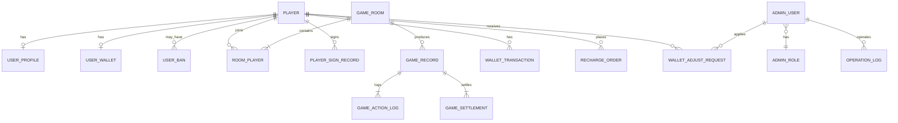
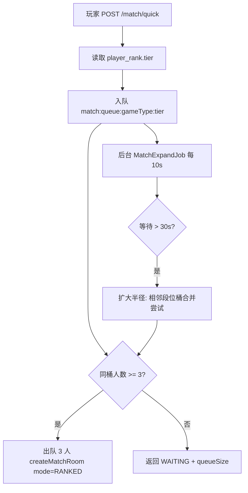
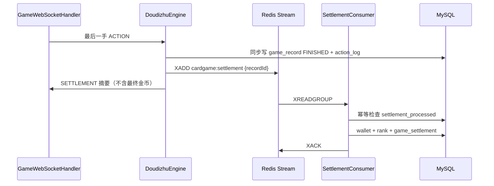

# CardGameBackend 后端服务设计文档


| 项目   | CardGameBackend                             |
| ---- | ------------------------------------------- |
| 版本   | v1.12                                       |
| 技术栈  | Spring Boot 4.1、Java 17、JPA、MySQL、Redis     |
| 关联项目 | cardgame-frontend（运营后台）、游戏客户端（微信小程序/H5/App） |


**变更记录**


| 版本    | 日期         | 说明                                                                                                                                       |
| ----- | ---------- | ---------------------------------------------------------------------------------------------------------------------------------------- |
| v1.12 | 2026-06-20 | **牌桌/结算同步**：`getVisibleState` 保留 `lastPlay.cards`；`SETTLEMENT` WS 显式 Map（Bot `goldDelta=0`）；`finishGame` `winnerSeat` 回退；文档与 Flyway 整合收尾 |
| v1.11 | 2026-06-20 | **Flyway 整合**：V2–V4 合并入 `V1__init_schema.sql`（21 表）；删库重建见 `CardGameBackend/docs/reset-db.sql`                                            |
| v1.10 | 2026-06-20 | **action_log seq 修复**：`nextSystemSeq` 改为 `actionSeq+1`，避免 LANDLORD/SETTLEMENT 与 BID 重复 seq（1062）                                         |
| v1.9  | 2026-06-20 | **PVE 开局修复**：系统事件操作者 `900000`（`SystemPlayers.SYSTEM_ACTOR_ID`）；§3.3、§11.4、§11.13.2 同步                                                    |
| v1.8  | 2026-06-18 | Phase 6C 运营后台 mode 筛选 + Admin API；§10 Phase 6C 标 ✅                                                                                       |
| v1.7  | 2026-06-18 | Phase 6A 工程实现：PVE/Bot API、BotTurnScheduler、仅真人结算；§10 同步                                                                                  |
| v1.6  | 2026-06-18 | Phase 6 人机模式设计：§5 玩家 API、§10、§11.13（PVE 一键练习 + 亲友房加 Bot）                                                                                 |
| v1.5  | 2026-06-18 | §5 API 表、§10/§11.12 与代码对齐：Phase 5A 标 ✅；lobby 接口标未实现；测试待补                                                                                 |
| v1.4  | 2026-06-18 | Phase 5A 工程实现：`PlayerUserController`、`PlayerRecordController`、`finishGame` participants                                                  |
| v1.3  | 2026-06-18 | 玩家 `/user/`*、`/records/*` 详细设计（§11.12）；§3.3 `result_json` 增强；§10 Phase 5                                                                 |
| v1.2  | —          | 补关键 API 请求体；修正章节引用；完善系统配置 API                                                                                                            |
| v1.1  | —          | 对齐 DDL；19 张表 + 初始数据合并为单一 V1 脚本                                                                                                           |
| v1.0  | —          | 初版架构、API、领域模型                                                                                                                            |


## 1. 项目概述

### 1.1 目标

CardGameBackend 是棋牌游戏平台的核心服务端，负责：

- 玩家认证与账号体系
- 大厅、房间、匹配
- 实时对局（WebSocket）与游戏规则权威判定
- 经济系统（金币、充值、流水）
- 对局记录、回放数据
- 为运营后台提供管理 API

### 1.2 设计原则


| 原则      | 说明                          |
| ------- | --------------------------- |
| 服务端权威   | 洗牌、出牌、胡牌等判定均在服务端完成，客户端仅展示   |
| 单体模块化   | 初期采用单体多模块，降低运维复杂度，预留拆分边界    |
| 玩家/运营隔离 | 玩家 API 与后台 API 路径、鉴权、账号体系分离 |
| 可审计     | 金币流水、对局操作、运营操作均可追溯          |
| 玩法可扩展   | 通过 `GameEngine` 插件接入新玩法     |


### 1.3 系统边界

```
┌─────────────┐     REST/WS      ┌──────────────────┐
│ 游戏客户端   │ ───────────────► │  CardGameBackend │
│ (小程序等)  │ ◄─────────────── │                  │
└─────────────┘                  │  ┌────────────┐  │
                                 │  │ 玩家 API   │  │
┌─────────────┐     REST         │  └────────────┘  │
│ 运营后台     │ ───────────────► │  ┌────────────┐  │
│ (Vue 前端)  │                  │  │ 后台 API   │  │
└─────────────┘                  │  └────────────┘  │
                                 └────────┬─────────┘
                                          │
                              ┌───────────┴───────────┐
                              │ MySQL    Redis          │
                              └─────────────────────────┘
```

---

## 2. 技术架构

### 2.1 技术选型


| 类别     | 选型                | 说明                        |
| ------ | ----------------- | ------------------------- |
| 框架     | Spring Boot 4.1   | 当前项目已使用                   |
| 语言     | Java 17           | 当前项目已使用                   |
| ORM    | Spring Data JPA   | 当前项目已使用；复杂报表可补充 MyBatis   |
| 数据库    | MySQL 8           | 库名 `cardgame_db`          |
| 缓存     | Redis             | 房间状态、在线、匹配队列、限流、多实例 WS 广播 |
| 实时通信   | Spring WebSocket  | 对局消息推送                    |
| 认证     | JWT               | 玩家 token / 运营 token 分离    |
| 微信登录   | 微信 `code2session` | 小程序登录                     |
| 数据库迁移  | Flyway            | 生产环境禁用 `ddl-auto: update` |
| API 文档 | SpringDoc OpenAPI | 前后端联调                     |


### 2.2 建议新增依赖

```xml
<!-- WebSocket -->
<dependency>
    <groupId>org.springframework.boot</groupId>
    <artifactId>spring-boot-starter-websocket</artifactId>
</dependency>
<!-- Redis -->
<dependency>
    <groupId>org.springframework.boot</groupId>
    <artifactId>spring-boot-starter-data-redis</artifactId>
</dependency>
<!-- 安全 -->
<dependency>
    <groupId>org.springframework.boot</groupId>
    <artifactId>spring-boot-starter-security</artifactId>
</dependency>
<!-- 数据库迁移 -->
<dependency>
    <groupId>org.flywaydb</groupId>
    <artifactId>flyway-core</artifactId>
</dependency>
<!-- API 文档 -->
<dependency>
    <groupId>org.springdoc</groupId>
    <artifactId>springdoc-openapi-starter-webmvc-ui</artifactId>
    <version>2.8.5</version>
</dependency>
```

### 2.3 模块划分（包结构）

当前为单模块，建议按领域分包，后续可拆 Maven 子模块：

```
io.github.kingqiang.cardgame.cardgamebackend
├── CardGameBackendApplication.java
├── common/                    # 公共组件
│   ├── exception/             # 全局异常、错误码
│   ├── response/              # 统一响应 ApiResponse
│   ├── config/                # 全局配置
│   └── util/                  # 工具类
├── auth/                      # 认证
│   ├── controller/
│   ├── service/
│   └── security/              # JWT Filter、SecurityConfig
├── user/                      # 玩家用户
│   ├── entity/
│   ├── repository/
│   ├── service/
│   └── controller/
├── room/                      # 房间与匹配
│   ├── entity/
│   ├── service/
│   ├── controller/
│   └── websocket/             # WS 处理器、会话管理
├── game/                      # 游戏引擎
│   ├── engine/                # GameEngine 接口
│   ├── context/               # GameContext
│   ├── doudizhu/              # 斗地主（MVP 首玩法）
│   └── settlement/            # 结算逻辑
├── economy/                   # 经济系统
│   ├── entity/
│   ├── service/
│   └── controller/
├── record/                    # 对局记录与回放
│   ├── entity/
│   ├── service/
│   └── controller/
├── admin/                     # 运营后台 API（与玩家 API 隔离）
│   ├── entity/                # AdminUser、AdminRole
│   ├── service/
│   ├── controller/
│   └── audit/                 # 操作审计
└── job/                       # 定时任务
    └── RoomCleanupJob.java    # 超时房间清理等
```

### 2.4 部署架构

```
                    ┌─────────┐
  客户端 / 后台 ───► │  Nginx  │
                    └────┬────┘
                         │
              ┌──────────┼──────────┐
              ▼          ▼          ▼
         Instance-1  Instance-2  ...
              │          │
              └────┬─────┘
                   ▼
         ┌─────────────────────┐
         │ MySQL    Redis       │
         └─────────────────────┘
```

- 服务端口：`8080`（避开微信小程序禁用端口 8000–8100）
- 多实例时 WebSocket 通过 Redis Pub/Sub 广播房间消息
- 生产环境：MySQL 主从、Redis 哨兵、应用 2+ 实例

---

## 3. 领域模型设计

### 3.1 用户域（User）

> 领域层实体可命名为 `User`，数据库表名为 `player`（见 §3.8 命名说明）。

#### 实体

**player — 玩家主表**


| 字段         | 类型                 | 说明                 |
| ---------- | ------------------ | ------------------ |
| id         | BIGINT PK          | 用户 ID，自增           |
| openid     | VARCHAR(64) UNIQUE | 微信 openid          |
| unionid    | VARCHAR(64)        | 微信 unionid（可选）     |
| nickname   | VARCHAR(64)        | 昵称                 |
| avatar     | VARCHAR(512)       | 头像 URL             |
| status     | TINYINT            | 0 正常 / 1 封禁 / 2 注销 |
| created_at | DATETIME(3)        | 注册时间               |
| updated_at | DATETIME(3)        | 更新时间               |


**user_profile — 用户扩展**


| 字段         | 类型           | 说明      |
| ---------- | ------------ | ------- |
| user_id    | BIGINT PK/FK | 用户 ID   |
| level      | INT          | 等级，默认 1 |
| exp        | BIGINT       | 经验值     |
| vip_level  | INT          | VIP 等级  |
| created_at | DATETIME(3)  | 创建时间    |
| updated_at | DATETIME(3)  | 更新时间    |


**user_wallet — 钱包**


| 字段          | 类型           | 说明            |
| ----------- | ------------ | ------------- |
| user_id     | BIGINT PK/FK | 用户 ID         |
| gold        | BIGINT       | 金币余额（整数，最小单位） |
| diamond     | BIGINT       | 钻石余额          |
| frozen_gold | BIGINT       | 冻结金币（对局预扣等）   |
| version     | INT          | 乐观锁版本号        |
| created_at  | DATETIME(3)  | 创建时间          |
| updated_at  | DATETIME(3)  | 更新时间          |


**user_ban — 封禁记录**


| 字段          | 类型           | 说明              |
| ----------- | ------------ | --------------- |
| id          | BIGINT PK    | 主键              |
| user_id     | BIGINT       | 被封用户            |
| reason      | VARCHAR(256) | 封禁原因            |
| ban_until   | DATETIME(3)  | 解封时间（NULL 表示永久） |
| operator_id | BIGINT       | 操作人（运营账号 ID）    |
| revoked_at  | DATETIME(3)  | 提前解封时间          |
| created_at  | DATETIME(3)  | 封禁时间            |


### 3.2 房间域（Room）

**game_room — 房间**


| 字段          | 类型             | 说明                                   |
| ----------- | -------------- | ------------------------------------ |
| room_id     | VARCHAR(32) PK | 房间号                                  |
| game_type   | VARCHAR(32)    | 玩法：DOUDIZHU、MAHJONG 等                |
| mode        | VARCHAR(32)    | 模式：FRIEND、MATCH、RANKED、**PVE**（人机练习） |
| status      | VARCHAR(16)    | 房间状态                                 |
| owner_id    | BIGINT         | 房主                                   |
| max_players | INT            | 最大人数                                 |
| config_json | JSON           | 房间规则配置                               |
| created_at  | DATETIME(3)    | 创建时间                                 |
| updated_at  | DATETIME(3)    | 更新时间                                 |


**房间状态机**

```
WAITING → READY → PLAYING → SETTLING → FINISHED
                ↘ DISBANDED
```

**room_player — 房间玩家**


| 字段        | 类型          | 说明          |
| --------- | ----------- | ----------- |
| id        | BIGINT PK   |             |
| room_id   | VARCHAR(32) | 房间号         |
| user_id   | BIGINT      | 玩家          |
| seat      | INT         | 座位号 0-based |
| ready     | BOOLEAN     | 是否准备        |
| is_robot  | BOOLEAN     | 是否机器人       |
| joined_at | DATETIME(3) | 加入时间        |


**Redis 缓存结构**


| Key                      | 类型     | 说明               | TTL     |
| ------------------------ | ------ | ---------------- | ------- |
| `room:{roomId}`          | Hash   | 房间运行时状态          | 随房间生命周期 |
| `room:players:{roomId}`  | Hash   | 座位 → userId      | 同上      |
| `user:online:{userId}`   | String | 在线状态、所在房间        | 心跳续期    |
| `match:queue:{gameType}` | ZSet   | 匹配队列（score=等待时间） | 无       |


### 3.3 对局域（Game）

**game_record — 对局记录**


| 字段          | 类型             | 说明                                      |
| ----------- | -------------- | --------------------------------------- |
| record_id   | VARCHAR(32) PK | 对局 ID                                   |
| room_id     | VARCHAR(32)    | 房间号                                     |
| game_type   | VARCHAR(32)    | 玩法                                      |
| status      | VARCHAR(16)    | PLAYING / FINISHED / ABORTED            |
| start_at    | DATETIME(3)    | 开始时间                                    |
| end_at      | DATETIME(3)    | 结束时间                                    |
| result_json | JSON           | 结算摘要（§11.12.3 增强 `participants`/`mode`） |


**game_action_log — 操作流水（回放/仲裁）**


| 字段         | 类型          | 说明                                                                                                |
| ---------- | ----------- | ------------------------------------------------------------------------------------------------- |
| id         | BIGINT PK   |                                                                                                   |
| record_id  | VARCHAR(32) | 对局 ID                                                                                             |
| seq        | INT         | 操作序号（递增）                                                                                          |
| user_id    | BIGINT      | 操作玩家；**FK → `player.id`**。系统事件（`GAME_START` / `DEAL` / `SETTLEMENT`）使用 `**900000`（系统账号）**，禁止写 `0` |
| action     | VARCHAR(32) | 操作类型                                                                                              |
| payload    | JSON        | 操作详情                                                                                              |
| created_at | DATETIME(3) | 操作时间                                                                                              |


**game_settlement — 结算明细**


| 字段         | 类型          | 说明       |
| ---------- | ----------- | -------- |
| id         | BIGINT PK   |          |
| record_id  | VARCHAR(32) | 对局 ID    |
| user_id    | BIGINT      | 玩家       |
| gold_delta | BIGINT      | 金币变化（正负） |
| score      | INT         | 本局得分     |
| created_at | DATETIME(3) | 结算时间     |


### 3.4 经济域（Economy）

**wallet_transaction — 金币流水（只增不改）**


| 字段            | 类型           | 说明                    |
| ------------- | ------------ | --------------------- |
| id            | BIGINT PK    |                       |
| user_id       | BIGINT       | 用户                    |
| type          | VARCHAR(32)  | 流水类型                  |
| amount        | BIGINT       | 变动金额（正负）              |
| balance_after | BIGINT       | 变动后余额                 |
| ref_type      | VARCHAR(32)  | 关联类型：GAME、ORDER、ADMIN |
| ref_id        | VARCHAR(64)  | 关联 ID                 |
| remark        | VARCHAR(256) | 备注                    |
| created_at    | DATETIME(3)  | 创建时间                  |


**流水类型枚举**


| 类型           | 说明    |
| ------------ | ----- |
| GAME_WIN     | 对局赢取  |
| GAME_LOSE    | 对局输掉  |
| RECHARGE     | 充值    |
| ADMIN_ADJUST | 运营调账  |
| SHOP_BUY     | 商城购买  |
| DAILY_REWARD | 每日奖励  |
| ROOM_FEE     | 房间入场费 |


**shop_item — 商城商品**


| 字段         | 类型           | 说明             |
| ---------- | ------------ | -------------- |
| id         | BIGINT PK    | 商品 ID          |
| name       | VARCHAR(128) | 商品名            |
| price      | BIGINT       | 价格             |
| currency   | VARCHAR(16)  | GOLD / DIAMOND |
| payload    | JSON         | 发放内容           |
| status     | TINYINT      | 0 下架 / 1 上架    |
| sort_order | INT          | 排序             |
| created_at | DATETIME(3)  | 创建时间           |
| updated_at | DATETIME(3)  | 更新时间           |


**recharge_order — 充值订单**


| 字段          | 类型             | 说明                                 |
| ----------- | -------------- | ---------------------------------- |
| order_no    | VARCHAR(64) PK | 订单号                                |
| user_id     | BIGINT         | 用户                                 |
| amount      | BIGINT         | 支付金额（分）                            |
| gold_amount | BIGINT         | 发放金币                               |
| pay_channel | VARCHAR(32)    | WECHAT 等                           |
| status      | VARCHAR(16)    | PENDING / PAID / FAILED / REFUNDED |
| paid_at     | DATETIME(3)    | 支付时间                               |
| created_at  | DATETIME(3)    | 创建时间                               |
| updated_at  | DATETIME(3)    | 更新时间                               |


**wallet_adjust_request — 调账审批**


| 字段            | 类型           | 说明                                       |
| ------------- | ------------ | ---------------------------------------- |
| id            | BIGINT PK    | 申请 ID                                    |
| user_id       | BIGINT       | 目标用户                                     |
| adjust_type   | VARCHAR(16)  | INCREASE / DECREASE                      |
| amount        | BIGINT       | 调账金额（金币）                                 |
| reason        | VARCHAR(256) | 申请原因                                     |
| status        | VARCHAR(16)  | PENDING / APPROVED / REJECTED / EXECUTED |
| applicant_id  | BIGINT       | 申请人（运营账号）                                |
| approver_id   | BIGINT       | 审批人                                      |
| approved_at   | DATETIME(3)  | 审批时间                                     |
| reject_reason | VARCHAR(256) | 驳回原因                                     |
| created_at    | DATETIME(3)  | 申请时间                                     |
| updated_at    | DATETIME(3)  | 更新时间                                     |


超过 `system_config.wallet.adjust_threshold.amount` 阈值时，调账须走此审批流；小额可直接执行。

### 3.5 运营域（Admin）

**admin_user — 运营账号（与玩家隔离）**


| 字段            | 类型                 | 说明          |
| ------------- | ------------------ | ----------- |
| id            | BIGINT PK          | 管理员 ID      |
| username      | VARCHAR(64) UNIQUE | 登录名         |
| password_hash | VARCHAR(128)       | BCrypt 哈希   |
| real_name     | VARCHAR(64)        | 真实姓名        |
| role_id       | BIGINT FK          | 角色          |
| status        | TINYINT            | 0 禁用 / 1 启用 |
| last_login_at | DATETIME(3)        | 最后登录时间      |
| last_login_ip | VARCHAR(64)        | 最后登录 IP     |
| created_at    | DATETIME(3)        | 创建时间        |
| updated_at    | DATETIME(3)        | 更新时间        |


**admin_role — 角色**


| 字段          | 类型           | 说明    |
| ----------- | ------------ | ----- |
| id          | BIGINT PK    | 角色 ID |
| name        | VARCHAR(64)  | 角色名   |
| permissions | JSON         | 权限列表  |
| description | VARCHAR(256) | 角色描述  |
| created_at  | DATETIME(3)  | 创建时间  |
| updated_at  | DATETIME(3)  | 更新时间  |


**operation_log — 操作审计**


| 字段          | 类型          | 说明                          |
| ----------- | ----------- | --------------------------- |
| id          | BIGINT PK   | 主键                          |
| operator_id | BIGINT      | 操作人                         |
| action      | VARCHAR(64) | 操作类型                        |
| target_type | VARCHAR(32) | 目标类型：USER / ROOM / RECORD 等 |
| target_id   | VARCHAR(64) | 目标 ID                       |
| detail      | JSON        | 操作详情                        |
| ip          | VARCHAR(64) | 操作 IP                       |
| created_at  | DATETIME(3) | 操作时间                        |


### 3.6 扩展域（Activity & Config）

**activity_config — 活动配置**


| 字段          | 类型                 | 说明                |
| ----------- | ------------------ | ----------------- |
| id          | BIGINT PK          | 活动 ID             |
| code        | VARCHAR(64) UNIQUE | 活动编码，如 DAILY_SIGN |
| name        | VARCHAR(128)       | 活动名称              |
| type        | VARCHAR(32)        | 活动类型              |
| config_json | JSON               | 活动规则配置            |
| status      | TINYINT            | 0 禁用 / 1 启用       |
| start_at    | DATETIME(3)        | 开始时间（可选）          |
| end_at      | DATETIME(3)        | 结束时间（可选）          |
| created_at  | DATETIME(3)        | 创建时间              |
| updated_at  | DATETIME(3)        | 更新时间              |


**system_config — 系统配置**


| 字段           | 类型             | 说明   |
| ------------ | -------------- | ---- |
| config_key   | VARCHAR(64) PK | 配置键  |
| config_value | JSON           | 配置值  |
| description  | VARCHAR(256)   | 说明   |
| updated_at   | DATETIME(3)    | 更新时间 |


**player_sign_record — 签到记录**


| 字段          | 类型          | 说明             |
| ----------- | ----------- | -------------- |
| id          | BIGINT PK   | 主键             |
| user_id     | BIGINT      | 用户 ID          |
| sign_date   | DATE        | 签到日期           |
| streak_day  | INT         | 连续签到天数（1–7 循环） |
| reward_gold | BIGINT      | 本次奖励金币         |
| created_at  | DATETIME(3) | 签到时间           |


唯一约束：`(user_id, sign_date)`

### 3.7 ER 关系图




### 3.8 数据库 DDL 与表命名

完整 DDL 脚本位于：


| 文件                                                    | 用途                          |
| ----------------------------------------------------- | --------------------------- |
| `docs/schema.sql`                                     | 完整脚本（建库 + 建表 + 初始数据），适合手动执行 |
| `src/main/resources/db/migration/V1__init_schema.sql` | Flyway 迁移（建表 + 初始数据，一键初始化）  |


**表清单（共 21 张，均在 V1 中创建）**


| 域   | 表名                      | 说明                 |
| --- | ----------------------- | ------------------ |
| 用户  | `player`                | 玩家主表               |
| 用户  | `user_profile`          | 等级、VIP             |
| 用户  | `user_wallet`           | 钱包（含乐观锁 `version`） |
| 用户  | `user_ban`              | 封禁记录               |
| 运营  | `admin_role`            | 角色权限               |
| 运营  | `admin_user`            | 运营账号               |
| 运营  | `operation_log`         | 操作审计               |
| 房间  | `game_room`             | 游戏房间               |
| 房间  | `room_player`           | 房间玩家               |
| 对局  | `game_record`           | 对局记录               |
| 对局  | `game_action_log`       | 操作流水（回放）           |
| 对局  | `game_settlement`       | 结算明细               |
| 经济  | `wallet_transaction`    | 金币流水               |
| 经济  | `shop_item`             | 商城商品               |
| 经济  | `recharge_order`        | 充值订单               |
| 经济  | `wallet_adjust_request` | 调账审批               |
| 扩展  | `activity_config`       | 活动配置               |
| 扩展  | `system_config`         | 系统配置               |
| 扩展  | `player_sign_record`    | 签到记录               |
| 段位  | `player_rank`           | 玩家段位               |
| 段位  | `player_rank_log`       | 段位变动日志             |


**命名说明（避免 MySQL 保留字）**


| 设计文档概念  | 实际表名             | 原因                  |
| ------- | ---------------- | ------------------- |
| `user`  | `player`         | `user` 为 MySQL 保留字  |
| `order` | `recharge_order` | `order` 为 MySQL 保留字 |


JPA 实体通过 `@Table(name = "player")` 等方式映射，领域层仍可使用 `User` 命名。

---

## 4. 游戏引擎设计

### 4.1 核心接口

```java
public interface GameEngine {

    /** 玩法标识 */
    GameType type();

    /** 玩家加入，分配座位 */
    void onPlayerJoin(GameContext ctx, long userId, int seat);

    /** 玩家离开 */
    void onPlayerLeave(GameContext ctx, long userId);

    /** 处理玩家操作，返回结果 */
    ActionResult handleAction(GameContext ctx, GameAction action);

    /** 是否满足开局条件 */
    boolean canStart(GameContext ctx);

    /** 开局初始化（发牌等） */
    void onGameStart(GameContext ctx);

    /** 对局结算 */
    List<SettlementItem> settle(GameContext ctx);

    /** 获取当前玩家可见状态（脱敏） */
    Object getVisibleState(GameContext ctx, long userId);
}
```

### 4.2 GameContext 运行时结构

存储于 Redis，序列化为 JSON：

```json
{
  "recordId": "GR20250618001",
  "roomId": "R10086",
  "gameType": "DOUDIZHU",
  "phase": "PLAYING",
  "currentSeat": 1,
  "landlordSeat": 0,
  "multiplier": 2,
  "deck": [],
  "hands": {
    "0": ["3S","3H","3D"],
    "1": ["..."],
    "2": ["..."]
  },
  "lastPlay": { "seat": 0, "cards": ["3S","3H","3D"], "type": "TRIPLE" },
  "actionSeq": 16
}
```

- `hands` 按座位存储，下发时仅返回当前玩家自己的手牌
- `actionSeq` 全局递增，用于幂等与回放

### 4.3 斗地主 MVP 流程

```
进房 → 准备 → 开局
  → 叫地主（轮询）→ 抢地主（可选）→ 加倍（可选）
  → 出牌轮询（出牌/过牌校验）
  → 一方出完 → 结算（春天/反春天、炸弹加倍）
  → 写 game_record / game_settlement / wallet_transaction
  → 推送 SETTLEMENT 消息
```

**操作类型（action）**


| Action        | 说明  |
| ------------- | --- |
| CALL_LANDLORD | 叫地主 |
| GRAB_LANDLORD | 抢地主 |
| DOUBLE        | 加倍  |
| PLAY_CARDS    | 出牌  |
| PASS          | 过牌  |


### 4.4 新玩法接入步骤

1. 在 `game/{gametype}/` 下实现 `GameEngine`
2. 注册到 `GameEngineRegistry`（Spring 自动注入 Map）
3. 补充 `game_type` 枚举与房间配置 schema
4. 编写单元测试覆盖核心规则
5. 后台增加对应玩法开关配置

---

## 5. API 设计

### 5.1 统一规范

**Base URL**

- 玩家 API：`/api/v1`
- 后台 API：`/api/admin/v1`

**统一响应**

```json
{
  "code": 0,
  "message": "ok",
  "data": {},
  "traceId": "a1b2c3d4"
}
```

**错误码分段**


| 范围          | 说明               |
| ----------- | ---------------- |
| 10000–10999 | 通用（参数错误、未授权等）    |
| 20000–20999 | 用户（不存在、已封禁等）     |
| 30000–30999 | 房间（已满、不存在、状态错误等） |
| 40000–40999 | 对局（非法操作、非当前回合等）  |
| 50000–50999 | 经济（余额不足等）        |


**认证**

- Header：`Authorization: Bearer <token>`
- 玩家 token 与运营 token 使用不同 issuer / secret，互不通用

**分页规范**

列表接口统一使用 Query 参数：


| 参数       | 类型  | 默认  | 说明          |
| -------- | --- | --- | ----------- |
| page     | int | 1   | 页码，从 1 开始   |
| pageSize | int | 20  | 每页条数，最大 100 |


响应 `data` 结构：

```json
{
  "list": [],
  "total": 0,
  "page": 1,
  "pageSize": 20
}
```

**业务 ID 生成规则**


| ID 类型     | 格式示例                  | 说明                         |
| --------- | --------------------- | -------------------------- |
| room_id   | `R20250618143022001`  | R + yyyyMMddHHmmss + 3 位序列 |
| record_id | `GR20250618143022001` | GR + 时间戳 + 序列              |
| order_no  | `RO20250618143022001` | RO + 时间戳 + 序列              |


使用 Redis `INCR` 或数据库序列保证同一秒内不重复。

### 5.2 玩家 API

#### 认证


| 方法   | 路径                   | 说明                                       |
| ---- | -------------------- | ---------------------------------------- |
| POST | `/auth/wechat/login` | 微信 code 登录，返回 accessToken + refreshToken |
| POST | `/auth/refresh`      | 刷新 accessToken                           |


**登录请求/响应示例**

```json
// POST /api/v1/auth/wechat/login
{ "code": "wx_login_code" }

// Response
{
  "code": 0,
  "data": {
    "accessToken": "eyJ...",
    "refreshToken": "eyJ...",
    "expiresIn": 7200,
    "user": { "id": 10001, "nickname": "玩家A", "avatar": "..." }
  }
}
```

#### 用户（Phase 5A 已实现 ✅，详见 §11.12.1）


| 方法  | 路径              | 说明                 | 状态    |
| --- | --------------- | ------------------ | ----- |
| GET | `/user/me`      | 当前用户信息 + 钱包 + 段位摘要 | ✅ 已实现 |
| PUT | `/user/profile` | 修改昵称、头像            | ✅ 已实现 |


#### 大厅（尚未实现 ⚠️）


| 方法  | 路径             | 说明         | 状态     |
| --- | -------------- | ---------- | ------ |
| GET | `/lobby/games` | 可用玩法列表及配置  | ❌ 尚未实现 |
| GET | `/lobby/rooms` | 公开房间列表（分页） | ❌ 尚未实现 |


#### 房间


| 方法     | 路径                            | 说明                                   |
| ------ | ----------------------------- | ------------------------------------ |
| POST   | `/rooms`                      | 创建房间                                 |
| GET    | `/rooms/{roomId}`             | 房间详情                                 |
| POST   | `/rooms/{roomId}/join`        | 加入房间                                 |
| POST   | `/rooms/{roomId}/leave`       | 离开房间                                 |
| POST   | `/rooms/{roomId}/ready`       | 准备/取消准备                              |
| POST   | `/rooms/{roomId}/start`       | 房主开始（亲友房）                            |
| POST   | `/rooms/pve`                  | **Phase 6**：一键人机练习（1 人 + 2 Bot，自动开局） |
| POST   | `/rooms/{roomId}/bots`        | **Phase 6**：亲友房添加电脑（填空闲座位）           |
| DELETE | `/rooms/{roomId}/bots/{seat}` | **Phase 6**：移除指定座位的电脑（开局前）           |


`GET /rooms/{roomId}` 的 `players[]` 含 `userId`、`nickname`、`avatar`、`seat`、`ready`、`**isRobot`**（nickname 缺省为 `玩家{id}`；Bot 显示系统昵称如「电脑一号」）。

**创建房间请求示例**

```json
{
  "gameType": "DOUDIZHU",
  "mode": "FRIEND",
  "config": {
    "baseScore": 1,
    "enableGrab": true,
    "enableDouble": true
  }
}
```

#### 匹配


| 方法     | 路径              | 说明                                       |
| ------ | --------------- | ---------------------------------------- |
| POST   | `/match/quick`  | 快速匹配（加入队列）                               |
| GET    | `/match/status` | 查询匹配状态（WAITING / MATCHED / NOT_IN_QUEUE） |
| DELETE | `/match/quick`  | 取消匹配                                     |


#### 经济


| 方法   | 路径                               | 说明            |
| ---- | -------------------------------- | ------------- |
| GET  | `/wallet`                        | 钱包余额          |
| GET  | `/wallet/transactions`           | 流水分页          |
| GET  | `/shop/items`                    | 商城商品列表        |
| POST | `/shop/buy`                      | 购买商品          |
| POST | `/orders`                        | 创建充值订单        |
| POST | `/orders/{orderNo}/pay-callback` | 支付回调（微信服务器调用） |


#### 对局记录（Phase 5A 已实现 ✅，详见 §11.12.2）


| 方法  | 路径                           | 说明                  | 状态    |
| --- | ---------------------------- | ------------------- | ----- |
| GET | `/records`                   | 本人历史战绩（分页）          | ✅ 已实现 |
| GET | `/records/{recordId}`        | 对局详情（须参与该局）         | ✅ 已实现 |
| GET | `/records/{recordId}/replay` | 回放 action 列表（须参与该局） | ✅ 已实现 |


> 与运营 `/admin/records` 隔离：玩家仅可查 `game_settlement.user_id = 当前用户` 的对局；无权访问统一返回 **404「对局不存在」**（防枚举 recordId）。

#### 活动


| 方法   | 路径                       | 说明                       |
| ---- | ------------------------ | ------------------------ |
| GET  | `/activities/daily-sign` | 获取签到状态（今日是否已签、连续天数、奖励预览） |
| POST | `/activities/daily-sign` | 执行签到，返回奖励金币              |


**签到响应示例**

```json
{
  "code": 0,
  "data": {
    "signedToday": true,
    "streakDay": 3,
    "rewardGold": 200,
    "nextRewardGold": 200
  }
}
```

### 5.3 WebSocket 协议

**连接地址**：`ws://host/ws/game?token=<accessToken>`

**客户端 → 服务端**

```json
{
  "type": "ACTION",
  "roomId": "R10086",
  "seq": 15,
  "payload": {
    "action": "PLAY_CARDS",
    "cards": ["3S", "3H", "3D"]
  }
}
```

```json
{ "type": "PING" }
```

**服务端 → 客户端**


| type          | 说明          |
| ------------- | ----------- |
| STATE_SYNC    | 全量/增量状态同步   |
| ACTION_RESULT | 操作结果（成功/失败） |
| ROOM_EVENT    | 玩家进出、准备、解散等 |
| SETTLEMENT    | 对局结算        |


`SETTLEMENT` payload：`settlements[]`（`userId`、`seat`、`goldDelta`、`scoreDelta`、`multiplier`；**Bot 行 `goldDelta=0`**）+ `result`（`winnerSeat`、`landlordSeat`、`multiplier`）。由 `GameMessageBroadcaster.broadcastSettlement` 序列化为显式 Map，避免 Lombok 对象 JSON 歧义。
| AUTO_PLAY     | 托管出牌/过牌（服务端代操作） |
| ERROR         | 错误信息        |
| PONG          | 心跳响应        |

```json
{
  "type": "STATE_SYNC",
  "roomId": "R10086",
  "seq": 16,
  "payload": {
    "phase": "PLAYING",
    "currentSeat": 1,
    "myHand": ["4S", "5S", "6S"],
    "lastPlay": { "seat": 0, "cards": ["3S","3H","3D"], "cardCount": 3 }
  }
}
```

**可靠性**

- 客户端携带单调递增 `seq`，服务端拒绝重复或乱序操作
- 断线重连后服务端推送全量 `STATE_SYNC`
- 心跳间隔 30s，60s 无响应标记离线

**断线托管策略**


| 参数   | 值      | 说明                 |
| ---- | ------ | ------------------ |
| 心跳间隔 | 30s    | 客户端发 PING          |
| 离线判定 | 60s    | 无心跳则标记离线           |
| 托管触发 | 离线 15s | 斗地主自动 PASS 或出最小合法牌 |
| 重连窗口 | 对局结束前  | 重连后恢复控制权，取消托管      |


托管逻辑由 `GameEngine` 按玩法实现，默认仅对 MATCH / RANKED 模式启用。

### 5.4 后台 API

**登录响应示例**

```json
{
  "code": 0,
  "data": {
    "accessToken": "eyJ...",
    "refreshToken": "eyJ...",
    "expiresIn": 7200,
    "user": { "id": 1, "username": "admin", "realName": "系统管理员" },
    "permissions": ["dashboard:view", "user:list", "..."]
  }
}
```


| 模块  | 方法                  | 路径                                           | 说明           |
| --- | ------------------- | -------------------------------------------- | ------------ |
| 认证  | POST                | `/admin/auth/login`                          | 运营登录         |
| 认证  | POST                | `/admin/auth/logout`                         | 登出           |
| 认证  | PUT                 | `/admin/auth/password`                       | 修改密码         |
| 仪表盘 | GET                 | `/admin/dashboard/overview`                  | 核心指标         |
| 仪表盘 | GET                 | `/admin/dashboard/trends`                    | 趋势数据         |
| 用户  | GET                 | `/admin/users`                               | 用户列表（分页、筛选）  |
| 用户  | GET                 | `/admin/users/{id}`                          | 用户详情         |
| 用户  | POST                | `/admin/users/{id}/ban`                      | 封禁           |
| 用户  | POST                | `/admin/users/{id}/unban`                    | 解封           |
| 用户  | POST                | `/admin/users/{id}/adjust-wallet`            | 人工调账（小额直接执行） |
| 用户  | POST                | `/admin/wallet/adjust-requests`              | 提交大额调账申请     |
| 用户  | GET                 | `/admin/wallet/adjust-requests`              | 调账申请列表       |
| 用户  | POST                | `/admin/wallet/adjust-requests/{id}/approve` | 审批通过         |
| 用户  | POST                | `/admin/wallet/adjust-requests/{id}/reject`  | 审批驳回         |
| 房间  | GET                 | `/admin/rooms`                               | 在线房间列表       |
| 房间  | GET                 | `/admin/rooms/{roomId}`                      | 房间详情         |
| 房间  | POST                | `/admin/rooms/{roomId}/kick`                 | 踢人           |
| 房间  | POST                | `/admin/rooms/{roomId}/disband`              | 强制解散         |
| 对局  | GET                 | `/admin/records`                             | 对局列表         |
| 对局  | GET                 | `/admin/records/{recordId}`                  | 对局详情         |
| 对局  | GET                 | `/admin/records/{recordId}/replay`           | 回放数据         |
| 经济  | GET                 | `/admin/wallet/transactions`                 | 流水查询         |
| 经济  | GET                 | `/admin/orders`                              | 充值订单         |
| 商城  | GET/POST/PUT/DELETE | `/admin/shop/items`                          | 商品 CRUD      |
| 活动  | GET/POST/PUT/DELETE | `/admin/activities`                          | 活动配置 CRUD    |
| 系统  | GET/PUT             | `/admin/system/configs`                      | 系统配置列表读写（全量） |
| 系统  | GET/PUT             | `/admin/system/configs/{key}`                | 单个配置项读写      |
| 系统  | GET/POST/PUT/DELETE | `/admin/roles`                               | 角色管理         |
| 系统  | GET/POST/PUT/DELETE | `/admin/admins`                              | 管理员账号        |
| 审计  | GET                 | `/admin/operation-logs`                      | 操作日志         |


### 5.5 关键 API 请求体

以下为核心运营与玩家接口的请求体规范，响应均遵循 §5.1 统一格式。

#### 后台 — 认证

```json
// POST /api/admin/v1/admin/auth/login
{ "username": "admin", "password": "admin123" }

// PUT /api/admin/v1/admin/auth/password
{ "oldPassword": "admin123", "newPassword": "newSecurePass" }
```

#### 后台 — 用户管理

```json
// POST /api/admin/v1/admin/users/{id}/ban
{
  "reason": "恶意刷分",
  "banUntil": "2026-07-01T00:00:00+08:00"   // 可选，省略表示永久封禁
}

// POST /api/admin/v1/admin/users/{id}/unban
{ "reason": "申诉通过，解除封禁" }

// POST /api/admin/v1/admin/users/{id}/adjust-wallet（小额直接执行）
{
  "adjustType": "INCREASE",   // INCREASE | DECREASE
  "amount": 1000,            // 正整数，金币
  "reason": "活动补偿"
}
```

#### 后台 — 调账审批

```json
// POST /api/admin/v1/admin/wallet/adjust-requests（超过阈值时）
{
  "userId": 10001,
  "adjustType": "DECREASE",
  "amount": 200000,
  "reason": "异常金币回收"
}

// POST /api/admin/v1/admin/wallet/adjust-requests/{id}/reject
{ "rejectReason": "材料不足，驳回" }

// POST .../approve 无需 body；服务端自动执行调账并更新状态为 EXECUTED
```

#### 后台 — 房间监控

```json
// POST /api/admin/v1/admin/rooms/{roomId}/kick
{
  "userId": 10002,
  "reason": "长时间挂机"
}

// POST /api/admin/v1/admin/rooms/{roomId}/disband
{ "reason": "房间异常，运营强制解散" }
```

#### 后台 — 系统配置

```json
// PUT /api/admin/v1/admin/system/configs/maintenance
{
  "configValue": {
    "enabled": true,
    "message": "系统维护中，预计 22:00 恢复"
  }
}

// GET /api/admin/v1/admin/system/configs/{key} 响应示例
{
  "code": 0,
  "data": {
    "configKey": "wallet.adjust_threshold",
    "configValue": { "amount": 100000, "requireApproval": true },
    "description": "大额调账阈值（金币）"
  }
}
```

#### 玩家 — 用户与房间

```json
// GET /api/v1/user/me?gameType=DOUDIZHU
{
  "code": 0,
  "data": {
    "id": 10001,
    "nickname": "玩家A",
    "avatar": "https://...",
    "gold": 12345,
    "createdAt": "2026-06-01T10:00:00",
    "rankSummary": {
      "gameType": "DOUDIZHU",
      "tier": "GOLD",
      "points": 156,
      "wins": 45,
      "losses": 12
    }
  }
}

// PUT /api/v1/user/profile
{ "nickname": "新昵称", "avatar": "https://..." }

// GET /api/v1/records?page=1&pageSize=20&gameType=DOUDIZHU&mode=RANKED
{
  "code": 0,
  "data": {
    "list": [{
      "recordId": "GR202606181430001",
      "roomId": "R10086",
      "gameType": "DOUDIZHU",
      "mode": "RANKED",
      "status": "FINISHED",
      "startAt": "2026-06-18T14:30:00",
      "endAt": "2026-06-18T14:38:00",
      "durationSec": 480,
      "myGoldDelta": 120,
      "myScore": 1,
      "isWin": true,
      "multiplier": 2
    }],
    "total": 1,
    "page": 1,
    "pageSize": 20
  }
}

// POST /api/v1/rooms/{roomId}/ready
{ "ready": true }

// POST /api/v1/match/quick
{ "gameType": "DOUDIZHU", "mode": "MATCH" }

// POST /api/v1/shop/buy
{ "itemId": 1, "quantity": 1 }
```

#### WebSocket — 托管通知（服务端 → 客户端）

```json
{
  "type": "AUTO_PLAY",
  "roomId": "R10086",
  "seq": 17,
  "payload": {
    "seat": 1,
    "action": "PASS",
    "reason": "OFFLINE_TIMEOUT"
  }
}
```

---

## 6. 核心业务流程

### 6.1 微信登录

```
客户端 wx.login() 获取 code
  → POST /auth/wechat/login
  → 服务端调用微信 code2session 获取 openid
  → 查/建 player 记录，初始化 user_profile、user_wallet
  → 签发 JWT 返回
```

### 6.2 创建房间并对局（亲友房）

```
POST /rooms 创建房间
  → 其他玩家 POST /rooms/{id}/join
  → 全员 POST /rooms/{id}/ready
  → 房主 POST /rooms/{id}/start 或人数满自动开始
  → 创建 game_record，初始化 GameContext
  → WebSocket 推送 STATE_SYNC
  → 玩家通过 WS 发送 ACTION
  → GameEngine 校验并更新状态
  → 对局结束 → settle() → 写库 → 推送 SETTLEMENT
```

### 6.3 快速匹配

```
POST /match/quick 加入匹配队列（mode=MATCH 为 FIFO；mode=RANKED 按段位桶，详见 §11.3）
  → 匹配服务按 gameType + 段位撮合（RANKED）或 FIFO（MATCH）
  → 凑齐人数后自动创建房间
  → 通知双方/多方进入房间
  → 后续流程同对局
```

### 6.4 金币变动（事务）

```
开启事务
  → SELECT user_wallet WHERE user_id=? FOR UPDATE（或乐观锁 version）
  → 校验余额
  → UPDATE gold
  → INSERT wallet_transaction
提交事务
```

### 6.5 每日签到

```
GET /activities/daily-sign 获取签到状态
  → 查 activity_config（code=DAILY_SIGN）
  → 查 player_sign_record 最近签到记录
  → 返回连续天数、今日是否已签、奖励预览

POST /activities/daily-sign 执行签到
  → 校验今日未签到
  → 计算 streak_day（1–7 循环）
  → 写 player_sign_record
  → 增加金币 + 写 wallet_transaction（DAILY_REWARD）
```

### 6.6 调账审批

```
运营提交调账（金额 >= 阈值）
  → 创建 wallet_adjust_request（PENDING）
  → 财务 GET 列表 → 审批
  → APPROVED → 执行调账 → wallet_transaction（ADMIN_ADJUST）→ EXECUTED
  → REJECTED → 记录 reject_reason
小额调账仍走 POST /admin/users/{id}/adjust-wallet 直接执行
```

---

## 7. 安全设计


| 项   | 措施                            |
| --- | ----------------------------- |
| 传输  | 全站 HTTPS / WSS                |
| 认证  | JWT 短效（2h）+ Refresh Token（7d） |
| 密码  | 运营密码 BCrypt 存储                |
| 微信  | session_key 仅存服务端，不下发客户端      |
| 限流  | IP + userId 维度，登录/匹配/出牌等接口    |
| 防作弊 | 服务端权威判定；异常操作频率检测；同 IP 多号告警    |
| 权限  | 后台 RBAC；敏感操作写 operation_log   |
| 数据  | openid 后台脱敏展示；金额禁止浮点          |


---

## 8. 非功能需求


| 指标           | 目标                  |
| ------------ | ------------------- |
| REST API P99 | < 200ms（非对局接口）      |
| WebSocket 延迟 | < 100ms（同城）         |
| 单房间玩家数       | 4–8 人（支持麻将扩展）       |
| 可用性          | 99.9%               |
| 数据备份         | MySQL 每日全量 + binlog |


---

## 9. 配置说明

当前 `application.yaml` 关键配置：

```yaml
server:
  port: 8080   # 避开微信禁用端口 8000-8100

spring:
  datasource:
    url: jdbc:mysql://localhost:3306/cardgame_db?...
  flyway:
    enabled: true
    locations: classpath:db/migration
    baseline-on-migrate: true
  data:
    redis:
      host: localhost
      port: 6379
  jpa:
    hibernate:
      ddl-auto: validate   # 生产环境使用 validate + Flyway，禁止 update
    show-sql: false

cardgame:
  jwt:
    player-secret: ${PLAYER_JWT_SECRET}
    admin-secret: ${ADMIN_JWT_SECRET}
    access-expire: 7200
    refresh-expire: 604800
  wechat:
    app-id: ${WECHAT_APP_ID}
    app-secret: ${WECHAT_APP_SECRET}
```

敏感配置通过环境变量注入，禁止提交到版本库。

### 9.1 开发联调与 CORS


| 场景         | 方案                                                  |
| ---------- | --------------------------------------------------- |
| 运营后台（Vite） | `vite.config.ts` 代理 `/api` → `localhost:8080`       |
| 微信小程序      | 配置合法域名；开发期可用开发者工具「不校验合法域名」                          |
| 跨域（如需）     | `WebMvcConfigurer.addCorsMappings`，仅 dev profile 开放 |


---

## 10. 实施计划

### Phase 1 — 基础骨架（2–3 周）✅ 已完成

- [x] 统一响应体、全局异常、错误码
- [x] JWT 认证（运营侧：登录、Filter、access/refresh token 签发）
- [x] 执行 V1 Flyway 迁移（21 张表 + 初始数据）
- [x] 后台登录 API（login / logout）
- [x] SpringDoc 依赖与基础配置（Swagger UI 可访问）

> Phase 1 验收标准：运营后台可登录联调。玩家侧 JWT、微信登录、SpringDoc 注解细化延后至 Phase 2 一并完成。

### Phase 2 — 房间与斗地主 + Phase 1 收尾（3–4 周）✅ 已完成

**Phase 1 收尾（后端）**

- [x] 玩家 JWT 认证（`player-secret`、PlayerJwtAuthenticationFilter）
- [x] 微信登录（mock 模式 + 真实 code2session）
- [x] Token 刷新接口（admin / player refresh）
- [x] SpringDoc 注解（主要 Controller）

**房间与对局**

- [x] WebSocket 框架与会话管理（`/ws/game`）
- [x] 房间 CRUD、准备、开始（REST API）
- [x] 斗地主 GameEngine（叫地主、出牌、过牌、结算）
- [x] 对局记录、操作日志、结算写库
- [x] 断线重连与 STATE_SYNC（RECONNECT 消息）

**运营 API（支撑前端 Phase 2 页面）**

- [x] 仪表盘 overview
- [x] 用户列表 / 封禁 / 解封
- [x] 房间监控 / 强制解散 / 踢人
- [x] 对局列表 / 详情 / 回放

### Phase 3 — 经济与运营 API（2–3 周）✅ 已完成

- [x] 钱包流水、乐观锁
- [x] 商城 CRUD、充值订单（运营列表 + 玩家创建/回调）
- [x] 后台用户管理、封禁、调账 API
- [x] 操作审计日志
- [x] 活动 API（运营 CRUD + 玩家每日签到）、系统配置 API
- [x] 调账审批 API
- [x] 玩家侧：`GET /wallet`、`GET /wallet/transactions`、`GET/POST /shop/`*、`GET/POST /activities/daily-sign`

### Phase 4 — 增强（持续）— 设计 ✅ / 波次 1–3 已实现

> **详细设计见 [§11 Phase 4 详细设计*](#11-phase-4-详细设计)*。以下为实施进度勾选。

**波次 1（已实现）**

- [x] 快速匹配（内存/Redis 可选，FIFO，暂无段位）
- [x] Redis 多实例 WS 广播（可选，`cardgame.redis.enabled`）
- [x] 定时任务（超时 WAITING 房间清理）

**波次 2（已实现）**

- [x] 段位系统 + 段位撮合匹配（§11.2–11.3）
- [x] 回放数据协议标准化 + 运营动画回放支撑（§11.4）

**波次 3（已实现）**

- [x] 异步结算（Redis Stream，§11.5；默认同步，可选开启）
- [x] 数据导出 API（§11.7）
- [x] 仪表盘告警 API（§11.8）

**波次 4（部分完成）**

- [x] 活动配置可视化表单编辑器（前端 §11.9）
- [x] 运营段位展示（用户列表 rankSummary + 排行榜 nickname，§11.8）
- [ ] 麻将玩法扩展（§11.6，可选）

### Phase 5 — 玩家资料与战绩（1 周）— **Phase 5A 已完成 ✅**，测试待补

> **详细设计见 [§11.12 Phase 5 玩家资料与战绩](#1112-phase-5-玩家资料与战绩)**。小程序 Phase 5B 对接见 [cardgame-miniprogram §10](../cardgame-miniprogram/docs/DESIGN.md#10-实施计划)。

**后端（Phase 5A）** ✅

- [x] `PlayerUserController`：`GET /user/me`（含 `rankSummary`，默认 `gameType=DOUDIZHU`）、`PUT /user/profile`
- [x] `PlayerRecordController`：`GET /records`、`GET /records/{id}`、`GET /records/{id}/replay`
- [x] `PlayerRecordService`：按 `game_settlement.user_id` 过滤；详情/replay 校验参与权；无权 **404**
- [x] `GameSessionService.finishGame`：`result_json` 写入 `mode` + `participants[]`（§11.12.3）
- [ ] 单元/集成测试：权限边界、空列表、历史 record fallback

**不在 Phase 5 范围**：真实微信支付、`game_settlement.seat` 列迁移（P2 可选）、昵称敏感词过滤（P2）。

**验收**：Swagger 可见 5 个玩家接口；登录用户可查本人战绩列表/详情；非参与 recordId 返回 404；新对局详情含 participants seat。

### Phase 6 — 人机模式 — **Phase 6A/6B/6C 已完成 ✅**

> **详细设计见 [§11.13 Phase 6 人机模式](#1113-phase-6-人机模式)**。小程序 Phase 6B 见 [cardgame-miniprogram §10](../cardgame-miniprogram/docs/DESIGN.md#10-实施计划)。

**Phase 6A — 后端** ✅

- [x] V1 种子数据：系统 Bot 玩家（900001–900003）+ `game.pve` / `game.bot` 配置
- [x] V1 种子数据：系统事件操作者 `900000`（`SystemPlayers.SYSTEM_ACTOR_ID`；修复 PVE/开局 `game_action_log` 外键失败 → 10004）
- [x] `SystemPlayers.SYSTEM_ACTOR_ID`：`GameSessionService` 系统 action 日志统一使用该 ID
- [x] `POST /rooms/pve`：`PveRoomService` 创建 1 人 + 2 Bot → 自动 ready → `startGame`
- [x] `POST/DELETE /rooms/{roomId}/bots`：亲友房增删 Bot（仅 `FRIEND` + `WAITING` + 房主）
- [x] `BotPlayerRegistry`、`EasyDoudizhuBot`、`BotTurnScheduler`（服务端驱动 `handleAction`）
- [x] `SettlementService`：跳过 Bot 钱包；`finishGame` participants 含 `isRobot`
- [x] `RoomPlayerDto.isRobot`

**Phase 6B — 小程序** ✅

- [x] `services/room.ts` + `utils/pve-flow.ts`
- [x] 大厅「人机练习」卡片
- [x] room 页「添加/移除电脑」+ `isRobot` 座位 UI
- [x] `record-label` 增加 `PVE`→练习

**Phase 6C — 运营后台** ✅

- [x] `SystemConfigView` 结构化编辑 `game.pve` / `game.bot`（cardgame-frontend v1.4）
- [x] 房间监控 / 对局列表 PVE 筛选 + Bot 展示

**Phase 6C — polish（待做）**

- [ ] 单元/集成测试：PVE 一键、Bot 链式出牌、仅真人金币
- [ ] Bot 难度选择 UI、牌桌「电脑」角标
- [ ] 仪表盘「今日人机练习局数」

---

## 11. Phase 4 详细设计

本章补齐 Phase 4 各增强项的**目标、数据模型、接口、流程与验收标准**，作为后续实现的唯一依据。与 Phase 1–3 不同，Phase 4 按**波次**交付，每波次可独立验收。

### 11.1 目标、范围与波次划分


| 波次  | 主题                               | 后端    | 前端            | 优先级 |
| --- | -------------------------------- | ----- | ------------- | --- |
| 1   | 快速匹配、Redis WS、房间清理               | ✅ 已实现 | ✅ ECharts 趋势  | P0  |
| 2   | 段位 + RANKED 匹配、回放协议、ReplayPlayer | ✅ 已实现 | ✅ 已实现         | P0  |
| 3   | 异步结算、数据导出、仪表盘告警                  | ✅ 已实现 | ✅ 已实现         | P1  |
| 4   | 麻将玩法、活动可视化编辑器                    | 麻将待实现 | ✅ 活动表单 + 段位展示 | P2  |


**不在 Phase 4 范围（后续 Phase 5+）**：真实微信支付对接、压测平台、多语言、移动端 H5 玩家端。

### 11.2 段位系统

#### 11.2.1 业务规则

- 每个玩家、每种玩法、每个赛季独立段位。
- 默认赛季 ID：`S{yyyy}Q{1-4}`，由定时任务或首次访问时自动创建。
- 初始段位：**青铜（BRONZE）**，积分 **0**。
- 仅 **MATCH / RANKED** 模式对局结束后更新段位；亲友房（FRIEND）不影响段位。
- 积分变动（可配置，默认）：


| 结果    | 积分变化 | 说明                 |
| ----- | ---- | ------------------ |
| 胜利    | +25  | 地主胜按角色系数可 ×1.2（可选） |
| 失败    | -15  | 积分不低于当前段位下限        |
| 流局/中止 | 0    | ABORTED 不计分        |


- 段位升降（默认阈值，存 `system_config` 键 `rank.tier_thresholds`）：


| 段位       | 积分下限 | 积分上限 |
| -------- | ---- | ---- |
| BRONZE   | 0    | 99   |
| SILVER   | 100  | 299  |
| GOLD     | 300  | 599  |
| PLATINUM | 600  | 999  |
| DIAMOND  | 1000 | —    |


#### 11.2.2 数据模型

**新增表 `player_rank`、`player_rank_log`（已含于 V1__init_schema.sql）**

```sql
CREATE TABLE `player_rank` (
    `user_id`     BIGINT       NOT NULL COMMENT '玩家 ID',
    `game_type`   VARCHAR(32)  NOT NULL COMMENT '玩法，如 DOUDIZHU',
    `season_id`   VARCHAR(16)  NOT NULL COMMENT '赛季 ID，如 S2026Q2',
    `tier`        VARCHAR(16)  NOT NULL DEFAULT 'BRONZE' COMMENT '段位',
    `points`      INT          NOT NULL DEFAULT 0 COMMENT '当前积分',
    `wins`        INT          NOT NULL DEFAULT 0 COMMENT '本赛季胜场',
    `losses`      INT          NOT NULL DEFAULT 0 COMMENT '本赛季负场',
    `updated_at`  DATETIME(3)  NOT NULL DEFAULT CURRENT_TIMESTAMP(3) ON UPDATE CURRENT_TIMESTAMP(3),
    PRIMARY KEY (`user_id`, `game_type`, `season_id`),
    KEY `idx_player_rank_tier_points` (`game_type`, `season_id`, `tier`, `points` DESC),
    CONSTRAINT `fk_player_rank_user` FOREIGN KEY (`user_id`) REFERENCES `player` (`id`)
) ENGINE=InnoDB DEFAULT CHARSET=utf8mb4 COLLATE=utf8mb4_unicode_ci COMMENT='玩家段位';
```

**可选历史表 `player_rank_log`（审计/回放争议）**


| 字段                           | 类型          | 说明   |
| ---------------------------- | ----------- | ---- |
| id                           | BIGINT PK   |      |
| user_id                      | BIGINT      |      |
| record_id                    | VARCHAR(32) | 关联对局 |
| game_type                    | VARCHAR(32) |      |
| delta_points                 | INT         | 本次变动 |
| tier_before / tier_after     | VARCHAR(16) |      |
| points_before / points_after | INT         |      |
| created_at                   | DATETIME(3) |      |


#### 11.2.3 API

**玩家侧**


| 方法  | 路径                                                              | 说明          |
| --- | --------------------------------------------------------------- | ----------- |
| GET | `/api/v1/rank/me?gameType=DOUDIZHU`                             | 当前赛季段位与积分   |
| GET | `/api/v1/rank/leaderboard?gameType=DOUDIZHU&page=1&pageSize=20` | 排行榜（同赛季同玩法） |


**响应示例**

```json
{
  "code": 0,
  "data": {
    "gameType": "DOUDIZHU",
    "seasonId": "S2026Q2",
    "tier": "SILVER",
    "points": 156,
    "wins": 12,
    "losses": 8,
    "nextTier": "GOLD",
    "pointsToNextTier": 144
  }
}
```

**运营侧**


| 方法  | 路径                                     | 说明              |
| --- | -------------------------------------- | --------------- |
| GET | `/api/admin/v1/admin/rank/leaderboard` | 排行榜（可筛玩法/赛季/段位） |
| GET | `/api/admin/v1/admin/users/{id}/rank`  | 指定用户段位历史摘要      |


#### 11.2.4 与结算集成

对局 `FINISHED` 且 `mode ∈ {MATCH, RANKED}` 时，在结算流程中（同步或异步，见 §11.5）调用 `RankService.applySettlement(recordId, settlements)`：

1. 读取 `game_record.result_json` 中各玩家胜负；
2. 计算 `delta_points`；
3. 更新 `player_rank`（乐观锁或 `UPDATE ... WHERE points = ?`）；
4. 写 `player_rank_log`；
5. 若升/降级，可选推送 WS `RANK_CHANGE` 事件。

**新增错误码**：`RANK_SEASON_NOT_FOUND(80001)`、`RANK_UPDATE_CONFLICT(80002)`。

### 11.3 匹配服务增强（段位撮合）

#### 11.3.1 现状与目标

**现状（波次 1）**：`MatchQueue` 按 `gameType` 单一 FIFO 队列撮合，凑满 3 人即建房。

**目标（波次 2）**：同玩法内按**段位桶**优先匹配；等待超时后**扩大匹配范围**，避免长时间匹配不到。

#### 11.3.2 队列结构

Redis 开启时，队列 Key 设计：

```
match:queue:{gameType}:{tier}     → List<userId>   # 段位桶
match:meta:{gameType}:{userId}    → Hash           # 入队时间、当前搜索半径
```

内存模式（`cardgame.redis.enabled=false`）：`ConcurrentHashMap<String, Deque<Long>>`，Key 同上。

#### 11.3.3 撮合算法




**扩大半径规则**（等待 ≥ 30s 后，每 15s 扩一档）：


| 当前段位     | 扩大顺序              |
| -------- | ----------------- |
| BRONZE   | +SILVER           |
| SILVER   | BRONZE → GOLD     |
| GOLD     | SILVER → PLATINUM |
| PLATINUM | GOLD → DIAMOND    |
| DIAMOND  | PLATINUM          |


**请求体扩展**（向后兼容）：

```json
{ "gameType": "DOUDIZHU", "mode": "RANKED" }
```

`mode=MATCH` 仍走 FIFO 不分段；`mode=RANKED` 走段位撮合。

#### 11.3.4 接口变更


| 变更                       | 说明                                       |
| ------------------------ | ---------------------------------------- |
| `QuickMatchRequest.mode` | 新增可选值 `RANKED`，默认 `MATCH`                |
| `QuickMatchResponse`     | 新增 `estimatedWaitSec`、`matchTier`（匹配到的桶） |
| `Room.mode`              | 匹配建房时写入 `RANKED`                         |


### 11.4 回放数据协议

#### 11.4.1 目标

统一 `game_action_log.payload` JSON Schema，使运营后台 **ReplayPlayer** 能逐步还原牌局，而不依赖硬编码解析。

#### 11.4.2 斗地主 action 规范


| action       | 必填 payload 字段                      | 说明    |
| ------------ | ---------------------------------- | ----- |
| `GAME_START` | `players`, `seats`, `landlordSeat` | 开局快照  |
| `DEAL`       | `hands`（仅服务端存档，运营回放可脱敏为牌数）         | 发牌    |
| `BID`        | `seat`, `score`, `passed`          | 叫分/不叫 |
| `LANDLORD`   | `seat`, `bottomCards`              | 确定地主  |
| `PLAY_CARDS` | `seat`, `cards[]`                  | 出牌    |
| `PASS`       | `seat`                             | 过牌    |
| `SETTLEMENT` | `winners`, `scores`, `goldDelta`   | 结算    |


**系统事件 `user_id`**：`GAME_START`、`DEAL`、`SETTLEMENT` 写入 `game_action_log` 时，`user_id` **必须为** `SystemPlayers.SYSTEM_ACTOR_ID`（**900000**）。V1 DDL 中 `fk_game_action_user` 要求 `user_id` 存在于 `player` 表；历史上误用 `0` 会导致开局事务回滚、客户端见 **10004**。

`**seq` 分配（v1.10）**：`actionSeq` 表示**已落库的最大 seq**。玩家操作占用 `clientSeq`（须 `> actionSeq`）；系统事件经 `nextSystemSeq` 分配 `**actionSeq + 1`**。禁止在 `persistAction(clientSeq)` 后再用旧版 `nextSystemSeq`（返回当前 `actionSeq`），否则 `LANDLORD`/`SETTLEMENT` 会与 BID/出牌重复 seq → MySQL **1062**。

**牌面编码**：沿用引擎内格式，如 `3S`（3♠）、`XJ`（小王）、`DJ`（大王）。

**示例**

```json
{
  "action": "PLAY_CARDS",
  "seq": 12,
  "userId": 10001,
  "payload": {
    "seat": 1,
    "cards": ["3S", "3H", "3D"],
    "handRemaining": 15
  }
}
```

#### 11.4.3 引擎改造要点

1. `DoudizhuEngine` 每次状态变更写 `game_action_log` 时，payload 必须符合上表；
2. 历史脏数据：运营回放页对无法解析的 action 显示原始 JSON，不阻断播放；
3. **无需新 API**：沿用 `GET /admin/records/{id}/replay`；可选增加 `GET /admin/records/{id}/snapshot` 返回初始 STATE（Phase 4 可选）。

#### 11.4.4 运营回放 API 补充（可选）


| 方法  | 路径                                                   | 说明             |
| --- | ---------------------------------------------------- | -------------- |
| GET | `/api/admin/v1/admin/records/{recordId}/replay/meta` | 总步数、玩法、参与者昵称映射 |


### 11.5 异步结算（Redis Stream）

#### 11.5.1 动机

对局结束时同步执行「写结算 + 钱包变动 + 段位更新 + 写流水」会拉长 WS 响应时间；Phase 4 将**非关键路径**异步化，核心原则：**钱包与段位最终一致，且幂等**。

#### 11.5.2 架构




#### 11.5.3 消息格式

Stream 名称：`cardgame:settlement`  
Consumer Group：`settlement-workers`

```json
{
  "recordId": "GR202606181200001",
  "roomId": "R202606181200001",
  "gameType": "DOUDIZHU",
  "mode": "RANKED",
  "settlements": [
    { "userId": 1, "goldDelta": 100, "win": true },
    { "userId": 2, "goldDelta": -50, "win": false }
  ],
  "idempotencyKey": "GR202606181200001",
  "createdAt": "2026-06-18T12:00:00"
}
```

#### 11.5.4 幂等与降级


| 机制        | 说明                                                                           |
| --------- | ---------------------------------------------------------------------------- |
| 幂等键       | `idempotencyKey = recordId`，消费前查 `game_settlement` 是否已存在                     |
| 失败重试      | 消费失败不 ACK，Pending 列表由 `SettlementPendingJob` 每 1 分钟重试，超 5 次写 DLQ Stream      |
| Redis 不可用 | **降级同步**：`cardgame.settlement.async-enabled=false` 时走现有同步 `WalletService` 路径 |
| 配置项       | `application.yaml` → `cardgame.settlement.async-enabled`、`stream-name`       |


#### 11.5.5 依赖

```xml
<!-- 已有 spring-boot-starter-data-redis，Stream API 使用 StringRedisTemplate -->
```

无需引入 RabbitMQ；若生产规模扩大，可再抽象 `SettlementPublisher` 接口切换 MQ 实现。

### 11.6 麻将玩法扩展（概要）

Phase 4 波次 4 可选交付，仅定义 MVP 边界，详细规则单独立项。


| 项         | 设计                                                      |
| --------- | ------------------------------------------------------- |
| GameType  | `MAHJONG`                                               |
| 人数        | 4 人                                                     |
| 模式        | 亲友房优先；匹配队列 Key 独立 `match:queue:MAHJONG:*`               |
| 引擎包       | `game/mahjong/MahjongEngine.java`                       |
| 阶段        | `DEAL` → `EXCHANGE`（换三张，可选）→ `PLAY`（摸打）→ `WIN` / `DRAW` |
| 计分        | 番型表 JSON 存 `system_config` 键 `mahjong.scoring`          |
| 房间配置      | `config_json`: `{ "baseScore": 1, "rounds": 4 }`        |
| 回放 action | `DRAW`, `DISCARD`, `PONG`, `KONG`, `HU`, `PASS`         |


接入步骤仍遵循 §4.4；启用开关：`game.enabled_types` 增加 `MAHJONG`。

### 11.7 数据导出 API

#### 11.7.1 范围


| 资源   | 路径                                                   | 权限                    | 最大行数   |
| ---- | ---------------------------------------------------- | --------------------- | ------ |
| 金币流水 | `GET /api/admin/v1/admin/export/wallet/transactions` | `economy:transaction` | 50,000 |
| 充值订单 | `GET /api/admin/v1/admin/export/orders`              | `economy:transaction` | 50,000 |
| 对局记录 | `GET /api/admin/v1/admin/export/records`             | `record:list`         | 20,000 |
| 操作日志 | `GET /api/admin/v1/admin/export/operation-logs`      | `system:log`          | 20,000 |


**Query 参数**：与对应列表 API 相同（`userId`、`status`、时间范围等），另加 `format=csv`（默认 csv，后续可扩展 xlsx）。

**响应**：`Content-Type: text/csv; charset=UTF-8`，`Content-Disposition: attachment; filename="transactions_20260618.csv"`，UTF-8 BOM 头 `\uFEFF` 兼容 Excel。

#### 11.7.2 实现要点

- 使用 **流式写 CSV**（`StreamingResponseBody`），避免大结果集 OOM；
- 导出操作写 `operation_log`（`EXPORT_DATA`）；
- 超过上限返回 `413` 或提示缩小筛选范围（错误码 `EXPORT_TOO_LARGE(90001)`）。

### 11.8 仪表盘告警 API

#### 11.8.1 接口

`GET /api/admin/v1/admin/dashboard/alerts`

**响应示例**

```json
{
  "code": 0,
  "data": {
    "alerts": [
      {
        "level": "WARNING",
        "code": "ADJUST_PENDING",
        "message": "3 笔大额调账待审批",
        "count": 3,
        "link": "/economy/adjust-requests?status=PENDING"
      },
      {
        "level": "INFO",
        "code": "BAN_SPIKE",
        "message": "今日封禁 8 人，高于 7 日均值",
        "count": 8,
        "link": "/users?status=BANNED"
      },
      {
        "level": "WARNING",
        "code": "ROOM_DISBAND_SPIKE",
        "message": "今日强制解散 5 间，请留意异常",
        "count": 5,
        "link": "/rooms?status=DISBANDED"
      }
    ]
  }
}
```

#### 11.8.2 规则（默认值，可配置 `dashboard.alert_rules`）


| code                 | 条件                                               | level   |
| -------------------- | ------------------------------------------------ | ------- |
| `ADJUST_PENDING`     | `wallet_adjust_request.status=PENDING` count > 0 | WARNING |
| `BAN_SPIKE`          | 今日封禁数 > 近 7 日均值 × 2 且 ≥ 5                        | INFO    |
| `ROOM_DISBAND_SPIKE` | 今日 `ROOM_DISBAND` 操作日志 > 3                       | WARNING |


### 11.9 数据库迁移计划


| 脚本                    | 内容                                 |
| --------------------- | ---------------------------------- |
| `V1__init_schema.sql` | 21 表 + 种子（含段位、PVE/Bot、系统账号 900000） |
| `V2__xxx.sql`（未来）     | 增量变更；**禁止修改已发布的 V1**               |


> 2026-06-20 已将历史 `V2__phase4_rank`、`V3__phase6_bot_players`、`V4__system_actor_player` 合并入 V1。本地脏数据：`CardGameBackend/docs/reset-db.sql` 删库后重启。

### 11.10 Phase 4 错误码扩展


| code  | 枚举                    | 说明       |
| ----- | --------------------- | -------- |
| 80001 | RANK_SEASON_NOT_FOUND | 赛季不存在    |
| 80002 | RANK_UPDATE_CONFLICT  | 段位更新冲突   |
| 90001 | EXPORT_TOO_LARGE      | 导出超过行数上限 |


### 11.11 验收标准


| 波次  | 验收项                                                                    |
| --- | ---------------------------------------------------------------------- |
| 2   | 玩家可查看段位；RANKED 匹配同段位优先；回放 action 符合 §11.4 Schema；前端 ReplayPlayer 可逐步播放 |
| 3   | 对局结束后金币/段位在 5s 内一致；Redis 故障时同步降级可用；CSV 导出 ≤50k 行；仪表盘展示告警卡片             |
| 4   | MAHJONG 亲友房可完成 1 局；活动配置可视化编辑 DAILY_SIGN 奖励数组                           |


### 11.12 Phase 5 玩家资料与战绩

> 驱动小程序 Phase 5：`profile` 一次拉资料、`records` / `records/detail` 对接。运营端 `/admin/records` 已实现，玩家端独立 Controller/DTO，共享 Repository。  
> **工程状态（v1.5）**：Phase 5A 代码 **已落地 ✅**；单元/集成测试待补；小程序 Phase 5B **已对接 ✅**（v2.5）；replay 小程序 UI 为 Phase 5C。

#### 11.12.1 玩家用户 API

**Controller**：`PlayerUserController` → `/api/v1/user`  
**鉴权**：`SecurityUtils.requirePlayerId()`（与 `/wallet` 一致）


| 方法  | 路径              | 说明               |
| --- | --------------- | ---------------- |
| GET | `/user/me`      | 当前用户 + 钱包 + 段位摘要 |
| PUT | `/user/profile` | 更新昵称/头像          |


`**GET /user/me`**


| Query      | 默认         | 说明                  |
| ---------- | ---------- | ------------------- |
| `gameType` | `DOUDIZHU` | 控制 `rankSummary` 玩法 |


**响应 `PlayerMeDto`**


| 字段                                      | 来源                                                    |
| --------------------------------------- | ----------------------------------------------------- |
| `id`, `nickname`, `avatar`, `createdAt` | `player`                                              |
| `gold`                                  | `user_wallet`                                         |
| `rankSummary`                           | `RankService.getMyRank(userId, gameType)`；无段位时 `null` |


`**PUT /user/profile**`


| 字段         | 规则                            |
| ---------- | ----------------------------- |
| `nickname` | 1–16 字符，trim，与 `avatar` 至少填一项 |
| `avatar`   | max 512，允许空串                  |


- 更新 `player.updated_at`；JWT 内 nickname 不即时刷新，客户端以响应为准  
- MVP 不做敏感词过滤（P2）

#### 11.12.2 玩家战绩 API

**Controller**：`PlayerRecordController` → `/api/v1/records`  
**Service**：`PlayerRecordService`（不复用 `AdminRecordDetailDto`）

**权限（所有 `{recordId}` 接口）**

```
EXISTS game_settlement WHERE record_id = ? AND user_id = currentUserId
```

不满足 → `BusinessException(PARAM_ERROR, "对局不存在")` → HTTP 200 + `code` 非 0（与现有风格一致）或 404，**统一文案「对局不存在」**，防枚举。

`**GET /records`**


| Query               | 默认     | 说明                                        |
| ------------------- | ------ | ----------------------------------------- |
| `page` / `pageSize` | 1 / 20 | `pageSize` max 50                         |
| `gameType`          | 空=全部   |                                           |
| `mode`              | 空=全部   | `FRIEND` / `MATCH` / `RANKED` / `**PVE**` |


**查询**：`game_settlement` JOIN `game_record` LEFT JOIN `game_room` ON `room_id`，`WHERE gs.user_id = ? AND gr.status = 'FINISHED'`，`ORDER BY gr.end_at DESC`。

**列表项 `PlayerRecordListItemDto`**


| 字段                                                 | 说明                       |
| -------------------------------------------------- | ------------------------ |
| `recordId`, `roomId`, `gameType`, `mode`, `status` |                          |
| `startAt`, `endAt`, `durationSec`                  |                          |
| `myGoldDelta`, `myScore`                           | 来自 `game_settlement`     |
| `isWin`                                            | MVP：`myGoldDelta > 0`    |
| `multiplier`                                       | `result_json.multiplier` |


`**GET /records/{recordId}**`

**响应 `PlayerRecordDetailDto`**：元数据 + `result`（winnerSeat/landlordSeat/multiplier）+ `mySettlement` + `participants[]`（userId、nickname、seat、goldDelta、isLandlord）。

`**GET /records/{recordId}/replay**`

- 响应：`List<GameActionLogDto>`（与 admin replay 同结构）  
- 加载逻辑可与 `AdminRecordService.loadActionDtos` 共享底层 Repository

**与 Admin API 差异**


| 维度   | Admin              | Player                             |
| ---- | ------------------ | ---------------------------------- |
| 范围   | 全平台                | 仅本人参与                              |
| 列表筛选 | 任意 status/gameType | 固定 FINISHED + 本人                   |
| 详情   | 内嵌 actions         | 摘要 + participants；actions 走 replay |


#### 11.12.3 结算写库增强（`result_json`）

在 `GameSessionService.finishGame()` 写 `result_json` 时扩展（**无 DDL 迁移**）：

```json
{
  "winnerSeat": 0,
  "landlordSeat": 1,
  "multiplier": 2,
  "mode": "RANKED",
  "participants": [
    { "userId": 10001, "seat": 1, "goldDelta": 120, "scoreDelta": 1 },
    { "userId": 10002, "seat": 0, "goldDelta": -60, "scoreDelta": -1 }
  ]
}
```

- `participants` 来自 `SettlementEvent.settlements`（含 seat）  
- 详情 API 优先读 `participants`；批量查 `player` 补 `nickname`  
- **历史对局**（无 `participants`）：fallback = `game_settlement` 行 + `landlordSeat`；`seat` 显示 `null`，前端展示 `—`

**P2 可选**：`game_settlement.seat` 列迁移；`participants[].nickname` 快照防改名。

#### 11.12.4 新增代码结构

```
user/controller/PlayerUserController.java
user/service/PlayerUserService.java
user/dto/PlayerMeDto.java
user/dto/UpdatePlayerProfileRequest.java

record/controller/PlayerRecordController.java
record/service/PlayerRecordService.java
record/dto/PlayerRecordListItemDto.java
record/dto/PlayerRecordDetailDto.java
record/repository/GameSettlementRepository  ← 扩展分页查询
```

#### 11.12.5 验收标准

> Phase 5A 功能已按下列标准实现；自动化测试（权限、空列表、历史 fallback）仍待补。


| 项          | 标准                              |
| ---------- | ------------------------------- |
| `/user/me` | 返回 gold + rankSummary（DOUDIZHU） |
| `/records` | 仅 FINISHED + 本人；分页正确            |
| 权限         | 非参与 recordId → 「对局不存在」          |
| 新对局详情      | `participants` 含 seat、goldDelta |
| replay     | 返回 action 列表，结构与 admin 一致       |


### 11.13 Phase 6 人机模式

> 解决「无真实用户无法验收全链路」问题。Bot 由**服务端**在轮到其座位时调用现有 `GameSessionService.handleAction`，客户端仍走 WS `STATE_SYNC` / `SETTLEMENT`，保持服务端权威。  
> **与 `AUTO_PLAY` 区别**：`AUTO_PLAY` 替**掉线真人**出牌；Bot 是**独立对手账号**（`room_player.is_robot=true`）。

#### 11.13.1 目标与范围


| 入口        | mode     | 流程                | 说明                                |
| --------- | -------- | ----------------- | --------------------------------- |
| 大厅「人机练习」  | `PVE`    | 跳过 room → 直进 game | 1 真人 + 2 Bot，REST 内同步 `startGame` |
| 亲友房「添加电脑」 | `FRIEND` | 仍经 room 页         | 房主填空闲座位；Bot 自动 ready；满员后房主开始      |


**不在 Phase 6 范围**：匹配队列自动补 Bot、麻将 Bot、客户端本地 AI、`AUTO_PLAY` 断线托管。

#### 11.13.2 数据模型

`**room_player.is_robot`**（V1 已有）：创建 Bot 入座时置 `true`；真人始终 `false`。

**系统账号（V1 种子数据）**


| id         | openid             | nickname | 说明                                                 |
| ---------- | ------------------ | -------- | -------------------------------------------------- |
| **900000** | `__system_actor__` | 系统       | V1 种子：`game_action_log` 系统事件（发牌/开局/结算）；非 Bot、不参与结算 |
| 900001     | `__bot_sys_001__`  | 电脑一号     | 不可微信登录                                             |
| 900002     | `__bot_sys_002__`  | 电脑二号     | 同上                                                 |
| 900003     | `__bot_sys_003__`  | 电脑三号     | 同上                                                 |


- Bot（900001–900003）：`status=NORMAL`；**不创建** `user_wallet`（或 gold=0 且结算跳过）
- 系统账号（900000）：同上，仅用于操作流水 FK，不可登录
- 同一房间 3 个 Bot 账号可轮换使用，避免单局重复 userId

`**game_room.config_json` 扩展**


| 字段                 | 默认     | 说明                                       |
| ------------------ | ------ | ---------------------------------------- |
| `baseScore`        | 1      | 已有                                       |
| `botDifficulty`    | `EASY` | `EASY` / `NORMAL` / `HARD`（MVP 仅实现 EASY） |
| `botActionDelayMs` | 800    | Bot 出牌前延迟（毫秒），可覆盖系统默认                    |


`**system_config` 新增**


| config_key | config_value 示例                                                       | 说明       |
| ---------- | --------------------------------------------------------------------- | -------- |
| `game.pve` | `{ "enabled": true, "defaultDifficulty": "EASY" }`                    | PVE 总开关  |
| `game.bot` | `{ "minDelayMs": 500, "maxDelayMs": 1500, "difficulties": ["EASY"] }` | Bot 全局参数 |


#### 11.13.3 玩家 API

`**POST /api/v1/rooms/pve`**

鉴权：玩家 JWT。前置：`game.pve.enabled=true`。

请求体：

```json
{
  "gameType": "DOUDIZHU",
  "config": {
    "baseScore": 1,
    "botDifficulty": "EASY"
  }
}
```

服务端顺序（**单事务 + 同步开局**）：

1. 创建 `game_room`：`mode=PVE`，`ownerId=当前用户`，`maxPlayers=3`
2. 真人入座 seat=0；从 `BotPlayerRegistry` 取 2 个 Bot 入座 seat=1,2（`is_robot=true`，`ready=true`）
3. 调用 `GameSessionService.startGame`
4. 若 `currentSeat` 为 Bot → `BotTurnScheduler.schedule(roomId)` 链式驱动

响应：`RoomDetailResponse`，`**status=PLAYING`**，`players[]` 含 `isRobot`。

错误：


| code  | 场景                         |
| ----- | -------------------------- |
| 10001 | `gameType` 非 DOUDIZHU（MVP） |
| 30003 | PVE 未启用                    |
| 30004 | 用户已在其他未结束房间（可选校验）          |


---

`**POST /api/v1/rooms/{roomId}/bots**`


| 约束  | 规则                               |
| --- | -------------------------------- |
| 房间  | `mode=FRIEND`，`status=WAITING`   |
| 操作者 | 房主                               |
| 空位  | 至少 1 个；Bot 总数 ≤ 2（3 人局至少保留 1 真人） |


请求体：

```json
{ "count": 1 }
```

行为：按 seat 升序填充空位；每个 Bot `ready=true`；广播 `ROOM_EVENT` `BOT_JOIN`。

---

`**DELETE /api/v1/rooms/{roomId}/bots/{seat}**`

- 仅房主；仅 `WAITING`；该 seat 必须为 `is_robot=true`
- 删除 `room_player` + 更新 `GameContext`；广播 `BOT_LEAVE`

#### 11.13.4 Bot 决策与调度

**接口**

```java
public interface DoudizhuBot {
    GameAction decide(GameContext ctx, int seat, BotDifficulty difficulty);
}
```

**MVP — `EASY` 策略**


| 阶段          | 行为                                                 |
| ----------- | -------------------------------------------------- |
| 叫地主 BIDDING | 30% 叫地主，否则 PASS（可配置概率）                             |
| 出牌 PLAYING  | 用 `DoudizhuRules` 枚举手牌组合，选**能压过上家的最小牌型**；无可压则 PASS |
| 最后一手        | 能一次出完则出完                                           |


`**BotTurnScheduler`**

```
broadcastStateSync / startGame 之后
  → 若 phase=FINISHED 则 return
  → seat = currentSeat
  → 若 room_player.is_robot(seat)
       delay(botActionDelayMs)
       action = bot.decide(ctx, seat, difficulty)
       handleAction(roomId, botUserId, ctx.actionSeq+1, action)  // 复用现有路径
       （handleAction 末尾再次 schedule，形成 Bot 链）
```

- 每房间同一时刻仅 1 个 Bot 任务（防并发重复出牌）
- Bot **不建立 WebSocket**；日志 `user_id` 仍为 Bot id，便于回放

**扩展 — `NORMAL` / `HARD`（Phase 6B）**

- 注册表 `Map<BotDifficulty, DoudizhuBot>`；运营 `game.bot.difficulties` 控制可用档位

#### 11.13.5 结算与经济

**金币（已确认：仅真人）**

在 `SettlementService.process` 或 `finishGame` 组装事件时：

```java
if (botPlayerRegistry.isBot(userId)) {
    continue; // 不写 wallet_transaction
}
```

- `game_settlement`：**仅真人**插入行（Bot 不写行，避免脏数据）
- `result_json.participants`：**含 Bot**（nickname、seat、`goldDelta: 0`、`isRobot: true`），供战绩详情展示
- 引擎 `DoudizhuEngine.settle` 仍算三方 `goldDelta`；落库前按真人比例映射或仅取真人 delta（推荐：真人承担 Bot 应付份额，即 Bot 输赢合并到真人视角的引擎结果 — **MVP 简化：仍按 3  seat 计算，落库时 Bot 跳过，真人按引擎结果写**）

**段位**

- `RankService.applyGameResult`：`PVE` 与 `FRIEND` 一样跳过（现有逻辑已跳过 FRIEND；显式增加 `PVE`）

**战绩**

- `game_record` / 列表 `mode`：`PVE` 或 `FRIEND`（含 Bot 仍为 FRIEND，列表靠 participants 识别）

#### 11.13.6 DTO 与 WS 扩展

`**RoomDetailResponse.RoomPlayerDto`**


| 字段        | 类型      | 说明   |
| --------- | ------- | ---- |
| `isRobot` | boolean | 是否电脑 |


`**STATE_SYNC`（可选增强）**

在 `getVisibleState` 增加 `robotSeats: number[]`，便于小程序显示「电脑」角标（Phase 6A 可用 room 缓存 + 固定昵称，6B 再下发）。

#### 11.13.7 新增代码结构

```
bot/
  BotPlayerRegistry.java          # 系统 Bot id、isBot 判定
  BotDifficulty.java              # EASY, NORMAL, HARD
  BotTurnScheduler.java           # 延迟调度 + 链式驱动
  doudizhu/
    DoudizhuBot.java              # 接口
    EasyDoudizhuBot.java          # MVP 实现

user/
  SystemPlayers.java              # SYSTEM_ACTOR_ID = 900000

room/
  service/PveRoomService.java     # POST /rooms/pve
  service/RoomBotService.java     # POST/DELETE bots
  controller/...                  # 或在 RoomController 扩展

resources/db/migration/
  V1__init_schema.sql             # 唯一迁移：21 表 + 种子（含 Bot、900000）
```

#### 11.13.8 验收标准


| 项       | 标准                                                                           |
| ------- | ---------------------------------------------------------------------------- |
| PVE 一键  | 单用户 POST `/rooms/pve` → 响应 `PLAYING` → WS 收 `STATE_SYNC` → 可打完至 `SETTLEMENT` |
| 亲友房 Bot | 房主 POST `/bots` ×2 → 开始 → 对局正常                                               |
| 金币      | 仅真人 wallet 变化；Bot 无流水                                                        |
| 段位      | PVE 局不改变 `player_rank`                                                       |
| 战绩      | 真人 `GET /records` 可见；`mode=PVE` 或 FRIEND+Bot 详情含电脑参与者                        |
| 回放      | `game_action_log` 含 Bot 的 ACTION，seq 连续；系统事件 `user_id=900000`                |


#### 11.13.8.1 已知问题与修复（v1.9）


| 现象                                         | 根因                                                                          | 修复                                                                                 |
| ------------------------------------------ | --------------------------------------------------------------------------- | ---------------------------------------------------------------------------------- |
| `POST /rooms/pve` 返回 **10004**             | `startGame` 写 `game_action_log` 时 `user_id=0`，违反 `fk_game_action_user`，事务回滚 | V1 种子插入 `player.id=900000`；`GameSessionService` 改用 `SystemPlayers.SYSTEM_ACTOR_ID` |
| MySQL **1062** `uk_game_action_record_seq` | 叫地主结束写 `LANDLORD` 时 `seq` 与刚写入的 `BID` 相同；结算 `SETTLEMENT` 同理                 | `nextSystemSeq` 改为分配 `actionSeq+1`；开局 `actionSeq` 从 0 起                            |
| 数据库 `game_record` 始终为 0                    | 同上，任何「房主点开始 / PVE 自动开局」均无法完成                                                | 删库重建并确保 V1 含 900000 后重启后端                                                          |


**验收 SQL**（可选）：

```sql
SELECT id, nickname FROM player WHERE id = 900000;
-- 人机练习成功后应能看到 game_record 与 game_action_log（含 user_id=900000 的 GAME_START/DEAL）
```

#### 11.13.9 运营后台协同

见 [cardgame-frontend §10 Phase 6 / §11.12](../cardgame-frontend/docs/DESIGN.md#1112-phase-6-人机模式运营配置)：PVE 开关、Bot 参数、房间/对局列表展示 `isRobot` / `PVE` 模式。

---

## 12. 附录

### 12.1 索引建议

索引已包含在 DDL 脚本中，核心索引如下：

```sql
CREATE UNIQUE INDEX uk_player_openid ON player(openid);
CREATE INDEX idx_game_record_room_start ON game_record(room_id, start_at);
CREATE INDEX idx_wallet_tx_user_created ON wallet_transaction(user_id, created_at);
CREATE INDEX idx_operation_log_operator ON operation_log(operator_id, created_at);
CREATE INDEX idx_room_player_room ON room_player(room_id);
CREATE INDEX idx_wallet_adjust_status ON wallet_adjust_request(status, created_at);
CREATE UNIQUE INDEX uk_player_sign_user_date ON player_sign_record(user_id, sign_date);
```

### 12.2 数据库迁移（Flyway）

项目使用 **Flyway** 管理数据库版本。应用启动时，Flyway 会按版本号顺序自动执行 `src/main/resources/db/migration/` 下的 SQL 脚本，并将执行记录写入 `flyway_schema_history` 表，确保每个脚本**只执行一次**。

#### 迁移脚本一览


| 脚本                    | 作用                                                                                        |
| --------------------- | ----------------------------------------------------------------------------------------- |
| `V1__init_schema.sql` | **完整初始化**：21 张表 + 索引 + 外键 + 初始数据（角色、管理员、商品、活动、段位配置、PVE/Bot、系统账号 900000、Bot 900001–900003） |


> 2026-06-20 将历史 V2–V4 合并入 V1。本地脏数据请执行 `CardGameBackend/docs/reset-db.sql` 后重启。

> 后续变更通过 **V2、V3…** 增量脚本追加，勿修改已发布的 V1。

#### V1 — 完整初始化

**表结构（21 张）**

- 用户域：`player`、`user_profile`、`user_wallet`、`user_ban`
- 运营域：`admin_role`、`admin_user`、`operation_log`
- 房间域：`game_room`、`room_player`
- 对局域：`game_record`、`game_action_log`、`game_settlement`
- 经济域：`wallet_transaction`、`shop_item`、`recharge_order`、`wallet_adjust_request`
- 扩展：`activity_config`、`system_config`、`player_sign_record`
- 段位域：`player_rank`、`player_rank_log`

**初始数据**


| 数据      | 说明                                                |
| ------- | ------------------------------------------------- |
| 超级管理员角色 | 拥有全部后台权限（含 `system:config`）                       |
| 只读角色    | 仅可查看仪表盘与报表                                        |
| 默认管理员   | 用户名 `admin`，密码 `admin123`（**首次登录后必须修改**）          |
| 示例商城商品  | 3 个金币礼包                                           |
| 每日签到活动  | `DAILY_SIGN` 配置                                   |
| 系统配置    | 启用玩法、维护公告、调账阈值、**段位阈值**、**game.pve**、**game.bot** |
| 系统账号    | `900000` 系统事件操作者（`game_action_log` FK）            |
| Bot 玩家  | `900001`–`900003`；`player` 自增从 `900004` 起         |


#### 执行流程

```
应用启动
    │
    ▼
Flyway 检查 flyway_schema_history
    │
    ├─ V1 未执行？ → 执行 V1__init_schema.sql（建表 + 插数据）
    │
    └─ 完成 → 应用正常启动
```

#### 与 docs/schema.sql 的区别


|      | V1（Flyway）                    | docs/schema.sql     |
| ---- | ----------------------------- | ------------------- |
| 执行方式 | 应用启动自动迁移                      | 手动一次性执行             |
| 建库   | 不建库（需预先创建 `cardgame_db`）      | 含 `CREATE DATABASE` |
| 内容   | 建表 + 初始数据                     | 建库 + 建表 + 初始数据      |
| 版本追踪 | 有，记录在 `flyway_schema_history` | 无                   |
| 后续变更 | 新增 V2、V3… 脚本                  | 需自行维护               |


#### 使用前提

1. `pom.xml` 添加 `flyway-core` 依赖
2. `application.yaml` 配置 Flyway（见第 9 节）
3. 手动创建空库：

```sql
CREATE DATABASE cardgame_db
    DEFAULT CHARACTER SET utf8mb4
    DEFAULT COLLATE utf8mb4_unicode_ci;
```

#### 手动执行（开发环境可选）

不接入 Flyway 时，可直接执行完整脚本：

```bash
mysql -u root -p < docs/schema.sql
```

#### 后续演进规范

有新的数据库变更时，**不要修改已发布的 V1**，而是新增版本脚本：

```
V2__xxx.sql                      -- 首个增量迁移（例：新表、新列）
V3__yyy.sql                      -- 后续增量，勿改已发布脚本
```

Flyway 只会执行尚未运行过的版本。已有环境若曾跑过旧版 V2–V4，需 **删库重建** 后再启动。

### 12.3 枚举定义


| 枚举                  | 值                                                                             | 说明     |
| ------------------- | ----------------------------------------------------------------------------- | ------ |
| PlayerStatus        | NORMAL(0), BANNED(1), DELETED(2)                                              | 玩家状态   |
| GameType            | DOUDIZHU, MAHJONG                                                             | 玩法，可扩展 |
| RoomMode            | FRIEND, MATCH, RANKED, **PVE**                                                | 房间模式   |
| RoomStatus          | WAITING, READY, PLAYING, SETTLING, FINISHED, DISBANDED                        | 房间状态   |
| RecordStatus        | PLAYING, FINISHED, ABORTED                                                    | 对局状态   |
| OrderStatus         | PENDING, PAID, FAILED, REFUNDED                                               | 充值订单   |
| WalletTxType        | GAME_WIN, GAME_LOSE, RECHARGE, ADMIN_ADJUST, SHOP_BUY, DAILY_REWARD, ROOM_FEE | 流水类型   |
| AdjustRequestStatus | PENDING, APPROVED, REJECTED, EXECUTED                                         | 调账审批   |
| RankTier            | BRONZE, SILVER, GOLD, PLATINUM, DIAMOND                                       | 段位     |
| ActivityType        | DAILY_SIGN, NEWBIE_GIFT, LIMITED                                              | 活动类型   |


### 12.4 错误码示例


| code  | 说明         |
| ----- | ---------- |
| 0     | 成功         |
| 10001 | 参数错误       |
| 10002 | 未授权        |
| 10003 | 无权限        |
| 20001 | 用户不存在      |
| 20002 | 用户已封禁      |
| 30001 | 房间不存在      |
| 30002 | 房间已满       |
| 30003 | 房间状态不允许该操作 |
| 40001 | 非当前回合      |
| 40002 | 非法操作       |
| 50001 | 余额不足       |
| 50002 | 今日已签到      |
| 80001 | 赛季不存在（段位）  |
| 80002 | 段位更新冲突     |
| 90001 | 导出超过行数上限   |


### 12.5 日志与监控


| 项    | 规范                                                                        |
| ---- | ------------------------------------------------------------------------- |
| 日志框架 | SLF4J + Logback                                                           |
| 请求追踪 | 每个请求生成 `traceId`，写入响应体与 MDC                                               |
| 关键日志 | 登录、封禁、调账、对局结算、支付回调；**未捕获异常**写 `traceId` + stack（`GlobalExceptionHandler`） |
| 监控指标 | 在线连接数、进行中房间数、对局 QPS、API 延迟                                                |
| 告警   | 错误率 > 1%、P99 > 500ms、Redis/MySQL 连接异常                                     |


### 12.6 测试策略


| 层级   | 范围                      | 工具                                |
| ---- | ----------------------- | --------------------------------- |
| 单元测试 | GameEngine 规则、结算计算、牌型校验 | JUnit 5                           |
| 集成测试 | Repository、钱包事务、API 鉴权  | Spring Boot Test + Testcontainers |
| 接口测试 | 核心 REST 流程              | MockMvc / RestAssured             |
| 压力测试 | 房间并发、WebSocket 连接       | Phase 4 补充                        |


### 12.7 本地开发环境

```bash
# 1. 启动 MySQL 8、Redis 7
# 2. 创建数据库
mysql -u root -p -e "CREATE DATABASE cardgame_db DEFAULT CHARSET utf8mb4;"

# 3. 执行 DDL（二选一）
mysql -u root -p cardgame_db < docs/schema.sql          # 手动
# 或接入 Flyway 后启动 Spring Boot 自动迁移

# 4. 配置环境变量
export PLAYER_JWT_SECRET=dev-player-secret
export ADMIN_JWT_SECRET=dev-admin-secret
export WECHAT_APP_ID=your-app-id
export WECHAT_APP_SECRET=your-app-secret

# 5. 启动后端
./mvnw spring-boot:run

# 6. 启动运营后台（另开终端）
cd ../cardgame-frontend && npm run dev
```

### 12.8 关联文档

- 运营后台设计：[cardgame-frontend/docs/DESIGN.md](../../cardgame-frontend/docs/DESIGN.md)

