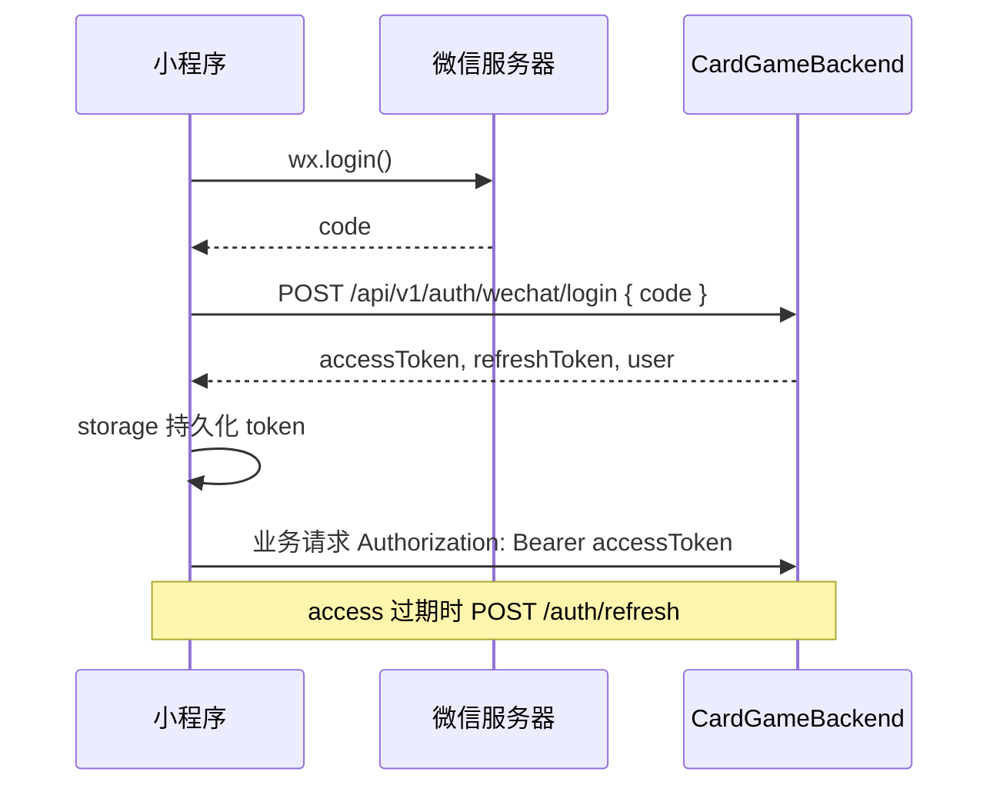

# cardgame-miniprogram 微信小程序设计文档

| 项目 | cardgame-miniprogram |
|------|----------------------|
| 版本 | v2.11 |
| 技术栈 | 微信原生小程序、TypeScript（推荐）、WXML/WXSS |
| 关联项目 | [CardGameBackend](../CardGameBackend/docs/DESIGN.md)（玩家 API + WebSocket）、[cardgame-frontend](../cardgame-frontend/docs/DESIGN.md)（运营后台，路径独立） |

**变更记录**

| 版本 | 日期 | 说明 |
|------|------|------|
| v1.0 | 2026-06-19 | 初版：基于 CardGameBackend 已实现玩家 API 与 WS 协议 |
| v1.1 | 2026-06-19 | 新增 §5.3 横版牌桌 UI 设计（1334×750、组件、阶段状态） |
| v1.2 | 2026-06-19 | **全页面横版**重设计：统一画布、布局壳、左侧导航、各页线框 |
| v1.3 | 2026-06-19 | 新增 §5.10 多玩法扩展预留（架构、大厅选玩法、麻将线框、接入清单） |
| v1.4 | 2026-06-19 | P0 闭环：匹配轮询、`STATE_SYNC`/`SETTLEMENT` 示例、出牌区规则、路由与结算数据流；§11 同步后端 |
| v1.5 | 2026-06-19 | 补 DTO/ACTION_RESULT 示例、大厅玩法条线框、回合计时、分享进房、设置/协议页、game query |
| v1.6 | 2026-06-19 | §2.3/§4.2.1/§7 视口动态适配（`page-meta` + `root-font-size`）；§9.3 真机局域网调试；Phase 1/2 工程状态同步 |
| v1.7 | 2026-06-19 | §10 Phase 1/2 缺口清单（代码审计同步）：未完成项、阶段边界、验收说明 |
| v1.8 | 2026-06-19 | 缺口专项设计：§5.0.4 top-bar、§4.5.3 冷启动分支、§3.4.6 room/match WS 接入 |
| v1.9 | 2026-06-18 | §10/§11.6 缺口关闭同步：top-bar、冷启动重进、封禁 modal、排行榜入口、lobby→match `navigateTo`；WS 缺口顺延 Phase 3 |
| v2.0 | 2026-06-18 | Phase 3 工程同步：`ws.ts`、牌桌组件、game/result、room WS；match 预连接；出牌区本机牌面/对手牌背优化 |
| v2.1 | 2026-06-18 | Phase 4 经济与活动：shop/wallet/sign/rank 完整 UI、recharge mock 充值 |
| v2.2 | 2026-06-18 | 文档全面同步 Phase 1–4 工程：§2 目录、§3.3 API 封装名、§4 路由表、§5.9/§5.12、§10 Phase 2 边界 |
| v2.3 | 2026-06-18 | §2 补 `types/`、合并 behaviors 重复项；§6.1 与 `types/api.ts`/`types/game.ts` 对齐；§8 60001 行为修正 |
| v2.4 | 2026-06-18 | Phase 5 玩家资料/战绩设计同步：§3.3.2、§5.5/§5.12.1、§6.1、§10/§11（对齐 CardGameBackend §11.12） |
| v2.5 | 2026-06-18 | Phase 5B 工程：`services/user.ts`、`record.ts`；profile/records/detail 对接；`request.put` |
| v2.6 | 2026-06-18 | §10/§11.6 与代码对齐：Phase 5A/5B 标 ✅；§3.3/§4/§5 同步已实现状态；Phase 5C 仍待办 |
| v2.7 | 2026-06-18 | Phase 6 人机模式设计：§3.3.4、§5.2/§5.4、§10/§11（对齐 CardGameBackend §11.13） |
| v2.8 | 2026-06-18 | Phase 6B 工程：pve-flow、lobby/room 人机 UI、room API 封装 |
| v2.9 | 2026-06-18 | §10 Phase 6C 运营后台标 ✅；§11.6 Phase 6 工程状态同步 |
| v2.11 | 2026-06-20 | 牌桌 polish：对手头像旁持久出牌/`seat-table`、本地倒计时超时代操作、结算 `ensureUserInfo`+`settlement-view`、手牌自适应；Flyway 整合为单一 V1 |
| v2.10 | 2026-06-20 | PVE 10004 根因与后端依赖同步：§3.3.4、§11.1/§11.6；`env.ts`/`pve-flow` loading 修复 |

---

## 1. 项目概述

### 1.1 定位

cardgame-miniprogram 是棋牌游戏平台的**玩家端微信小程序**，面向 C 端用户，提供登录、大厅、匹配/建房、实时斗地主、钱包商城、签到与段位等能力。

与运营后台 `cardgame-frontend` 严格分离：

| 维度 | 小程序 | 运营后台 |
|------|--------|----------|
| 用户 | 微信玩家 | 内部管理员 |
| API 前缀 | `/api/v1` | `/api/admin/v1` |
| 鉴权 | 玩家 JWT（`player-secret`） | 管理员 JWT（`admin-secret`） |
| 登录 | `wx.login` → code 换 token | 账号密码 |

### 1.2 核心职责

- 微信静默/授权登录，维护 access/refresh token
- 大厅：玩法入口、快速匹配、亲友房创建/加入
- 对局：WebSocket 实时同步；MVP 斗地主，多玩法通过 `GameRenderer` 扩展（§5.10）
- 经济：金币余额、商城购买、充值下单（支付对接 Phase 5+）
- 成长：每日签到、段位展示与排行榜
- 个人：昵称头像、战绩列表/详情（Phase 5B ✅）；改昵称 UI（Phase 5C 待做）

### 1.3 系统边界

```
┌─────────────────────────────────────────────────────────────┐
│                  cardgame-miniprogram                        │
│  ┌──────────┐  ┌──────────┐  ┌──────────┐  ┌──────────┐  │
│  │ 登录模块  │  │ 大厅/房间 │  │ 牌桌 WS  │  │ 钱包商城  │  │
│  └────┬─────┘  └────┬─────┘  └────┬─────┘  └────┬─────┘  │
│       └─────────────┴─────────────┴─────────────┘          │
│                         │ services/api + ws                 │
└─────────────────────────┼───────────────────────────────────┘
                          │ HTTPS / WSS
                          ▼
              ┌───────────────────────┐
              │    CardGameBackend     │
              │  /api/v1/**  +  /ws/game │
              └───────────┬───────────┘
                          │
              ┌───────────┴───────────┐
              │ MySQL      Redis(可选) │
              └───────────────────────┘
```

### 1.4 设计原则

| 原则 | 说明 |
|------|------|
| 服务端权威 | 洗牌、判定、结算均由后端 `DoudizhuEngine` 完成，小程序只渲染 `STATE_SYNC` |
| 薄客户端 | 复杂规则不重复实现，仅做合法操作 UI 引导与牌型选择辅助 |
| 断线可恢复 | 进入对局页自动 `RECONNECT`，本地缓存 `roomId` |
| 与后台解耦 | 不调用任何 `/api/admin/v1` 接口 |
| 渐进交付 | 先斗地主 MVP，麻将等玩法待后端 Phase 4 波次 4 |
| **全横屏** | **所有页面强制 landscape**，统一 1334×750 画布与视觉语言 |

---

## 2. 技术架构

### 2.1 技术选型

| 类别 | 选型 | 说明 |
|------|------|------|
| 运行时 | 微信原生小程序 | 官方支持 `wx.login`、支付、分享 |
| 语言 | TypeScript（推荐） | `miniprogram-api-typings`，与后台前端类型风格一致 |
| 样式 | WXSS + rpx | **全局横屏画布 1334×750 rpx** |
| 状态 | `App.globalData` + 页面 data | MVP 足够；复杂后可引入 `mobx-miniprogram` |
| 网络 | 封装 `request` + `connectSocket` | 统一 token、错误码、traceId |
| 构建 | 微信开发者工具 | 可选接入 npm + TS 编译 |

> **备选方案**：若需同时出 H5/App，可评估 Taro 3 + Vue3，API/WS 层与本设计保持一致，仅视图层替换。

### 2.2 建议目录结构

```
cardgame-miniprogram/
├── docs/
│   └── DESIGN.md              ← 本文档
├── miniprogram/
│   ├── app.ts                 # 全局生命周期、登录态
│   ├── app.json               # 页面路由、全局 pageOrientation、权限声明
│   ├── app.wxss
│   ├── config/
│   │   ├── env.ts             # API_BASE、WS_BASE（按环境切换）
│   │   └── game.ts            # 玩法常量、段位映射、turnTimeoutSec
│   ├── behaviors/
│   │   ├── viewport-adapt.ts  # page-meta、uiScale
│   │   └── sub-page-header.ts # 子页金币 + 默认返回
│   ├── services/
│   │   ├── request.ts         # HTTP 封装（Bearer、refresh、错误 toast）
│   │   ├── auth.ts            # wx.login + token 存储；ensureUserInfo（补全 user_info）
│   │   ├── ws.ts              # WebSocket 单例、心跳、BIND_ROOM、RECONNECT（Phase 3 ✅）
│   │   ├── room.ts            # create/join/detail/ready/start/leave + createPve/addBot（Phase 6）
│   │   ├── match.ts           # quick/status/cancel
│   │   ├── wallet.ts          # balance/transactions
│   │   ├── shop.ts            # listItems/buy
│   │   ├── order.ts           # 充值 createOrder/payCallback
│   │   ├── rank.ts            # me/leaderboard
│   │   ├── activity.ts        # dailySignStatus/dailySign
│   │   ├── user.ts            # me/updateProfile（Phase 5B ✅）
│   │   └── record.ts          # list/detail/replay（Phase 5B ✅；replay UI Phase 5C）
│   ├── types/
│   │   ├── api.ts             # REST DTO（UserInfo、ShopItem、RankLeaderboardItem 等）
│   │   └── game.ts            # WS 协议（WsMessage、DoudizhuStateSync、SettlementPayload）
│   ├── components/
│   │   ├── layout/
│   │   │   ├── landscape-shell/
│   │   │   ├── nav-dock/
│   │   │   ├── top-bar/
│   │   │   ├── gold-badge/
│   │   │   └── modal/
│   │   └── game/                  # 牌桌组件集（§5.6，Phase 3 ✅）
│   │       ├── game-hud/
│   │       ├── player-seat/
│   │       ├── play-zone/
│   │       ├── card-hand/
│   │       ├── card-item/
│   │       └── action-bar/
│   ├── pages/
│   │   ├── index/
│   │   ├── lobby/
│   │   ├── room/
│   │   ├── match/
│   │   ├── game/
│   │   ├── result/
│   │   ├── records/           # 战绩列表（shell + dock，Phase 5B ✅）
│   │   │   └── detail/
│   │   ├── rank/              # 排行榜（Phase 4 ✅）
│   │   ├── shop/              # 商城（Phase 4 ✅）
│   │   ├── recharge/          # mock 充值（Phase 4 ✅）
│   │   ├── wallet/            # 流水（Phase 4 ✅）
│   │   ├── sign/              # 签到（Phase 4 ✅）
│   │   ├── settings/          # 设置 stub
│   │   ├── legal/             # 协议 stub
│   │   └── profile/
│   ├── utils/
│   │   ├── storage.ts
│   │   ├── format.ts
│   │   ├── viewport.ts
│   │   ├── match-flow.ts
│   │   ├── pve-flow.ts        # 人机练习：createPve → bindRoom → game（Phase 6）
│   │   ├── room-seats.ts
│   │   ├── profile-summary.ts
│   │   ├── post-login-route.ts
│   │   ├── cards.ts
│   │   ├── doudizhu-view.ts
│   │   ├── play-zone.ts       # 中央出牌区：仅本机牌面
│   │   ├── seat-table.ts      # 对手头像旁出牌/不出持久展示
│   │   ├── settlement-view.ts # 结算页：匹配本人 settlement、胜负解析
│   │   ├── hand-layout.ts     # 手牌张数/安全区自适应叠牌
│   │   ├── record-label.ts
│   │   └── transaction-label.ts  # 流水/签到文案、buildSignCells、RECHARGE_TIERS
│   └── assets/
│       └── cards/             # 牌面图片（可选，亦可用 CSS+文字）
├── project.config.json
├── tsconfig.json
└── package.json               # devDependencies: typescript, typings
```

### 2.3 环境配置

| 环境 | REST Base | WebSocket | 说明 |
|------|-----------|-----------|------|
| 开发（模拟器） | `http://127.0.0.1:8080/api/v1` | `ws://127.0.0.1:8080/ws/game` | 开发者工具勾选「不校验合法域名」 |
| 开发（真机） | `http://{DEV_LAN_HOST}:8080/api/v1` | `ws://{DEV_LAN_HOST}:8080/ws/game` | 手机与电脑同一 WiFi；`DEV_LAN_HOST` 为本机局域网 IP |
| 体验/生产 | `https://api.example.com/api/v1` | `wss://api.example.com/ws/game` | 微信公众平台配置 **request / socket 合法域名** |

后端默认端口 **8080**（避开微信禁用 8000–8100）。生产需 HTTPS 反向代理。

**本地 `config/env.ts`（已实现 ✅）**：按运行环境自动切换 Host，模拟器走 `127.0.0.1`，真机走局域网 IP。

```typescript
/** 真机调试：Mac 终端 ipconfig getifaddr en0 查本机 IP */
const DEV_LAN_HOST = '192.168.1.5'
const DEV_PORT = 8080

function resolveDevHost(): string {
  try {
    const { platform } = wx.getSystemInfoSync()
    if (platform === 'devtools') return '127.0.0.1'
  } catch { /* tsc 等非运行时 */ }
  return DEV_LAN_HOST
}

export const ENV = {
  get apiBase() { return `http://${resolveDevHost()}:${DEV_PORT}/api/v1` },
  get wsBase() { return `ws://${resolveDevHost()}:${DEV_PORT}/ws/game` },
}
```

| 场景 | 典型现象 | 处理 |
|------|----------|------|
| 模拟器 OK、真机登录失败 | 真机访问 `127.0.0.1` 指向手机自身 | 更新 `DEV_LAN_HOST`，确认防火墙放行 8080 |
| 体验版/正式版 | HTTP 局域网不可用 | 必须 HTTPS + 合法域名或内网穿透（ngrok/frp） |

生产环境替换为固定 HTTPS 域名即可，无需 `resolveDevHost` 分支。

---

## 3. 与 CardGameBackend 对接

### 3.1 统一响应格式

与后端 §5.1 一致：

```json
{
  "code": 0,
  "message": "ok",
  "data": {},
  "traceId": "a1b2c3d4"
}
```

`code !== 0` 时展示 `message`；`10002` 触发重新登录。

### 3.2 认证流程



**本地开发**：后端 `cardgame.wechat.mock-enabled=true` 时，任意 code 可换 token。

**Token 存储**：

| Key | 内容 |
|-----|------|
| `access_token` | 短 token，2h（默认） |
| `refresh_token` | 长 token，7d |
| `user_info` | `{ id, nickname, avatar }` 缓存 |

**request 拦截逻辑**：

1. 自动附加 `Authorization`
2. 收到 `10002` → 尝试 refresh → 失败则跳转 `pages/index` 重新登录
3. 收到 `30002`（封禁）→ 弹窗并清 token

**并发 refresh**：多个请求同时 10002 时，`request.ts` 用单例 Promise 去重，仅发一次 `POST /auth/refresh`，其余请求排队重试。

### 3.3 REST API 清单

以下对照 **CardGameBackend 当前代码**（2026-06），标注实现状态。

#### 已实现 ✅

| 模块 | 方法 | 路径 | 封装 | 用途 |
|------|------|------|------|------|
| 认证 | POST | `/auth/wechat/login` | `auth.login()` | 登录 |
| 认证 | POST | `/auth/refresh` | `auth.refresh()` | 刷新 token |
| 房间 | POST | `/rooms` | `room.create()` | 创建亲友房 |
| 房间 | GET | `/rooms/{roomId}` | `room.detail()` | 房间详情/轮询 |
| 房间 | POST | `/rooms/{roomId}/join` | `room.join()` | 加入 |
| 房间 | POST | `/rooms/{roomId}/leave` | `room.leave()` | 离开 |
| 房间 | POST | `/rooms/{roomId}/ready` | `room.ready()` | 准备 |
| 房间 | POST | `/rooms/{roomId}/start` | `room.start()` | 房主开始 |
| 匹配 | POST | `/match/quick` | `match.quick()` | 快速/段位匹配 |
| 匹配 | DELETE | `/match/quick?gameType=` | `match.cancel()` | 取消匹配 |
| 匹配 | GET | `/match/status?gameType=` | `match.status()` | 匹配态轮询（§3.3.1） |
| 钱包 | GET | `/wallet` | `wallet.balance()` | 余额 |
| 钱包 | GET | `/wallet/transactions` | `wallet.transactions()` | 流水 |
| 商城 | GET | `/shop/items` | `shop.listItems()` | 商品列表 |
| 商城 | POST | `/shop/buy` | `shop.buy()` | 购买 |
| 订单 | POST | `/orders` | `order.createOrder()` | 创建充值单 |
| 订单 | POST | `/orders/{orderNo}/pay-callback` | `order.payCallback()` | dev mock 支付 |
| 活动 | GET | `/activities/daily-sign` | `activity.dailySignStatus()` | 签到状态 |
| 活动 | POST | `/activities/daily-sign` | `activity.dailySign()` | 执行签到 |
| 段位 | GET | `/rank/me?gameType=DOUDIZHU` | `rank.me()` | 我的段位 |
| 段位 | GET | `/rank/leaderboard` | `rank.leaderboard()` | 排行榜 |
| 用户 | GET | `/user/me` | `user.me()` | 资料 + 金币 + 段位摘要（Phase 5B ✅） |
| 用户 | PUT | `/user/profile` | `user.updateProfile()` | 修改昵称/头像（封装 ✅；settings UI Phase 5C） |
| 战绩 | GET | `/records` | `record.list()` | 本人历史战绩分页（Phase 5B ✅） |
| 战绩 | GET | `/records/{recordId}` | `record.detail()` | 对局详情（Phase 5B ✅） |
| 战绩 | GET | `/records/{recordId}/replay` | `record.replay()` | 回放 action 列表（API ✅；小程序 UI Phase 5C） |
| 人机 | POST | `/rooms/pve` | `room.createPve()` | **Phase 6**：一键练习，跳过 room |
| 人机 | POST | `/rooms/{roomId}/bots` | `room.addBot()` | **Phase 6**：亲友房添加电脑 |
| 人机 | DELETE | `/rooms/{roomId}/bots/{seat}` | `room.removeBot()` | **Phase 6**：移除电脑（开局前） |

#### 后端设计有、尚未实现 ⚠️（非 Phase 5/6 人机）

| 方法 | 路径 | 小程序影响 |
|------|------|------------|
| GET | `/lobby/games` | 大厅玩法列表（MVP 硬编码 DOUDIZHU） |
| GET | `/lobby/rooms` | 公开房间列表 |

**快速匹配请求体**（与后端 `QuickMatchRequest` 一致）：

```json
{
  "gameType": "DOUDIZHU",
  "mode": "MATCH"
}
```

`mode` 可选 `RANKED`（段位撮合，Phase 4 已实现）。

**创建房间请求体**：

```json
{
  "gameType": "DOUDIZHU",
  "mode": "FRIEND",
  "config": {
    "baseScore": 1,
    "enableGrab": true,
    "enableDouble": true
  }
}
```

**房间玩家资料** ✅：`RoomPlayerDto` 已含 `nickname`、`avatar`（§5.4.1 方案 A）。

#### 3.3.1 匹配状态轮询（P0）

**问题**：`POST /match/quick` 入队后再次 POST 会返回 `40005 MATCH_ALREADY_IN_QUEUE`，**不能**用重复 POST 轮询。

**推荐后端接口**（已实现 ✅）：

```
GET /api/v1/match/status?gameType=DOUDIZHU
```

响应复用 `QuickMatchResponse` 结构：

| status | 含义 | 小程序行为 |
|--------|------|------------|
| `NOT_IN_QUEUE` | 不在队列 | 返回大厅或提示已过期 |
| `WAITING` | 排队中 | 继续轮询，展示 queueSize / estimatedWaitSec |
| `MATCHED` | 已撮合 | `redirectTo` room，`roomId` 必填 |
| `CANCELLED` | 已取消 | 回大厅 |

**match 页轮询策略**（§5.3）：

1. 大厅首次 `POST /match/quick` → 若已 `MATCHED` 直接进 room；若 `WAITING` 进 match 页
2. match 页每 **3s** `GET /match/status`
3. 可选加速：match 页 **预连接 WS**（§3.4.1），后端后续支持向用户推送 `MATCH_FOUND` 时可去掉轮询

**QuickMatchResponse 字段**（POST 与 GET status 共用）：

| 字段 | 说明 |
|------|------|
| status | WAITING / MATCHED / CANCELLED / **NOT_IN_QUEUE** |
| roomId | MATCHED 时有值 |
| queueSize | 当前队列人数 |
| requiredPlayers | 所需人数（斗地主 3） |
| matchMode | MATCH / RANKED |
| matchTier | RANKED 时段位桶 |
| estimatedWaitSec | RANKED 预估等待秒数 |

#### 3.3.3 玩家资料与战绩（Phase 5A/5B 已实现 ✅）

对齐 [CardGameBackend §11.12](../CardGameBackend/docs/DESIGN.md#1112-phase-5-玩家资料与战绩)。

**设计决策（已确认）**

| 项 | 决策 |
|----|------|
| `/user/me` | **含** `rankSummary`（Query `gameType`，默认 `DOUDIZHU`） |
| 无权 recordId | 统一 **404 文案「对局不存在」** |
| 历史对局 seat | 新对局 `result_json.participants` 有 seat；旧对局 fallback，前端 seat 显示 `—` |
| replay | **后端 MVP 一并交付 ✅**；小程序回放 UI 为 **Phase 5C** |

**`GET /user/me` 响应（节选）**

```json
{
  "id": 10001,
  "nickname": "玩家A",
  "avatar": "https://...",
  "gold": 12345,
  "createdAt": "2026-06-01T10:00:00",
  "rankSummary": {
    "gameType": "DOUDIZHU",
    "tier": "GOLD",
    "points": 156,
    "wins": 45,
    "losses": 12
  }
}
```

**`GET /records` Query**：`page`、`pageSize`（max 50）、`gameType`、`mode`（FRIEND/MATCH/RANKED/**PVE**）。

**列表项字段**：`recordId`、`gameType`、`mode`、`endAt`、`durationSec`、`myGoldDelta`、`isWin`、`multiplier`。

**详情**：`participants[]`（userId、nickname、seat、goldDelta、isLandlord）；`mySettlement` 供顶栏摘要。

**小程序封装**

```typescript
// services/user.ts
user.me(gameType?: string): Promise<PlayerMe>
user.updateProfile(body: { nickname?: string; avatar?: string }): Promise<UserInfo>

// services/record.ts
record.list(params?: { page?, pageSize?, gameType?, mode? }): Promise<PageResult<PlayerRecordListItem>>
record.detail(recordId: string): Promise<PlayerRecordDetail>
record.replay(recordId: string): Promise<GameActionLog[]>
```

**页面对接**

| 页面 | 状态 | 说明 |
|------|------|------|
| `profile` | ✅ | `onShow` → `loadProfileSummary()` 优先 `user.me()`，失败 fallback |
| `records` | ✅ | 列表 + gameType 筛选 + 空态 |
| `records/detail` | ✅ | `record.detail(recordId)`；seat 缺失显示 `—` |
| `settings` | ⚠️ stub | 改昵称 → `user.updateProfile()`（**Phase 5C**） |
| replay UI | ❌ | `record.replay()` 简易回放页（**Phase 5C**） |

#### 3.3.4 人机模式（Phase 6）✅

对齐 [CardGameBackend §11.13](../CardGameBackend/docs/DESIGN.md#1113-phase-6-人机模式)。**后端须已执行 Flyway V1**（含系统账号 `900000` 与 Bot `900001–900003`，见 [§11.13.8.1](../CardGameBackend/docs/DESIGN.md#111381-已知问题与修复v19)）；曾跑旧版 V2–V4 的环境需先执行 `CardGameBackend/docs/reset-db.sql` 删库重建，否则 `POST /rooms/pve` 可能返回 **10004**。

**已确认决策**

| 项 | 决策 |
|----|------|
| 入口 | 大厅 **人机练习** + 亲友房 **添加电脑** |
| PVE 路由 | **跳过 room**，`POST /rooms/pve` 返回 `PLAYING` 后直进 `game` |
| 金币 | 仅真人变化；结算页只展示本人 `goldDelta` |
| AI | 默认 `botDifficulty=EASY`；后续 NORMAL/HARD 由 `config` / 运营配置扩展 |

**`POST /rooms/pve` 请求**

```json
{
  "gameType": "DOUDIZHU",
  "config": { "baseScore": 1, "botDifficulty": "EASY" }
}
```

**响应**：`RoomDetailResponse`，`status=PLAYING`，`mode=PVE`，`players[].isRobot`。

**错误码**

| code | 场景 |
|------|------|
| `40007` | `game.pve.enabled=false` |
| `10004` | 数据库缺系统账号 `900000` 或曾跑旧迁移未删库重建；见后端 §11.13.8.1、`reset-db.sql` |

**客户端流程（PVE）**

```typescript
// utils/pve-flow.ts（新建）
async function enterPveGame(gameType: GameType) {
  const detail = await room.createPve({ gameType, config: { botDifficulty: 'EASY' } })
  storage.setLastRoomId(detail.roomId)
  await ws.ensureConnected()
  ws.bindRoom(detail.roomId)
  wx.redirectTo({ url: `/pages/game/game?roomId=${detail.roomId}&gameType=${gameType}` })
}
```

**亲友房添加 Bot**

- 房主在 room 页点击「添加电脑」→ `room.addBot(roomId, { count: 1 })`
- 空位显示 Bot 昵称 + 「电脑」角标；Bot 自动 `ready=true`
- 满 3 人后真人房主点「开始」→ 现有 `room.start` → `redirectTo` game

**`services/room.ts` 扩展**

```typescript
room.createPve(body: CreatePveRequest): Promise<RoomDetail>
room.addBot(roomId: string, body?: { count?: number }): Promise<RoomDetail>
room.removeBot(roomId: string, seat: number): Promise<RoomDetail>
```

**类型扩展（`types/api.ts`）**

```typescript
interface RoomPlayer {
  // ...existing
  isRobot?: boolean
}
type RoomMode = 'FRIEND' | 'MATCH' | 'RANKED' | 'PVE'
```

**页面对接**

| 页面 | 改造 |
|------|------|
| `lobby` | 新增卡片「🤖 人机练习」→ `enterPveGame` |
| `room` | 房主显示「添加电脑 / 移除电脑」；座位 UI 展示 `isRobot` |
| `game` | 对手 `isRobot` 时昵称旁「电脑」标签（来自进房前 `players` 缓存或 `STATE_SYNC.robotSeats`） |
| `result` / `records` | `modeLabel` 增加 `PVE` →「练习」 |

#### Phase 5+（不在当前后端范围）

- 微信支付真实 `wx.requestPayment` 对接（当前仅 mock `pay-callback`）

#### Phase 4+（后端规划中，小程序 UI 预留见 §5.10）

- 麻将 `MAHJONG` 玩法（后端 [CardGameBackend §11.6](../CardGameBackend/docs/DESIGN.md)）
- `GET /lobby/games` 玩法列表（MVP 可硬编码，上线前对接）

### 3.4 WebSocket 协议

**连接**：`wss://{host}/ws/game?token={accessToken}`

握手阶段后端 `GameWebSocketHandshakeInterceptor` 校验玩家 JWT，无效则拒绝连接。

#### 客户端 → 服务端

| type | 说明 | payload |
|------|------|---------|
| `PING` | 心跳（建议 30s） | 无 |
| `ACTION` | 游戏操作 | `{ action, cards? }` |
| `RECONNECT` | 断线重连 | 需带 `roomId` |

```json
{
  "type": "ACTION",
  "roomId": "R20250618143022001",
  "seq": 15,
  "payload": {
    "action": "PLAY_CARDS",
    "cards": ["3S", "3H", "3D"]
  }
}
```

#### 服务端 → 客户端

| type | 说明 | 小程序处理 |
|------|------|------------|
| `STATE_SYNC` | 状态同步 | 更新牌桌 store |
| `ACTION_RESULT` | 操作结果 | 失败 toast |
| `ROOM_EVENT` | 进出、准备、匹配 | room 页刷新；payload.event 见下表 |
| `SETTLEMENT` | 结算 | 写入 globalData → 跳转 result（§5.7.1） |
| `AUTO_PLAY` | 托管出牌 | ⚠️ 后端尚未实现；预留顶栏横幅 |
| `ERROR` | 错误 | toast |
| `PONG` | 心跳响应 | — |

**ROOM_EVENT payload.event**

| event | 说明 | 页面处理 |
|-------|------|----------|
| `PLAYER_JOIN` | 有人加入 | room 刷新或局部更新 |
| `PLAYER_LEAVE` | 有人离开 | 同上 |
| `PLAYER_READY` | 准备状态变化 | 更新 ready 图标 |
| `MATCH_FOUND` | 匹配房创建 | ⚠️ 当前仅广播至已 bindRoom 的连接；match 页仍依赖 GET status |

#### 3.4.1 WebSocket 连接生命周期

| 阶段 | 页面 | 行为 |
|------|------|------|
| 登录后 | App.onLaunch | **不**自动连接（省资源） |
| 进入匹配 | match | `ws.connect()` 单例；可选监听 MATCH_FOUND |
| 进入房间 | room | 保持连接；监听 ROOM_EVENT |
| 进入牌桌 | game | `ws.reconnect(roomId)` → 收 STATE_SYNC |
| 离开对局 | result / lobby | 保持连接或 `ws.close()`（MVP 可保持至回大厅） |
| 冷启动 | index | 若有 `last_room_id` 弹窗 → 确认后 connect + RECONNECT（§4.5.3，**已实现 ✅**） |

#### 3.4.2 STATE_SYNC payload 示例（斗地主）

服务端按用户裁剪可见信息；**`lastPlay` 可含 `cards` 牌面**（v1.12 起 `getVisibleState` 保留，供对手座位 `seat-table` 展示）；中央 `play-zone` 仍仅展示本机出牌。

```json
{
  "type": "STATE_SYNC",
  "roomId": "R20250618143022001",
  "seq": 12,
  "payload": {
    "recordId": "GR20250618143022001",
    "roomId": "R20250618143022001",
    "gameType": "DOUDIZHU",
    "phase": "PLAYING",
    "currentSeat": 1,
    "landlordSeat": 0,
    "multiplier": 1,
    "actionSeq": 12,
    "mySeat": 2,
    "myHand": ["3S", "3H", "3D", "4S", "5S"],
    "lastPlay": {
      "seat": 0,
      "cards": ["3S", "3H", "3D"],
      "cardCount": 3
    },
    "handCounts": {
      "0": 12,
      "1": 17,
      "2": 5
    }
  }
}
```

| 字段 | UI 绑定 |
|------|---------|
| `handCounts` | key 为 **字符串** seat（`"0"`…） |
| `lastPlay.cardCount` | 无 `cards` 时对手座位展示牌背 × N |
| `lastPlay.cards` | 对手座位展示牌面（`seat-table`）；中央 `play-zone` 仅本机 |
| `lastPlay` 无 cards 仅有 `cardCount` | 对手座位展示牌背 × N |
| `multiplier` | HUD 底分倍数展示 |

#### 3.4.3 SETTLEMENT payload 示例

```json
{
  "type": "SETTLEMENT",
  "roomId": "R20250618143022001",
  "payload": {
    "settlements": [
      { "userId": 10001, "seat": 0, "scoreDelta": 120, "goldDelta": 120, "multiplier": 1 },
      { "userId": 10002, "seat": 1, "scoreDelta": -60, "goldDelta": -60, "multiplier": 1 },
      { "userId": 10003, "seat": 2, "scoreDelta": -60, "goldDelta": -60, "multiplier": 1 }
    ],
    "result": {
      "winnerSeat": 0,
      "landlordSeat": 0,
      "multiplier": 1
    }
  }
}
```

小程序解析（`utils/settlement-view.ts` + `services/auth.ensureUserInfo`）：

```typescript
const userInfo = await ensureUserInfo(gameType) // 有 token 但缺 user_info 时从 /user/me 补全
const me = findMySettlement(settlements, userInfo?.id)
const isWin = resolveIsWin(me, result.winnerSeat) // 优先 goldDelta > 0，回退 winnerSeat
const goldDelta = me?.goldDelta ?? 0
```

RANKED 模式 result 页额外请求 `GET /rank/me?gameType=DOUDIZHU` 展示段位变化。

#### 3.4.4 ACTION_RESULT payload 示例

操作失败或成功后广播（全员可见）：

```json
{
  "type": "ACTION_RESULT",
  "roomId": "R20250618143022001",
  "payload": {
    "success": true,
    "message": "ok",
    "userId": 10002
  }
}
```

| 字段 | 小程序处理 |
|------|------------|
| `success: false` | `wx.showToast(message)`，以随后 `STATE_SYNC` 为准 |
| `success: true` | 记录 `userId`；在紧随其后的 `STATE_SYNC` 中由 `seat-table` 更新该对手头像旁展示（出牌 / 不出 / 不叫），直至该座位再次行动 |

#### 3.4.5 已实现 REST 响应示例（节选）

**GET `/wallet`**

```json
{ "userId": 10001, "gold": 12345 }
```

**GET `/wallet/transactions?page=1&pageSize=20`**

```json
{
  "list": [
    {
      "id": 1,
      "userId": 10001,
      "type": "GAME_WIN",
      "amount": 120,
      "balanceAfter": 12345,
      "refType": "GAME_RECORD",
      "refId": "GR2026…",
      "remark": null,
      "createdAt": "2026-06-19T14:30:00"
    }
  ],
  "total": 42,
  "page": 1,
  "pageSize": 20
}
```

**GET `/shop/items`**

```json
[
  {
    "id": 1,
    "name": "1000金币礼包",
    "price": 1000,
    "currency": "GOLD",
    "payload": { "gold": 1000 },
    "status": 1,
    "statusLabel": "上架",
    "sortOrder": 1
  }
]
```

**POST `/shop/buy`**

```json
{
  "itemId": 1,
  "quantity": 1,
  "totalCost": 1000,
  "balanceAfter": 11345,
  "grantedGold": 1000
}
```

**GET `/activities/daily-sign`**

```json
{
  "signedToday": false,
  "streakDay": 3,
  "rewardGold": 200,
  "nextRewardGold": 200,
  "rewardPreview": [100, 100, 200, 200, 300, 300, 500]
}
```

#### 斗地主 action 与引擎对齐

后端 `DoudizhuEngine` 实际接受的 action（**以代码为准**）：

| 阶段 phase | action | 说明 |
|------------|--------|------|
| `BIDDING` | `CALL_LANDLORD` | 叫地主 |
| `BIDDING` | `PASS` | 不叫/过 |
| `PLAYING` | `PLAY_CARDS` | 出牌，payload.cards 必填 |
| `PLAYING` | `PASS` | 过牌 |

> 房间 config 中 `enableGrab` / `enableDouble` 后端 **尚未实现**，MVP UI 不展示抢地主/加倍按钮。

> 运营回放协议中的 `BID`/`LANDLORD` 为日志标准化命名，**WS 发送请用上表 action 名**。

#### seq 与重连

- 客户端维护单调递增 `seq`，每次 `ACTION` +1
- 进入 `pages/game` 时：建立 WS → 发送 `{ type: "RECONNECT", roomId }` → 等待 `STATE_SYNC`
- 本地 `storage` 保存 `last_room_id`，冷启动可提示是否回到对局

#### WS 客户端职责（`services/ws.ts`）

```typescript
// 伪代码结构
class GameSocket {
  connect(token: string): void
  bindRoom(roomId: string): void
  sendAction(action: string, cards?: string[]): void
  reconnect(roomId: string): void
  startHeartbeat(): void          // 30s PING
  onMessage(handler): void
  close(): void
}
```

#### 3.4.6 ROOM_EVENT 与 room/match 页 WS 接入（**已实现 ✅** v2.0）

> room 页 **WS + REST 2s 兜底**；match 页 **预连接** + status 轮询；game 页 `RECONNECT` 接管对局。

**消息 envelope**（与 `STATE_SYNC` 相同外层结构）：

```json
{
  "type": "ROOM_EVENT",
  "roomId": "R20250618143022001",
  "payload": {
    "event": "PLAYER_READY",
    "userId": 10002,
    "ready": true
  }
}
```

**payload.event 与后端实现（CardGameBackend `RoomService`）**

| event | payload 字段 | room 页处理 |
|-------|-------------|-------------|
| `PLAYER_JOIN` | `userId` | `refreshRoom()` 或 merge 玩家列表 |
| `PLAYER_LEAVE` | `userId` | 同上 |
| `PLAYER_READY` | `userId`, `ready` | 更新对应座位 ready 图标 |
| `PLAYER_KICK` | `userId`, `reason?` | toast + refresh |
| `MATCH_FOUND` | `players`（数组） | match 页监听（**需 bindRoom 才可达**）；当前仍主要依赖 GET status；匹配成功时主动 `bindRoom` |

**room 页接入流程**

```
onLoad(roomId)
  → ws.ensureConnected()
  → ws.bindRoom(roomId)          // 见下方「bind 前置条件」
  → ws.on('ROOM_EVENT', handler)
  → handler: refreshRoom(true)   // 立即拉 REST 详情，保证 nickname/avatar 完整
  → 保留 REST 轮询作兜底（见策略表）
onUnload
  → ws.off('ROOM_EVENT', handler)
  → 不 close（便于后续进 game）
```

**match 页预连接（已实现 ✅）**

```
onLoad
  → ws.ensureConnected()         // 仅 register，不 bindRoom
  → ws.on('ROOM_EVENT')          // MATCH_FOUND 加速跳转（需已 bind，通常靠 status 成功后 bindRoom）
  → GET /match/status 3s 轮询
  → MATCHED：ws.bindRoom(roomId) → redirectTo room
onUnload
  → 若未进 room/game：ws.close()
```

**工程路径**：`pages/match/match.ts`、`services/ws.ts`

**轮询 vs WS 策略**

| 模式 | REST 轮询 | WS ROOM_EVENT | 适用 |
|------|-----------|---------------|------|
| room 当前工程 | 2s 兜底 | 有事件立即 refresh | **v2.0 已交付** |
| match 当前工程 | 3s status | 预连接 + 可选 MATCH_FOUND | **v2.0 已交付** |
| 纯 WS | 关闭 | 全量依赖 | 需断线重连完善（P2） |

**bind 前置条件（⚠️ 后端协同）**

`ROOM_EVENT` 仅广播给 `WebSocketSessionManager.userIdsInRoom(roomId)`。REST `join` **不会**自动 bind，当前 `RECONNECT` 在房间 `WAITING`（无 GameContext）时会失败。

| 方案 | 说明 |
|------|------|
| A（推荐） | 后端 `BIND_ROOM { roomId }` — **已实现 ✅**（CardGameBackend + 小程序 `ws.bindRoom`） |
| B | room 页 `onLoad` 调 REST join 后，后端对**已在线** WS 会话自动 bind |
| C（过渡） | 维持 REST 2s 轮询，WS 仅 game 页 RECONNECT 时使用 — **已由 A 替代** |

**room 页 handler 伪代码**

```typescript
function onRoomEvent(msg: WsMessage) {
  if (msg.type !== 'ROOM_EVENT' || msg.roomId !== currentRoomId) return
  const { event } = msg.payload
  if (event === 'PLAYER_READY') {
    // 可选：局部 patch seats；MVP 直接 refreshRoom(true)
  }
  refreshRoom(true)
}
```

**与 Phase 3 边界**：room 页收到 `STATE_SYNC`（开局后）应 `redirectTo` game，由 game 页接管 WS；room 页 unregister handler。

---

## 4. 页面与路由设计（全横屏）

### 4.1 全局横屏配置

**`app.json` 根级强制横屏**（所有页面默认 landscape，无需逐页切换）：

```json
{
  "pages": [
    "pages/index/index",
    "pages/lobby/lobby",
    "pages/records/records",
    "pages/records/detail",
    "pages/profile/profile",
    "pages/match/match",
    "pages/room/room",
    "pages/game/game",
    "pages/result/result",
    "pages/rank/rank",
    "pages/shop/shop",
    "pages/recharge/recharge",
    "pages/wallet/wallet",
    "pages/sign/sign",
    "pages/settings/settings",
    "pages/legal/legal"
  ],
  "window": {
    "pageOrientation": "landscape",
    "navigationStyle": "custom",
    "backgroundColor": "#0F1923"
  }
}
```

> 不使用微信原生 **tabBar**（横屏下底部 tab 体验差），改用手写 **左侧导航 dock**（`nav-dock` 组件）。

**单页 override 示例**（均为横屏，仅差异在是否显示 dock）：

| 页面 | `navigationStyle` | 左侧 dock | `disableScroll` | `page-meta` |
|------|---------------------|-----------|-----------------|-------------|
| index / game / match / room / result | custom | 隐藏 | true | ✅ 必须 |
| lobby / records / profile | custom | 显示 | true | ✅ 必须 |
| rank / shop / wallet / sign / recharge / records/detail / settings / legal | custom | 隐藏 + 顶栏返回 | true | ✅ 必须 |

> 所有页面首行 `<page-meta root-font-size="{{rootFontSize}}" page-style="{{viewportPageStyle}}" />`，配合 `behaviors/viewport-adapt`（§4.2.1）。

### 4.2 统一布局壳（landscape-shell）

除全屏流程页（启动、匹配、牌桌、结算）外，业务页共用 **左导航 + 右内容** 两栏布局：

```
1334 × 750 rpx
┌──────┬─────────────────────────────────────────────────────────────┐
│ NAV  │  TOP-BAR（可选）：标题 · 金币 · 段位              [返回]     │ 64rpx
│ DOCK ├─────────────────────────────────────────────────────────────┤
│ 72   │                                                             │
│      │                    MAIN CONTENT                             │ 686rpx
│  🏠  │                                                             │
│  📋  │                                                             │
│  👤  │                                                             │
└──────┴─────────────────────────────────────────────────────────────┘
```

| 区域 | 宽度 | 说明 |
|------|------|------|
| `nav-dock` | 72rpx（工程约 64rpx，随 uiScale 缩放） | 图标：大厅 / 战绩 / 我的；当前项高亮条 |
| `main` | 1262rpx | 各页面内容；内边距 24rpx |

**全屏页**（无 dock）：内容区占满 1334rpx —— `index`、`match`、`room`、`game`、`result`。

#### 4.2.1 视口动态适配（viewport-adapt）✅

横屏真机上 **750rpx 恒等于屏幕宽度**（长边），但**可视高度**因机型差异大（约 320~580rpx，换算后远小于设计画布 750rpx）。若写死大尺寸或滥用 `100vw`/`100vh`，会出现整页被缩放、四边裁切。

**策略**：运行时按视口计算 `uiScale`，通过每页首节点 **`page-meta`** 动态设置 `root-font-size`，使全页 rpx 等比缩放。

```
uiScale = clamp( heightRpx / 720 , 0.58 , 1.0 )
heightRpx = 750 × windowHeight / windowWidth
rootFontSize = (windowWidth / 750) × uiScale   // px
```

| 模块 | 路径 | 职责 |
|------|------|------|
| 度量计算 | `utils/viewport.ts` | `buildViewportMeta()`：uiScale、tier、机型微调 |
| 页面 Behavior | `behaviors/viewport-adapt.ts` | `attached`/`show` 刷新；写入 `rootFontSize`、`viewportPageStyle` |
| 全局监听 | `app.ts` | `wx.onWindowResize` → 当前页 `refreshViewport()` |
| 调试 | `App.globalData.viewport` | vConsole：`getApp().globalData.viewport.metrics` |

**每页 WXML 首行（必须）**：

```xml
<page-meta root-font-size="{{rootFontSize}}" page-style="{{viewportPageStyle}}" />
```

`page-style` 注入 CSS 变量：`--ui-scale`、`--vh-rpx`、`--gap-md`、`--gap-sm`、`--panel-radius`。

**uiScale 分档（tier）**

| tier | uiScale | 典型机型 |
|------|---------|----------|
| xl | ≥0.95 | iPad 横屏、大屏 Android |
| lg | ≥0.82 | 常规 iPhone 横屏 |
| md | ≥0.72 | 标准屏 |
| sm | ≥0.64 | 窄屏 |
| xs | <0.64 | iPhone SE 等（另有 `modelScaleAdjust` 微调） |

**布局硬性规范**

| 规则 | 说明 |
|------|------|
| 禁止 `100vw` / `100vh` | 横屏真机会按竖屏视口计算，导致整页缩小；用 `width/height: 100%` |
| `page` 设 `overflow: hidden` | 防止页面级滚动条 |
| 安全区 | `landscape-shell` 外层 `padding: env(safe-area-inset-*)`；子组件不再重复 inset |
| 样式书写 | 按设计稿 rpx 编写；**缩放交给 `root-font-size`**，勿为每种机型写死多套尺寸 |
| 内容溢出 | shell 内 `main` 设 `min-height: 0`；必要时 `overflow-y: auto`（如 lobby） |

新增机型特例：在 `viewport.ts` → `modelScaleAdjust()` 追加白名单。

| 页面 | 路径 | 布局模式 | 主要 API |
|------|------|----------|----------|
| 启动 | `index` | 全屏 | `auth.login` |
| 大厅 | `lobby` | shell + dock | 匹配、建房、**人机练习**（Phase 6） |
| 战绩 | `records` | shell + dock | `/records`（**Phase 5B ✅**） |
| 我的 | `profile` | shell + dock | `/user/me`（**Phase 5B ✅**；fallback `/wallet` + `/rank/me`） |
| 匹配中 | `match` | 全屏 | `/match/quick`、`/match/status` |
| 亲友房 | `room` | 全屏 | `/rooms/*` |
| 牌桌 | `game` | 全屏 | WebSocket；query：`roomId`（必填）、`gameType`（默认 DOUDIZHU） |
| 结算 | `result` | 全屏 | SETTLEMENT |
| 排行榜 | `rank` | 全屏 + 返回 | `/rank/me`、`/rank/leaderboard`（**Phase 4 ✅**） |
| 商城 | `shop` | 全屏 + 返回 | `/shop/*`；顶栏入口 **充值**（**Phase 4 ✅**） |
| 充值 | `recharge` | 全屏 + 返回 | `/orders` mock（**Phase 4 ✅**） |
| 流水 | `wallet` | 全屏 + 返回 | `/wallet/transactions`（**Phase 4 ✅**） |
| 签到 | `sign` | 全屏 + 返回 | `/activities/daily-sign`（**Phase 4 ✅**） |
| 战绩详情 | `records/detail` | 全屏 + 返回 | `/records/{recordId}`（**Phase 5B ✅**） |
| 设置 | `settings` | 全屏 + 返回 | 本地 + 退出登录 |
| 协议 | `legal` | 全屏 + 返回 | 静态文案；query：`type=user\|privacy` |

### 4.4 核心用户流程

（所有跳转页面均为横屏，无方向切换。）

```
登录(index) → 大厅(lobby)
  ├─ 快速/排位匹配 → match → room → game → result → lobby
  ├─ 创建/加入房间 → room → game → result → lobby
  ├─ 分享链接带 roomId → index 登录后进 room（§4.6）
  └─ dock 切换 → records / profile → 子页(rank/shop/wallet/sign/recharge/settings/legal)
```

### 4.5 路由与导航策略

#### 4.5.1 nav-dock 三页切换

dock 仅 3 项（大厅 / 战绩 / 我的），使用 **`wx.reLaunch`** 切换，避免页面栈堆积：

| 当前 | 目标 | 方法 |
|------|------|------|
| 任意 dock 页 | 另一 dock 页 | `reLaunch({ url })` |
| dock 页 | 子页 rank/shop… | `navigateTo` |
| 子页 | 上一页 | `navigateBack` |

`nav-dock` 组件内部维护 `currentTab`，点击非当前项时 `reLaunch`。

#### 4.5.2 对局流程页

| 跳转 | 方法 | 原因 |
|------|------|------|
| lobby → match | `navigateTo` | 可取消返回 |
| match → room | `redirectTo` | 匹配成功不可回 match |
| room → game | `redirectTo` | 开局后不可回 room |
| game → result | `redirectTo` | 结算独占 |
| result → lobby / match | `reLaunch` | 清空对局栈 |

#### 4.5.3 冷启动重进对局（专项设计，**已实现 ✅**）

**工程实现**：`utils/post-login-route.ts`（`resolvePostLoginRoute` / `showRejoinModal` / `navigatePostLoginRoute`）；`pages/index/index.ts` 登录成功后调用；`utils/storage.ts` 提供 `clearLastRoomId`（离开 room 时清除）。

**与 §4.6 分享进房的优先级**

```
index.onLoad(options)
  ① options.roomId → storage.pending_room_invite（分享链接，最高优先级）
  ② （无分享 roomId）→ 登录成功后检查 storage.last_room_id
```

| 场景 | 条件 | 行为 |
|------|------|------|
| 分享进房 | `pending_room_invite` 非空 | §4.6：`POST join` → `redirectTo` room；**不走**重进 modal |
| 重进对局 | 无 pending，有 `last_room_id` | `GET /rooms/{id}` 见下表 |
| 默认 | 以上皆否 | `redirectTo` lobby |

**`last_room_id` 检查逻辑**（登录成功后、`afterLogin` 内）

```typescript
async function resolvePostLoginRoute(): Promise<'room' | 'game' | 'lobby'> {
  const invite = storage.getPendingRoomInvite()
  if (invite) { /* §4.6 已有 */ return 'room' }

  const lastRoomId = storage.getLastRoomId()
  if (!lastRoomId) return 'lobby'

  try {
    const detail = await room.detail(lastRoomId)
    if (detail.status === 'PLAYING') {
      const ok = await showRejoinModal(lastRoomId, detail.gameType)
      return ok ? 'game' : 'lobby'
    }
    if (detail.status === 'WAITING') {
      // 用户仍在等待房：静默回 room，无需 modal
      return 'room'
    }
    // FINISHED / DISBANDED / 404
    storage.clearLastRoomId()
    return 'lobby'
  } catch {
    storage.clearLastRoomId()
    return 'lobby'
  }
}
```

**重进 modal**（§5.11「进行中的对局」）

| 项 | 值 |
|----|-----|
| 标题 | 进行中的对局 |
| 内容 | 房间 `{roomId}` · {gameType 中文} · 是否回到牌桌？ |
| 取消 | 清 `last_room_id`（可选）→ lobby |
| 确认 | `ws.ensureConnected()` → `ws.reconnect(roomId)` → **`redirectTo`** `game?roomId=&gameType=` |

> 使用 `redirectTo` 而非 `reLaunch`，避免清掉 dock 栈；若从 index 冷启动无栈，效果等同进入 game。

**错误处理**

| 情况 | 处理 |
|------|------|
| `GET /rooms/{id}` 404 | 清 `last_room_id`，进 lobby |
| 确认后 RECONNECT 失败 | toast「对局已结束」→ 清 id → lobby |
| 登录 30002 封禁 | §5.11 modal，**优先于**上述路由 |

**storage 写入时机**：`room.onLoad`、`create/join` 成功时 `setLastRoomId`；`leave`、对局结算回大厅后可 `clearLastRoomId`（Phase 3 result 页补充）。

### 4.6 分享进房与 index 参数

**分享 path**（§5.4.2）：`/pages/index/index?roomId=R2026…`

```
index.onLoad(options)
  → 若 options.roomId：storage.set('pending_room_invite', roomId)
  → wx.login → auth.login 成功
  → 若 pending_room_invite 存在：
       POST /rooms/{id}/join → redirectTo room
     否则 redirectTo lobby
```

join 失败（满员/已开局）时 toast 并进入 lobby。

### 4.7 牌桌页 query

| 参数 | 必填 | 默认 | 说明 |
|------|------|------|------|
| `roomId` | 是 | — | 来自 room 页或冷启动重进 |
| `gameType` | 否 | `DOUDIZHU` | 选择 `GameRenderer`（§5.10） |

---

## 5. 全页面横版 UI 设计

> **统一画布**：1334 × 750 rpx（宽 × 高）。下文线框均按此尺寸。

### 5.0 全局视觉规范

#### 5.0.1 设计语言

棋牌横屏客户端风格：**深色背景 + 绿色牌桌点缀 + 金色强调**。

| Token | 值 | 用途 |
|-------|-----|------|
| `--bg-app` | `#0F1923` | 全局背景 |
| `--bg-panel` | `#1A2634` | 卡片/面板 |
| `--bg-panel-hover` | `#243447` | 按钮 hover |
| `--table-green` | `#1B5E3B` | 牌桌、品牌强调 |
| `--gold` | `#F5C842` | 金币、地主、VIP |
| `--accent` | `#FF9800` | 主按钮 |
| `--text-1` | `#FFFFFF` | 主文字 |
| `--text-2` | `rgba(255,255,255,0.72)` | 次要文字 |
| `--text-3` | `rgba(255,255,255,0.45)` | 占位 |
| `--danger` | `#EF5350` | 失败、退出 |
| `--success` | `#66BB6A` | 胜利、成功 |
| `--border` | `rgba(255,255,255,0.08)` | 分割线 |

#### 5.0.2 字体与圆角

| 用途 | 字号 | 圆角 |
|------|------|------|
| 大标题 | 36rpx | 面板 16rpx |
| 卡片标题 | 28rpx | 按钮 12rpx |
| 正文 | 24rpx | 输入框 8rpx |
| 辅助 | 20rpx | 头像 50% |
| 数字（金币） | 32rpx tabular | — |

#### 5.0.3 通用组件

| 组件 | 路径 | 说明 |
|------|------|------|
| `landscape-shell` | `components/layout/landscape-shell` | 左 dock + 内容槽 |
| `nav-dock` | `components/layout/nav-dock` | 72rpx 竖向导航 |
| `top-bar` | `components/layout/top-bar` | 标题、返回、右侧金币 |
| `gold-badge` | `components/layout/gold-badge` | 💰 12,345 |
| `rank-badge` | `components/layout/rank-badge` | 段位 Tag |
| `panel` | `components/layout/panel` | 圆角深色卡片 |
| `btn-primary` / `btn-ghost` | 全局 class | 主/次按钮 |

#### 5.0.4 top-bar 组件规格（**已实现 ✅**）

用于 **全屏子页**（rank / shop / wallet / sign / settings / legal / records/detail），与 `landscape-shell` 互斥。子页共用 `behaviors/sub-page-header.ts`（金币拉取、默认返回 lobby）。

**线框**（高 **64rpx**，随 §4.2.1 uiScale 缩放）

```
┌──────────────────────────────────────────────────────────────────────────┐
│ [← 返回]   页面标题                              [slot:right]  💰 12,345 │
└──────────────────────────────────────────────────────────────────────────┘
```

**路径**：`components/layout/top-bar/`

**Properties**

| 属性 | 类型 | 默认 | 说明 |
|------|------|------|------|
| `title` | String | `''` | 居中偏左标题 |
| `showBack` | Boolean | `true` | 显示返回按钮 |
| `gold` | Number | `-1` | `<0` 隐藏金币；`≥0` 显示 `gold-badge` |
| `loading` | Boolean | `false` | 右侧加载态（可选） |

**Events**

| 事件 | 说明 |
|------|------|
| `bind:back` | 点击返回；默认 `wx.navigateBack({ fail: reLaunch lobby })` 可由页 override |

**Slots**

| 名称 | 说明 |
|------|------|
| `right` | 标题与金币之间的扩展区（如 rank 页赛季 Tag） |

**WXML 结构（参考）**

```xml
<view class="top-bar">
  <view wx:if="{{showBack}}" class="back" bindtap="onBack">← 返回</view>
  <text class="title">{{title}}</text>
  <view class="right">
    <slot name="right" />
    <gold-badge wx:if="{{gold >= 0}}" gold="{{gold}}" />
  </view>
</view>
```

**样式要点**

| 项 | 值 |
|----|-----|
| 高度 | `64rpx`；`flex-shrink: 0` |
| 返回 | `btn-ghost` 小号，左对齐 |
| 标题 | `26rpx` font-weight 600 |
| 金币 | 复用 `gold-badge`，右对齐 |

**页面接入示例**

```json
// pages/rank/rank.json
{ "usingComponents": { "top-bar": "/components/layout/top-bar/top-bar" } }
```

```xml
<page-meta … />
<view class="page-full sub-page">
  <top-bar title="排行榜" gold="{{gold}}" bind:back="onBack" />
  <!-- 正文 scroll-view -->
</view>
```

**与 lobby/profile 顶栏关系**：dock 页顶栏继续 **内联**（含头像、签到）；不强制改用本组件。

---

### 5.1 启动页（index）— 全屏

```
┌──────────────────────────────────────────────────────────────────────────┐
│                                                                          │
│                    [LOGO]  棋牌斗地主                                     │
│                    ───────────────                                       │
│                    正在登录…  ◠                                          │
│                                                                          │
│              （失败时）[ 重新登录 ]                                        │
└──────────────────────────────────────────────────────────────────────────┘
```

| 项 | 说明 |
|----|------|
| 背景 | `--bg-app` 渐变 +  subtle 扑克纹理 |
| 逻辑 | `onLoad(options)` → 存分享 roomId（§4.6）→ `wx.login` → `auth.login` → lobby / room |
| 异常 | 封禁弹窗（§5.11）；网络错误重试按钮 |

---

### 5.2 大厅（lobby）— shell + dock

```
┌────┬─────────────────────────────────────────────────────────────────────┐
│ 🏠 │ [头像] 玩家昵称    💰 12,345   [青铜·斗地主]            [签到]   │
│    ├─────────────────────────────────────────────────────────────────────┤
│ 📋 │  ┌──────────────┐  ┌──────────────┐  ┌──────────────┐  ← 玩法条 │
│    │  │ 🃏 斗地主 ✓  │  │ 🀄 麻将      │  │  更多…       │  横滑   │
│ 👤 │  │ 3人·已启用   │  │ 4人·即将开放  │  │              │         │
│    │  └──────────────┘  └──────────────┘  └──────────────┘          │
│    │  ┌─────────────────────┐  ┌─────────────────────┐               │
│    │  │   ⚡ 快速匹配        │  │   🏆 排位赛          │               │
│    │  │   休闲 · 即开即打    │  │   RANKED · 段位局   │               │
│    │  └─────────────────────┘  └─────────────────────┘               │
│    │  ┌──────────────┐  ┌──────────────┐  ┌──────────────┐          │
│    │  │  + 创建房间   │  │  # 加入房间   │  │  📊 排行榜   │          │
│    │  └──────────────┘  └──────────────┘  └──────────────┘          │
│    │  ┌──────────────┐  ← Phase 6：第四小卡片，与上排三列对齐或换行      │
│    │  │ 🤖 人机练习  │  单人 · 跳过等待 · POST /rooms/pve → game      │
│    │  └──────────────┘                                                  │
│    │  ┌──────────────────────────────────────────────────┐          │
│    │  │  📢 每日签到领 200 金币 · 点击前往 sign（MVP 硬编码 banner） │          │
│    │  └──────────────────────────────────────────────────┘          │
└────┴─────────────────────────────────────────────────────────────────────┘
```

| 区块 | 交互 |
|------|------|
| 玩法条 | 选中 `gameType`；MVP 仅 DOUDIZHU 可点，麻将灰显（§5.10.4） |
| 快速匹配 | `POST /match/quick { gameType, mode: MATCH }` → `match` |
| 排位赛 | `mode: RANKED` → `match` |
| 创建房间 | `POST /rooms { gameType, ... }` → `room` |
| **人机练习** | `POST /rooms/pve` → **跳过 room** → `game`（Phase 6） |
| 加入房间 | modal 输入 roomId（§5.11） |
| 排行榜 | `navigateTo` rank?gameType= |
| 签到 | `navigateTo` sign |
| 顶栏 | 金币 → wallet；段位 → rank（随选中玩法） |
| 公告 banner | MVP **硬编码**或读本地配置；Phase 5+ 可接运营 `system_config.lobby.banner` |

主按钮 **2×2 大卡片**（约 380×200rpx）；玩法条卡片 **200×120rpx**（与 §5.10.4 一致）。

---

### 5.3 匹配中（match）— 全屏

```
┌──────────────────────────────────────────────────────────────────────────┐
│  [← 取消]                                                                │
│                                                                          │
│              ◉  ◉  ◉  正在匹配…  （3 人局）                               │
│              队列 2/3 · 预计 15s · 段位桶 SILVER                          │
│                                                                          │
│                    [ 取消匹配 ]                                          │
└──────────────────────────────────────────────────────────────────────────┘
```

| 项 | 说明 |
|----|------|
| 动画 | 三点脉冲；RANKED 显示 `matchTier` |
| 首次请求 | 大厅 `POST /match/quick`；`MATCHED` 则直接 `redirectTo` room |
| 轮询 | 在队列中时每 **3s** `GET /match/status?gameType=`（§3.3.1）；**禁止**重复 POST |
| WS | 可选预连接，便于后续 MATCH_FOUND 推送 |
| 成功 | `status=MATCHED` 且带 `roomId` → `redirectTo` room |
| 取消 | `DELETE /match/quick?gameType=` → `reLaunch` lobby |

**match 房流程**：进入 room 后仍需全员 **准备 + 房主开始**（与亲友房相同），非自动开局。

---

### 5.4 亲友房等待（room）— 全屏

```
┌──────────────────────────────────────────────────────────────────────────┐
│  房间号 R2026…  [复制] [分享]                              [离开]        │
├──────────────────────────────────────────────────────────────────────────┤
│     ┌─────────┐      ┌─────────┐      ┌─────────┐                        │
│     │ 座位 0   │      │ 座位 1   │      │ 座位 2   │                        │
│     │ [头像]   │      │ [头像]   │      │  空位    │                        │
│     │ 昵称 ✓   │      │ 昵称     │      │  等待…   │                        │
│     │  已准备  │      │         │      │         │                        │
│     └─────────┘      └─────────┘      └─────────┘                        │
│                    （房主标识 👑）                                        │
├──────────────────────────────────────────────────────────────────────────┤
│              [ 准备 / 取消准备 ]     [ 开始游戏 ]（仅房主）                 │
│  房主 · 等待中：[ + 添加电脑 ]  （Phase 6，每空位可填 Bot，Bot 自动准备）      │
└──────────────────────────────────────────────────────────────────────────┘
```

| 项 | 说明 |
|----|------|
| 布局 | 三座位 **横向并排** 居中，适配横屏 |
| 电脑座位 | `isRobot=true` 时昵称旁 **「电脑」** 标签；头像可用默认 Bot 图 |
| 添加电脑 | 仅房主、`WAITING`、有空位 → `room.addBot`；满员隐藏按钮 |
| 移除电脑 | 点击 Bot 座位菜单 → `room.removeBot(roomId, seat)`（开局前） |
| 轮询 | 2s `GET /rooms/{id}`；或 WS `ROOM_EVENT`（`BOT_JOIN` / `BOT_LEAVE`）驱动刷新 |
| PLAYING | 自动 `redirectTo` game |
| 分享 | `onShareAppMessage` 携带 `roomId` path（§5.4.1）；**含 Bot 的房间仍可分享**（真人好友可替换 Bot 空位逻辑 Phase 6B） |

#### 5.4.1 玩家昵称与头像

`RoomDetailResponse.players` 含 `userId`、`nickname`、`avatar`、`seat`、`ready`、**`isRobot`**（Phase 6）。nickname 为空时后端回退 `玩家{userId}`；Bot 为「电脑一号」等。

#### 5.4.2 分享参数

```typescript
onShareAppMessage() {
  return {
    title: `来一局斗地主！房间号 ${roomId}`,
    path: `/pages/index/index?roomId=${roomId}`, // index 登录后 redirectTo room
  }
}
```

---

### 5.5 战绩（records）— shell + dock（**Phase 5B 已实现 ✅**，§3.3.3）

```
┌────┬─────────────────────────────────────────────────────────────────────┐
│ 🏠 │  战绩记录                                    筛选 ▾  [对局/全部]   │
│    ├─────────────────────────────────────────────────────────────────────┤
│ 📋 │  ┌────────────────────────────────────────────────────────────┐    │
│    │  │ GR2026…  斗地主  胜利  +120金  06-19 14:30      [详情 >]   │    │
│ 👤 │  ├────────────────────────────────────────────────────────────┤    │
│    │  │ GR2026…  排位    失败   -60金  06-18 20:12      [详情 >]   │    │
│    │  └────────────────────────────────────────────────────────────┘    │
│    │  数据来源：`record.list()`；空态：暂无对局，去大厅开一局              │
└────┴─────────────────────────────────────────────────────────────────────┘
```

列表行：`recordId` 短码 | 玩法 | 模式（亲友/匹配/排位/**练习**）| 胜/负 | `myGoldDelta` | `endAt`。筛选 **gameType**（§5.10.5）；`mode=PVE` 显示「练习」（Phase 6）。

---

### 5.6 牌桌（game）— 全屏

（核心对局 UI，全站统一横屏 1334×750。）

#### 5.6.1 整体布局

```
┌──────────────────────────────────────────────────────────────────────────┐ 72rpx
│ [≡] 房间 R2026…     底分×1     🔶 30s     📶 已连接      [托管] [退出] │
├──────────────────────────────────────────────────────────────────────────┤
│     ┌─────────────┐                         ┌─────────────┐              │
│     │ 头像 对手A   │                         │ 头像 对手B   │              │
│     │ [地主] 12张  │                         │  17张       │              │
│     └─────────────┘                         └─────────────┘              │
│                      ┌───────────────┐                                   │
│                      │ 🂠 🂠 🂠 ×3    │  ← 牌背×cardCount（§5.6.9）        │
│                      └───────────────┘                                   │
│  ┌────────────────────────────────────────────────────────────────────┐  │
│  │  手牌区（扇形横滑，选中上浮）                                        │  │
│  └────────────────────────────────────────────────────────────────────┘  │
│         [ 不叫 ]  [ 叫地主 ]     或     [ 不出 ]  [ 出牌 ]               │ 88rpx
└──────────────────────────────────────────────────────────────────────────┘
```

#### 5.6.2 阶段与 action

| phase | 操作栏 | WS action |
|-------|--------|-----------|
| BIDDING | 不叫 / 叫地主 | `PASS` / `CALL_LANDLORD` |
| PLAYING | 不出 / 出牌 | `PASS` / `PLAY_CARDS` |

#### 5.6.3 牌桌组件

`game-hud`、`game-table`、`player-seat`、`play-zone`、`card-hand`、`card-item`、`action-bar`、`timer-ring`

#### 5.6.4 牌面尺寸

| 场景 | 宽 × 高 |
|------|---------|
| 手牌 | 72 × 100 rpx |
| 出牌区 | 80 × 112 rpx |
| 对手牌背 | 48 × 68 rpx |

#### 5.6.5 STATE_SYNC 绑定

| 字段 | UI |
|------|-----|
| `phase` | 切换叫地主/出牌 UI |
| `currentSeat` | 座位高亮 + **本地倒计时**（§5.6.10） |
| `myHand` | 手牌区 |
| `mySeat` | 计算左/右对手映射 |
| `landlordSeat` | 地主金色角标 |
| `lastPlay` / `handCounts` | 出牌区牌背 × N / 对手剩牌（§5.6.9） |
| `actionSeq` | 调试 HUD（开发版可选） |

#### 5.6.6 座位映射

| 逻辑座位 | 屏幕位置 | 说明 |
|----------|----------|------|
| `mySeat` | 底部手牌区 | 当前玩家 |
| `(mySeat + 1) % 3` | 右上方 | 下家 |
| `(mySeat + 2) % 3` | 左上方 | 上家 |

#### 5.6.7 阶段 UI

**叫地主（BIDDING）**：对手仅显示牌背数量；中心区文案 + 轮次箭头；操作栏「不叫 / 叫地主」，非当前回合置灰。

**出牌（PLAYING）**：顶栏倒计时；中心区展示上一手或「不出」气泡；手牌多选 + 「不出 / 出牌」；无法压过上家时「出牌」disabled。

**托管 / 断线**：`AUTO_PLAY` 顶栏横幅；WS 断开时 📶 变红 + 遮罩，重连后以 `STATE_SYNC` 刷新。

**结算过渡**：收到 `SETTLEMENT` → 2s 简易胜负动画 → `redirectTo` result（全程横屏）。

#### 5.6.8 动效（MVP 最低）

| 事件 | 动效 |
|------|------|
| 选牌 | 上浮 16rpx + 外发光 |
| 出牌 | translateY 落牌 150ms |
| 回合切换 | 头像圈呼吸灯 |
| 叫地主 | 地主金色角标淡入 |
| 出牌（可选） | `wx.vibrateShort({ type: 'light' })` |

---

#### 5.6.9 出牌展示规则（**v2.11 已实现**）

| 区域 | 规则 |
|------|------|
| **中央 `play-zone`** | 仅展示**本机**出牌（`play-zone.ts` 乐观更新 + SYNC 缓存） |
| **对手头像旁 `player-seat`** | `seat-table.ts`：该对手**最近一次行动**持久展示，直到其再次行动时替换 |
| 对手出牌 | `lastPlay.cards` 有牌面 → 头像旁牌面；无 cards 仅有 `cardCount` → 牌背 × N |
| 对手 pass | 出牌阶段「不出」；叫地主阶段「不叫」（`lastPlay` 不写入 pass） |
| 本机 pass/出牌 | 中央区不展示 pass；本机出牌仍走中央 `play-zone` |

#### 5.6.10 回合计时（客户端本地）

后端 **不下发** countdown 字段；HUD「30s」为 **纯客户端**：

| 项 | 值 |
|----|-----|
| 默认时长 | 30s（`config/game.ts` 可配置 `turnTimeoutSec`） |
| 启动时机 | `STATE_SYNC` 中 `currentSeat` **变化**时重置 |
| 归零 | **轮到自己**时：`handleTurnTimeout` 自动不叫 / 不出 / 领出最小单牌（`game.ts`） |
| 叫地主阶段 | 超时自动 `PASS`（不叫） |
| 出牌阶段 | 有上家时超时自动 `PASS`；首家/新一轮超时自动出最小单牌 |

服务端权威超时（`AUTO_PLAY`）仍为 P2；当前为**本机页面打开时**的客户端代操作。

---

### 5.7 结算（result）— 全屏横版

```
┌──────────────────────────────────────────────────────────────────────────┐
│                                                                          │
│   🏆 胜利！          │    金币  +120    │    段位  青铜→白银 ↑          │
│                      │    本局得分 +25  │    胜/负  13W / 8L           │
│                      ├──────────────────────────────────────────────   │
│                      │    [ 再来一局 ]        [ 返回大厅 ]              │
└──────────────────────────────────────────────────────────────────────────┘
```

| 项 | 说明 |
|----|------|
| 布局 | **三列横排**：左侧大标题动画，右侧数据面板 + 按钮 |
| 数据 | §3.4.3 SETTLEMENT + 可选 `/rank/me` |
| 跳转 | 「再来一局」→ `reLaunch` match；「返回大厅」→ `reLaunch` lobby |

> 全程横屏，无需切换方向。

#### 5.7.1 结算数据流

```
game 页收到 SETTLEMENT
  → App.globalData.pendingSettlement = { roomId, settlements, result, gameType, mode }
  → wx.redirectTo('/pages/result/result')
result.onLoad
  → ensureUserInfo() 补全本地 userId
  → 读 globalData.pendingSettlement（为空则 reLaunch lobby）
  → findMySettlement + resolveIsWin 解析 goldDelta / 胜负
  → mode=RANKED 时请求 rank.me 展示段位
result.onUnload
  → 清空 pendingSettlement
```

不推荐经 query 传递 JSON（长度限制）；MVP 不用 `eventChannel`（redirectTo 不触发）。

---

### 5.8 我的（profile）— shell + dock

```
┌────┬─────────────────────────────────────────────────────────────────────┐
│ 🏠 │  [头像] 昵称  ID   💰金币          段位 xxx · 胜/负（单行顶栏）      │
│ 📋 ├─────────────────────────────────────────────────────────────────────┤
│    │  ┌────────┐  ┌────────┐  ┌────────┐  ┌────────┐                  │
│ 👤 │  │  商城  │  │  流水  │  │  签到  │  │ 排行榜 │  ← 高度 ~96rpx   │
│    │  └────────┘  └────────┘  └────────┘  └────────┘  （随 uiScale 缩放）│
│    │  ┌─────────────────────────────────────────────────────────┐     │
│    │  │  设置 · 用户协议 · 隐私政策 · 退出登录                         │     │
│    │  └─────────────────────────────────────────────────────────┘     │
└────┴─────────────────────────────────────────────────────────────────────┘
```

顶栏 **单行横向**：头像 + 昵称/ID + 金币徽章 + 段位摘要（已实现 ✅）。四宫格设计参考 **160×140rpx**，工程基准 **96rpx 高**，由 §4.2.1 视口缩放落到各机型。

**数据（Phase 5B ✅）**：`utils/profile-summary.ts` 优先 `user.me()`，失败 fallback 本地 `user_info` + `/wallet` + `/rank/me`（§3.3.3）。

**昵称编辑**（Phase 5C，`PUT /user/profile`）：点击昵称 → modal → `user.updateProfile()`；头像 MVP 使用微信头像昵称填写能力或占位图。

底部链接：`navigateTo` settings / legal?type=user / legal?type=privacy。

---

### 5.9 子页面（rank / shop / wallet / sign / recharge）— 全屏 + 顶栏返回（**Phase 4 已实现 ✅**）

共用 **top-bar** + `behaviors/sub-page-header.ts`（金币拉取、默认返回）。

#### 5.9.1 排行榜（rank）

**工程**：`pages/rank/` — 左 360rpx 我的段位卡片 + 右 scroll 列表；Tab 切换 `gameType`（麻将 disabled）。

顶栏下 **玩法 Tab**：`[ 斗地主 ] [ 麻将 ]`（切换 `gameType` Query，与 §5.10.5 一致）。

```
┌──────────────────────────────────────────────────────────────────────────┐
│ [← 返回]  排行榜          [ 斗地主 ✓ ] [ 麻将 ]        赛季 S2026Q2    │
├───────────────────────────────┬──────────────────────────────────────────┤
│  我的段位卡片                  │  排名  昵称      段位   积分  胜/负      │
│  青铜 → 156分                 │   1    张三      黄金   520   45/12       │
│  距下一段 144分                │   2    李四      黄金   498   40/15       │
│  （左 360rpx 固定）            │  （右列表 scroll-y；顶栏可切换 gameType）  │
└───────────────────────────────┴──────────────────────────────────────────┘
```

#### 5.9.2 商城（shop）

**工程**：`pages/shop/` — 横向 `scroll-view` 商品卡 240×320rpx；`modal` 购买确认；60001 → 引导 `recharge`。

```
┌──────────────────────────────────────────────────────────────────────────┐
│ [← 返回]  商城                                              💰 12,345   │
├──────────────────────────────────────────────────────────────────────────┤
│  ┌──────────┐  ┌──────────┐  ┌──────────┐  ┌──────────┐  → 横滑      │
│  │ 1000金币  │  │ 5000金币  │  │ 10000金币 │  │ 道具礼包  │              │
│  │  ¥10     │  │  ¥45     │  │  ¥80     │  │  300金   │              │
│  │ [购买]   │  │ [购买]   │  │ [购买]   │  │ [购买]   │              │
│  └──────────┘  └──────────┘  └──────────┘  └──────────┘              │
└──────────────────────────────────────────────────────────────────────────┘
```

商品卡片 **240×320rpx**，横向 `scroll-view`。

#### 5.9.3 流水（wallet）

**工程**：`pages/wallet/` — 四列表格 + scroll-y；类型文案见 `utils/transaction-label.ts`。

```
┌──────────────────────────────────────────────────────────────────────────┐
│ [← 返回]  金币流水                                                        │
├──────────────────────────────────────────────────────────────────────────┤
│  时间              类型           变动          余额                       │
│  06-19 14:30      对局奖励       +120          12,345                     │
│  06-19 12:00      每日签到       +200          12,225                     │
│  …  （表格横向列对齐，scroll-y）                                          │
└──────────────────────────────────────────────────────────────────────────┘
```

#### 5.9.4 每日签到（sign）

**工程**：`pages/sign/` — 7 格横向奖励条（120×160rpx）；`buildSignCells()` 驱动 ✓ / ★ 状态。

```
┌──────────────────────────────────────────────────────────────────────────┐
│ [← 返回]  每日签到                          连续 3 天 · 今日 +200 金      │
├──────────────────────────────────────────────────────────────────────────┤
│   [100] [100] [200] [200] [300] [300] [500]   ← 7 天横向奖励格           │
│     ✓     ✓     ★                                                  │
│                                                                          │
│                    [ 立即签到 ]  /  明日可领 200                          │
└──────────────────────────────────────────────────────────────────────────┘
```

7 格奖励 **120×160rpx** 横排；已签显示 ✓，当日 ★ 高亮。

---

### 5.11 通用弹窗（modal）

居中遮罩，宽 **560rpx**，圆角 16rpx，`--bg-panel` 背景。

| 场景 | 标题 | 内容 | 按钮 |
|------|------|------|------|
| 加入房间 | 加入亲友房 | 输入框 roomId | 取消 / 加入 |
| 购买确认 | 确认购买 | 商品名 + 金币价格 + 购买后余额 | 取消 / 确认 |
| 余额不足 | 金币不足 | 文案 + 当前余额 | 取消 / 去充值 |
| 账号封禁 | 账号受限 | 后端 message | 知道了 → 清 token |
| 重进对局 | 进行中的对局 | 房间号摘要 | 取消 / 回到牌桌 |
| 离开房间 | 确认离开？ | — | 取消 / 离开 |
| 修改昵称 | 修改昵称 | 输入框（依赖 PUT /user/profile） | 取消 / 保存 |

组件：`components/layout/modal`，props：`visible`、`title`、slot 内容、主/次按钮事件。

---

### 5.12 补充页面线框

#### 5.12.1 战绩详情（records/detail）— **Phase 5B 已实现 ✅**

**工程**：`pages/records/detail` + `record.detail(recordId)`；参与者 seat 缺失时显示 `—`（历史对局 fallback）。

```
┌──────────────────────────────────────────────────────────────────────────┐
│ [← 返回]  对局详情 GR2026…                                                │
├──────────────────────────────────────────────────────────────────────────┤
│  斗地主 · 排位 · 06-19 14:30 · 时长 8分    胜利 +120金                    │
│  玩家A(地主) +120   玩家B -60   玩家C -60                     │
│  [ 简易回放 ]（`record.replay()`，**Phase 5C** UI 待做）              │
└──────────────────────────────────────────────────────────────────────────┘
```

路由：`pages/records/detail?recordId=`，`navigateTo` 进入。

#### 5.12.2 充值（recharge）— dev mock（**已实现 ✅**）

**工程**：`pages/recharge/recharge.ts` — 三档 `RECHARGE_TIERS` → `POST /orders` → 模拟 pay-callback。

```
┌──────────────────────────────────────────────────────────────────────────┐
│ [← 返回]  充值                                              💰 12,345   │
├──────────────────────────────────────────────────────────────────────────┤
│  选择档位：[ ¥10 / 1000金 ] [ ¥45 / 5000金 ] …                           │
│  POST /orders → 展示 orderNo                                              │
│  [ 模拟支付成功 ]  → POST /orders/{orderNo}/pay-callback（仅 dev）       │
└──────────────────────────────────────────────────────────────────────────┘
```

生产环境替换为 `wx.requestPayment`（Phase 5+）。

#### 5.12.3 设置（settings）

```
┌──────────────────────────────────────────────────────────────────────────┐
│ [← 返回]  设置                                                            │
├──────────────────────────────────────────────────────────────────────────┤
│  音效          [ 开关 ON ]                                                │
│  震动          [ 开关 ON ]     ← MVP 可选 wx.vibrateShort 出牌反馈       │
│  清除缓存      [ 清除 ]                                                   │
│  版本号        v1.0.0                                                     │
│                    [ 退出登录 ]                                           │
└──────────────────────────────────────────────────────────────────────────┘
```

#### 5.12.4 用户协议 / 隐私政策（legal）

```
┌──────────────────────────────────────────────────────────────────────────┐
│ [← 返回]  用户协议 / 隐私政策                                              │
├──────────────────────────────────────────────────────────────────────────┤
│  （scroll-y 静态 Markdown 或 rich-text；提审前替换正式文案）                │
└──────────────────────────────────────────────────────────────────────────┘
```

`onLoad({ type })`：`user` | `privacy` 切换标题与正文（可放 `assets/legal/` 本地 md）。

---

### 5.10 多玩法扩展预留

> MVP 仅交付 **斗地主（DOUDIZHU）**；本节定义前端扩展边界，与后端 [GameEngine 插件架构](../CardGameBackend/docs/DESIGN.md#44-新玩法接入步骤) 对齐，避免第二玩法上线时推倒重来。

#### 5.10.1 设计原则

| 原则 | 说明 |
|------|------|
| 单页多渲染器 | **不**为每种玩法新建 `pages/game-xxx`，共用 `pages/game`，按 `gameType` 挂载不同 `GameRenderer` |
| 服务端权威 | 各玩法 `STATE_SYNC` 结构由后端 `GameEngine` 定义，小程序只做展示与 action 映射 |
| 元数据驱动 | 人数、匹配文案、段位 key、图标等放 `config/game.ts`，UI 读配置而非硬编码 |
| 渐进启用 | 后端 `game.enabled_types` / `GET /lobby/games` 控制可见玩法；未启用项灰显或隐藏 |
| 横屏一致 | 新玩法牌桌同样 1334×750，复用 `game-hud`、座位布局工具 |

#### 5.10.2 前端架构

> **当前工程（v2.3）**：MVP 已在 `pages/game/game.ts` 内联斗地主逻辑，复用 `components/game/*` 与 `utils/{cards,doudizhu-view,play-zone}.ts`；**尚未**落地 `stores/`、`renderers/registry`。下图为 Phase 4b+ 多玩法目标架构。

```
pages/game/game
    │
    │  onLoad: roomId, gameType（来自 room 或 query）
    ▼
stores/game.ts          ← 通用：roomId, gameType, phase, actionSeq（规划中）
    │
    ▼
renderers/registry.ts   ← getRenderer(gameType)（规划中）
    │
    ├── doudizhu/       ← §5.6 已实现组件集
    │     mapStateToView(STATE_SYNC)
    │     buildAction(payload) → WS ACTION
    │
    └── mahjong/        ← §5.10.7 占位
          mapStateToView(STATE_SYNC)
          buildAction(payload) → WS ACTION
```

**`GameRenderer` 接口（TypeScript）**

```typescript
interface GameRenderer {
  gameType: GameType
  /** 解析 STATE_SYNC.payload → 页面 data */
  mapStateToView(payload: Record<string, unknown>, mySeat: number): Partial<GameViewModel>
  /** 用户点击 → WS ACTION payload */
  buildAction(action: string, ctx: ActionContext): Record<string, unknown>
  /** 合法 action 白名单，用于按钮显隐 */
  supportedActions: string[]
  /** 组件路径或内置标识，WXML 中 <component is="{{rendererId}}" /> */
  componentId: string
}
```

注册表示例：

```typescript
// renderers/registry.ts
const REGISTRY: Record<GameType, GameRenderer> = {
  DOUDIZHU: doudizhuRenderer,
  MAHJONG: mahjongRenderer, // 后端就绪前可 throw 或占位页
}
export function getRenderer(gameType: GameType): GameRenderer {
  const r = REGISTRY[gameType]
  if (!r) throw new Error(`unsupported gameType: ${gameType}`)
  return r
}
```

#### 5.10.3 玩法元数据（config/game.ts）

```typescript
export type GameType = 'DOUDIZHU' | 'MAHJONG' // 与后端 GameType 枚举同步

export interface GameMeta {
  gameType: GameType
  name: string           // 展示名：斗地主 / 麻将
  icon: string           // assets 路径
  minPlayers: number
  maxPlayers: number
  matchLabel: string     // 匹配页文案：「3 人局」「4 人局」
  rankedSupported: boolean
  rankGameType: GameType // /rank/me?gameType=
}

export const GAME_CATALOG: Record<GameType, GameMeta> = {
  DOUDIZHU: {
    gameType: 'DOUDIZHU',
    name: '斗地主',
    icon: '/assets/games/doudizhu.png',
    minPlayers: 3,
    maxPlayers: 3,
    matchLabel: '3 人局',
    rankedSupported: true,
    rankGameType: 'DOUDIZHU',
  },
  MAHJONG: {
    gameType: 'MAHJONG',
    name: '麻将',
    icon: '/assets/games/mahjong.png',
    minPlayers: 4,
    maxPlayers: 4,
    matchLabel: '4 人局',
    rankedSupported: false, // MVP 亲友房优先，见后端 §11.6
    rankGameType: 'MAHJONG',
  },
}
```

**运行时玩法列表**（优先级高于硬编码）：

```typescript
// services/lobby.ts
// GET /lobby/games → { gameType, name, enabled, configSchema? }[]
// 失败或未实现时 fallback 为 Object.values(GAME_CATALOG) 且仅 DOUDIZHU enabled
```

#### 5.10.4 大厅玩法选择 UI

在 §5.2 主内容区 **顶部** 增加横向玩法切换条（选中玩法驱动下方匹配/建房请求的 `gameType`）：

```
┌────┬─────────────────────────────────────────────────────────────────────┐
│ 🏠 │ [头像] 昵称  💰 12,345  [青铜·斗地主]                    [签到]   │
│    ├─────────────────────────────────────────────────────────────────────┤
│ 📋 │  ┌──────────────┐  ┌──────────────┐  ┌──────────────┐              │
│    │  │ 🃏 斗地主 ✓  │  │ 🀄 麻将      │  │  更多…       │  ← 横滑     │
│ 👤 │  │ 3人·已启用   │  │ 4人·即将开放  │  │  （预留）    │              │
│    │  └──────────────┘  └──────────────┘  └──────────────┘              │
│    │  …（下方快速匹配 / 排位 / 建房按钮，gameType=当前选中）…              │
└────┴─────────────────────────────────────────────────────────────────────┘
```

| 项 | 说明 |
|----|------|
| 卡片尺寸 | 200×120rpx；选中态金色底边 + `✓` |
| 未启用 | `enabled=false` 时灰显 + toast「即将开放」 |
| 段位展示 | 顶栏段位 Tag 随选中玩法切换（`rank.me(gameType)`） |
| MVP | 仅渲染 DOUDIZHU 卡片；MAHJONG 卡片可 `disabled` 占位 |
| 存储 | `App.globalData.selectedGameType`，默认 `DOUDIZHU` |

**请求携带 gameType**

| 操作 | 参数 |
|------|------|
| 快速/排位匹配 | `POST /match/quick { gameType, mode }` |
| 创建房间 | `POST /rooms { gameType, ... }` |
| 取消匹配 | `DELETE /match/quick?gameType=` |
| 排行榜 | `GET /rank/me?gameType=`、`/rank/leaderboard?gameType=` |
| 战绩筛选 | `GET /records?gameType=&mode=`（**Phase 5B ✅**，§3.3.3） |

#### 5.10.5 页面复用策略

| 页面 | 复用方式 | 按玩法差异 |
|------|----------|------------|
| `lobby` | 单页 | 玩法切换条 + `selectedGameType` |
| `match` | 单页 | 文案 `GAME_CATALOG[gameType].matchLabel`；队列人数 3/4 |
| `room` | 单页 | 座位数 `maxPlayers` 动态布局（3 横排 / 4 四方） |
| `game` | 单页 + **Renderer** | 核心差异在 `renderers/{gameType}/` |
| `result` | 单页 | 结算字段因玩法而异；Renderer 提供 `mapSettlement()` |
| `rank` | 单页 | Query `gameType` 或顶栏 Tab 切换玩法 |
| `records` | 单页 | 筛选器增加「玩法」下拉 |

**room 四座位布局（麻将预留）**

```
        ┌─ 座位 2（对家）─┐
        │                 │
  座位3 │                 │ 座位 1
  （上家）│    桌面中央      │ （下家）
        │                 │
        └─ 座位 0（自己）─┘   ← 自己始终在屏幕下方
```

`room` 页通过 `seat-layout` 组件传入 `maxPlayers` + `mySeat` 计算屏幕方位。

#### 5.10.6 玩法对比（MVP 边界）

| 维度 | DOUDIZHU（已实现设计） | MAHJONG（预留） |
|------|------------------------|-----------------|
| 人数 | 3 | 4 |
| 页面 | §5.6 | §5.10.7 |
| 阶段 | BIDDING → PLAYING | DEAL → EXCHANGE? → PLAY → WIN/DRAW |
| 典型 action | CALL_LANDLORD, PLAY_CARDS, PASS | DRAW, DISCARD, PONG, KONG, HU, PASS |
| 匹配 | MATCH + RANKED | 亲友房优先；独立 `match:queue:MAHJONG:*` |
| 段位 | 已对接 | 独立 season + `gameType=MAHJONG` |
| 牌面编码 | `3S`…`DJ`（§12.1） | 筒条万 + 字牌，见 §12.3 |

#### 5.10.7 麻将牌桌线框（Phase 4+ 占位）

> 详细规则以后端 `MahjongEngine` 与独立规则文档为准；此处仅定横版布局与组件边界。

```
┌──────────────────────────────────────────────────────────────────────────┐ 72rpx
│ [≡] 房间 · 第 2/4 局    底分×1    🔶 15s    📶        [托管] [退出]      │
├──────────────────────────────────────────────────────────────────────────┤
│  ┌对手┐                                              ┌对手┐              │
│  │14张│         ┌─ 对家 14 张 ─┐                    │14张│              │
│  └────┘         └──────────────┘                    └────┘              │
│                    ┌ 出牌区：最近打出的牌 ┐                              │
│                    └─────────────────────┘                              │
│  ┌──────────────────────────────────────────────────────────────────┐  │
│  │ 手牌 14 张横排；摸牌位高亮；吃碰杠副露在左侧 meld 区                  │  │
│  └──────────────────────────────────────────────────────────────────┘  │
│     [ 过 ]  [ 碰 ]  [ 杠 ]  [ 胡 ]     （仅听牌/响应时显示）              │ 88rpx
└──────────────────────────────────────────────────────────────────────────┘
```

**麻将组件目录（预留）**

```
renderers/mahjong/
├── mahjong-renderer.ts      # GameRenderer 实现
├── mahjong-table/           # 四方桌面
├── mahjong-hand/            # 手牌 + 摸牌
├── mahjong-meld/            # 吃碰杠副露
├── mahjong-discard-row/     # 各家出牌河
├── mahjong-action-bar/      # 过/碰/杠/胡
└── tile-item/               # 单张麻将牌（文字或 PNG）
```

**手牌尺寸建议**：64 × 88 rpx（略小于扑克手牌，以容纳 14 张）。

#### 5.10.8 WebSocket action 分流

`pages/game` 统一收发 WS；**action 语义由 Renderer 解释**：

```typescript
// 发送
const payload = getRenderer(gameType).buildAction('PLAY_CARDS', { cards: selected })
ws.sendAction(roomId, seq, payload)

// 接收 STATE_SYNC
const view = getRenderer(gameType).mapStateToView(msg.payload, mySeat)
this.setData(view)
```

| gameType | payload 示例字段（以后端为准） |
|----------|-------------------------------|
| DOUDIZHU | `myHand`, `landlordSeat`, `lastPlay`, `handCounts` |
| MAHJONG | `myTiles`, `melds`, `discardPools`, `drawnTile`, `claimOptions` |

`SETTLEMENT` 同理：各 Renderer 实现 `mapSettlement()` 供 `result` 页渲染。

#### 5.10.9 新玩法接入清单（小程序侧）

与后端 §4.4 步骤对应：

| 步骤 | 小程序工作 |
|------|------------|
| 1 后端 Engine | — |
| 2 注册 Engine | — |
| 3 枚举与配置 | `GameType` + `GAME_CATALOG` 增加条目 |
| 4 单测 | Renderer 单元测试：`mapStateToView` / `buildAction` |
| 5 后台开关 | 对接 `GET /lobby/games` 的 `enabled` 字段 |
| 6 UI | 实现 `renderers/{gameType}/` 组件 + room 座位布局 |
| 7 联调 | match / room / game / result 全流程；rank/records 加筛选项 |

#### 5.10.10 交付阶段

| 阶段 | 玩法 | 小程序范围 |
|------|------|------------|
| Phase 3 | DOUDIZHU | §5.6 牌桌 + `doudizhuRenderer`；大厅可隐藏玩法条 |
| Phase 4 | MAHJONG MVP | §5.10.7 麻将 UI + 亲友房；大厅启用麻将卡片 |
| Phase 4+ | 多玩法并存 | `GET /lobby/games`、rank/records 玩法 Tab、运营 `game.enabled_types` |
| 后续 | 新 GameType | 按 §5.10.9 清单增量接入，无需改路由表 |

---

## 6. 状态与数据模型

### 6.1 TypeScript 类型（节选）

源码：`types/api.ts`（REST）、`types/game.ts`（WebSocket）。以下为与后端 DTO 对齐的核心字段。

```typescript
// types/api.ts
interface ApiResponse<T> {
  code: number
  message: string
  data: T
  traceId?: string
}

interface PageResult<T> {
  list: T[]
  total: number
  page: number
  pageSize: number
}

interface UserInfo {
  id: number
  nickname: string
  avatar: string
}

interface PlayerMe extends UserInfo {
  gold: number
  createdAt?: string
  rankSummary?: PlayerRank | null
}

interface PlayerRecordListItem {
  recordId: string
  roomId: string
  gameType: string
  mode: string
  status: string
  startAt: string
  endAt: string
  durationSec: number
  myGoldDelta: number
  myScore: number
  isWin: boolean
  multiplier?: number
}

interface PlayerRecordParticipant {
  userId: number
  nickname: string
  seat: number | null
  goldDelta: number
  isLandlord: boolean
}

interface PlayerRecordDetail {
  recordId: string
  roomId: string
  gameType: string
  mode: string
  status: string
  startAt: string
  endAt: string
  durationSec: number
  result: {
    winnerSeat: number
    landlordSeat: number
    multiplier: number
  }
  mySettlement: {
    seat: number | null
    goldDelta: number
    score: number
    isLandlord: boolean
    isWin: boolean
  }
  participants: PlayerRecordParticipant[]
}

interface WalletBalance {
  userId: number
  gold: number
}

interface WalletTransaction {
  id: number
  userId: number
  type: string
  amount: number
  balanceAfter: number
  refType?: string
  refId?: string
  remark?: string
  createdAt: string
}

interface ShopItem {
  id: number
  name: string
  price: number
  currency: string
  payload?: { gold?: number }
  status: number
  statusLabel: string
  sortOrder: number
}

interface ShopBuyResult {
  itemId: number
  quantity: number
  totalCost: number
  balanceAfter: number
  grantedGold: number
}

interface PlayerRank {
  userId: number
  gameType: string
  seasonId: string
  tier: string
  points: number
  wins: number
  losses: number
  nextTier?: string
  pointsToNextTier?: number
}

interface RankLeaderboardItem {
  rank: number
  userId: number
  nickname: string
  tier: string
  points: number
  wins: number
  losses: number
}

interface RechargeOrder {
  orderNo: string
  userId: number
  amount: number
  goldAmount: number
  payChannel: string
  status: string
  paidAt?: string
  createdAt: string
}

interface SettlementItem {
  userId: number
  seat: number
  scoreDelta: number
  goldDelta: number
  multiplier: number
}

interface DailySignStatus {
  signedToday: boolean
  streakDay: number
  rewardGold: number
  nextRewardGold: number
  rewardPreview: number[]
}

interface QuickMatchResponse {
  status: 'WAITING' | 'MATCHED' | 'CANCELLED' | 'NOT_IN_QUEUE'
  roomId?: string
  queueSize: number
  requiredPlayers: number
  matchMode?: string
  matchTier?: string
  estimatedWaitSec?: number
}

// types/game.ts
interface LastPlayState {
  seat: number
  cardCount: number
}

interface DoudizhuStateSync {
  recordId: string
  roomId: string
  gameType: string
  phase: 'BIDDING' | 'PLAYING' | 'FINISHED'
  currentSeat: number
  landlordSeat: number
  multiplier: number
  actionSeq: number
  mySeat?: number
  myHand?: string[]
  lastPlay?: LastPlayState | null
  handCounts?: Record<string, number>
}

interface ActionResultPayload {
  success: boolean
  message: string
  userId: number
}

interface SettlementPayload {
  settlements: SettlementItem[]
  result: {
    winnerSeat: number
    landlordSeat: number
    multiplier: number
  }
}

interface PendingSettlement {
  roomId: string
  gameType: string
  mode: string
  settlements: SettlementItem[]
  result: SettlementPayload['result']
}

/** App.globalData.pendingSettlement */
type GameState = DoudizhuStateSync // 牌桌 runtime；多玩法时迁移至 Renderer ViewModel（§5.10.2）
```

### 6.2 本地存储 Key

| Key | 说明 |
|-----|------|
| `access_token` / `refresh_token` | JWT |
| `user_info` | 用户缓存 |
| `last_room_id` | 断线重连 |
| `selected_game_type` | 大厅当前选中玩法，默认 `DOUDIZHU` |
| `pending_room_invite` | 分享带入的 roomId（index 消费后清除） |

**内存（App.globalData，不持久化）**

| Key | 说明 |
|-----|------|
| `pendingSettlement` | SETTLEMENT → result 页传递（§5.7.1） |
| `selectedGameType` | 与 storage 同步，供各页读取 |
| `viewport` | `buildViewportMeta()` 最新结果；含 `metrics.uiScale`、`tier`、`model`（§4.2.1） |

---

## 7. UI/UX 规范（全横屏）

| 场景 | 规范 |
|------|------|
| 加载 | `wx.showLoading` / 横屏骨架屏 |
| 错误 | `wx.showToast`，展示后端 `message` |
| 封禁 | 模态说明，不可继续操作 |
| 网络断开 | 牌桌顶栏 HUD 信号变红 + 半透明遮罩；自动 WS 重连 |
| 金币 | 千分位格式化，单位「金币」 |
| 段位 | 青铜/白银/黄金/铂金/钻石 Tag 配色与运营后台一致 |
| 安全区 | `landscape-shell` / 全屏页外层统一 `env(safe-area-inset-*)`；顶栏避开刘海与 Home 条 |
| 视口缩放 | 每页 `page-meta` + `behaviors/viewport-adapt`（§4.2.1） |
| 导航 | 主流程用 `nav-dock`；子页用 `top-bar` 返回，禁止混用竖屏 tabBar |
| 滚动 | 列表用 `scroll-view` 纵向；商品/奖励格用横向 `scroll-view` |
| 分页 | 流水/排行榜/战绩：`page` 从 1 开始，`pageSize=20`，触底加载下一页 |

**设计基准**

| 维度 | 规范 |
|------|------|
| 全局画布 | **1334 × 750 rpx**（宽 × 高） |
| 屏幕方向 | **`app.json` 根级 `pageOrientation: "landscape"`** |
| 布局壳 | 带 dock 页：左 72rpx 导航 + 右 1262rpx 内容 |
| 全屏页 | index / match / room / game / result / rank / shop / wallet / sign / records/detail / settings / legal |
| 牌桌主题 | 绿色毛毡桌面 + 深色 HUD（详见 §5.0.1） |
| 业务页主题 | `--bg-app` 深色 + `--bg-panel` 卡片 |

**横屏适配注意**

- **750rpx = 屏幕宽**，横屏高度仅约 **320~580rpx**（因机型而异）；设计画布 1334×750 为视觉基准，落地依赖 §4.2.1 动态缩放
- **禁止** `100vw` / `100vh`；容器用 `width/height: 100%`，`page` 设 `overflow: hidden`
- 样式按 rpx 设计稿编写；**勿为每种机型写死多套尺寸**，特例加 `modelScaleAdjust`
- 弹窗（加入房间、购买确认）居中，最大宽 480~560rpx（随 uiScale 缩放）
- 开发者工具预览时勾选「横屏」或依赖 `pageOrientation` 自动旋转
- `window.pageOrientation: landscape` 需基础库 **2.4.0+**；`page-meta root-font-size` 建议基础库 **2.9.0+**

---

## 8. 错误码处理（玩家相关）

| code | 枚举 | 小程序行为 |
|------|------|------------|
| 10002 | UNAUTHORIZED | refresh 或重新登录 |
| 30002 | PLAYER_BANNED | 清 token，modal 封禁（§5.11） |
| 40001 | ROOM_NOT_FOUND | toast，回大厅 |
| 40002 | ROOM_FULL | toast |
| 40003 | ROOM_NOT_JOINABLE | toast，回大厅 |
| 40004 | NOT_IN_ROOM | toast |
| 40005 | MATCH_ALREADY_IN_QUEUE | **勿重复 POST**；改 GET status |
| 40006 | MATCH_NOT_IN_QUEUE | 取消匹配时忽略或回大厅 |
| 50001 | GAME_ACTION_INVALID | toast，以 STATE_SYNC 为准 |
| 50002 | GAME_NOT_STARTED | room 页提示准备/等人 |
| 60001 | INSUFFICIENT_BALANCE | modal「去充值」→ `pages/recharge`（§5.9.2、§5.11） |
| 70006 | ALREADY_SIGNED_TODAY | 签到页已签状态 |
| 70007 | ACTIVITY_DISABLED | toast |

完整列表见 [CardGameBackend ErrorCode.java](../CardGameBackend/src/main/java/io/github/kingqiang/cardgame/cardgamebackend/common/response/ErrorCode.java)。

---

## 9. 微信平台配置

### 9.1 小程序后台

| 配置项 | 值 |
|--------|-----|
| request 合法域名 | `https://api.example.com` |
| socket 合法域名 | `wss://api.example.com` |
| 用户信息 | `wx.getUserProfile` 或头像昵称填写能力（按微信最新政策） |

### 9.2 后端微信配置

```yaml
cardgame:
  wechat:
    app-id: ${WECHAT_APP_ID}
    app-secret: ${WECHAT_APP_SECRET}
    mock-enabled: false   # 生产必须 false
```

### 9.3 开发调试

| 环境 | API 地址 | 必要条件 |
|------|----------|----------|
| 开发者工具（模拟器） | `http://127.0.0.1:8080` | 详情 → 本地设置 → **不校验合法域名** |
| 真机调试 | `http://{本机局域网 IP}:8080` | 修改 `config/env.ts` 的 `DEV_LAN_HOST`；手机与电脑同一 WiFi；后端 `mock-enabled: true` 时可不配微信 AppSecret |
| 体验版/正式版 | HTTPS 合法域名 | 微信公众平台配置 request/socket 域名；或 ngrok/frp 内网穿透 |

**真机登录失败排查**

1. vConsole → Network：请求 Host 是否为局域网 IP（非 `127.0.0.1`）
2. 手机浏览器访问 `http://{IP}:8080/swagger-ui.html` 验证网络
3. 响应 `30004`：检查后端是否误配 `WECHAT_APP_ID` 导致 mock 被绕过

**UI 适配调试**：vConsole 执行 `getApp().globalData.viewport.metrics` 查看 `heightRpx`、`uiScale`、`tier`、`model`。

---

## 10. 实施计划

### Phase 1 — 骨架与登录（1 周）

**工程状态**：**已完成 ✅**（100%），**可验收**（登录 + dock + 金币/段位可见 + 子页顶栏 + 冷启动重进）。

#### 已完成 ✅

- [x] 项目初始化、TS、`npm run typecheck`
- [x] `request` / `auth` 封装（Bearer、10002 refresh 去重、30002 封禁）
- [x] `app.json` 全局横屏 + `navigationStyle: custom`
- [x] 布局组件：`landscape-shell`、`nav-dock`、`gold-badge`、`modal`、**`top-bar`**
- [x] 启动页 + 微信登录 + token 刷新
- [x] 大厅 / 战绩占位 / 我的（dock 三页 `reLaunch` 切换）
- [x] 我的页：钱包余额、段位只读（`/wallet`、`/rank/me`）
- [x] 分享进房：`index?roomId=` → join → room（§4.6）
- [x] 视口动态适配（§4.2.1）、真机局域网 env（§2.3）
- [x] **`top-bar` + `sub-page-header`**：rank / shop / wallet / sign / settings / legal / records/detail（§5.0.4）
- [x] **冷启动重进对局**：`last_room_id` → `GET /rooms/{id}` → PLAYING modal / WAITING 静默回 room（§4.5.3）
- [x] **登录 30002 封禁 modal**（§5.11，优先于 post-login 路由）

#### 缺口

_无。Phase 1 缺口已于 v1.9 全部关闭。_

**验收**：真机/模拟器横屏可登录，dock 可切换，金币与段位可见；子页有统一顶栏；冷启动若有进行中房间可重进。  
**依赖**：后端 `8080`；真机修改 `config/env.ts` 的 `DEV_LAN_HOST`。

---

### Phase 2 — 匹配与亲友房（1–2 周）

**工程状态**：REST + WS **已完成 ✅**（100%），**可验收**（3 账号匹配 → room → 准备 → 房主开始 → **完整对局**）。

#### 已完成 ✅

- [x] 大厅 UI（§5.2 主体）：玩法条、快速匹配/排位、创建/加入/**排行榜**三卡片、签到 banner
- [x] `POST /match/quick` + `GET /match/status` 3s 轮询；`DELETE` 取消
- [x] 40005 `MATCH_ALREADY_IN_QUEUE` → 改 `GET status`，禁止重复 POST
- [x] match 页：队列文案、`matchTier`、取消回大厅、**WS 预连接**（§3.4.6）
- [x] **lobby → match 用 `navigateTo`**（§4.5.2，`utils/match-flow.ts`）
- [x] `POST /rooms` 创建亲友房；modal 输入 roomId 加入（§5.11）
- [x] room 等待页：三座位、昵称/头像、房主标识、准备/开始/离开
- [x] room **WS `BIND_ROOM` + `ROOM_EVENT`** + REST 2s 兜底轮询
- [x] room `PLAYING` 自动跳 game
- [x] 分享：`onShareAppMessage` → `/pages/index/index?roomId=`
- [x] **大厅「排行榜」入口**：第三列卡片 → `navigateTo` rank（§5.2）

#### 缺口

_无。Phase 2 已于 v2.0 全部关闭（含 WS）。_

#### 阶段边界（非 Phase 2）

| 项 | 说明 |
|----|------|
| `game` / `result` | Phase 3 完整牌桌与结算（v2.0 ✅） |
| `rank` / `shop` / `wallet` / `sign` / `recharge` | Phase 4 完整 UI（v2.1 ✅） |
| `settings` / `legal` | 仍为 stub | Phase 5C |
| `records` / `profile` 完整对接 | Phase 5B ✅（v2.5） | — |

**验收**：3 账号匹配进 room → 全员准备 → 房主开始 → 打完一局 → 结算页金币变化；经济子页可独立验收（§10 Phase 4）。

### Phase 3 — 斗地主牌桌（2–3 周）

**工程状态**：**MVP 已完成 ✅**（约 **90%**），**可验收**（完整打完一局 + 横屏结算）；动效/托管等为 P2 polish。

#### 已完成 ✅

- [x] `services/ws.ts`：连接、心跳、`RECONNECT`、`bindRoom` + `ROOM_EVENT`（§3.4.6）
- [x] 后端 `BIND_ROOM` 消息（CardGameBackend `GameWebSocketHandler`）
- [x] match 页 WS 预连接 + MATCHED 时 `bindRoom`（§3.4.6）
- [x] room 页 WS `ROOM_EVENT` + REST 兜底
- [x] 横版组件：`game-hud`、`player-seat`、`play-zone`、`card-hand`、`card-item`、`action-bar`
- [x] 叫地主 / 出牌 / 不出交互（§5.6.7）
- [x] `STATE_SYNC` 驱动渲染 + 30s 本地回合计时（§5.6.10）
- [x] 出牌区优化：本机牌面 + 对手牌背（§5.6.9，`utils/play-zone.ts`）
- [x] `SETTLEMENT` → `globalData.pendingSettlement` → `result` 页（§5.7.1）
- [x] 横版结算页：胜负、金币变化、RANKED 段位（§5.7）

#### 缺口（P2 polish，不阻塞验收）

| 优先级 | 项 | 说明 |
|--------|-----|------|
| P2 | [ ] 选牌辅助 / 出牌 disabled 智能判断 | 当前靠服务端 `ACTION_RESULT` |
| P2 | [ ] `AUTO_PLAY` 托管横幅 | 后端尚未实现 |
| P2 | [ ] 出牌落牌动效 / 呼吸灯完整版 | §5.6.8 MVP 最低已部分覆盖 |
| P2 | [ ] WS 断线自动重连遮罩 | game 页有断开提示，自动重连待补 |
| P2 | [x] 后端下发 `lastPlay.cards` | v1.12 已下发；对手头像旁 `seat-table` 展示（§5.6.9） |

**验收**：3 人亲友房或匹配房 → 叫地主 → 出牌至结束 → 结算页金币正确变化。  
**依赖**：后端 `8080` 运行；开发者工具不校验 WS 合法域名；真机 `DEV_LAN_HOST` 正确。

### Phase 4 — 经济与活动（1 周）

**工程状态**：**MVP 已完成 ✅**（约 **95%**），**可验收**（商城购买、签到、流水、排行榜、mock 充值）。

#### 已完成 ✅

- [x] 横版商城：横向商品 scroll、购买确认 modal、余额不足引导充值（§5.9.2）
- [x] 横版每日签到：7 格奖励条、签到/已签状态（§5.9.4）
- [x] 横版排行榜：左我的段位卡片 + 右列表、玩法 Tab（§5.9.1）
- [x] 金币流水表格（§5.9.3）
- [x] 充值 mock：`pages/recharge` → POST `/orders` + pay-callback（§5.12.2）
- [x] API 服务层：`services/shop.ts`、`activity.ts`、`order.ts`；扩展 `wallet`/`rank`

#### 缺口

| 优先级 | 项 | 说明 |
|--------|-----|------|
| P3 | [ ] `renderers/registry` + 大厅玩法切换条 | §5.10.4 可选 |
| P3 | [ ] 真实微信支付 | Phase 5+ |

**验收**：商城购买扣/add 金币 → 流水可见；签到领金币；排行榜有数据；mock 充值到账。

### Phase 4b — 麻将 MVP（依赖后端 MAHJONG，1–2 周）

- [ ] `mahjongRenderer` + §5.10.7 组件
- [ ] `room` 四座位布局、`match` 4 人文案
- [ ] 亲友房全流程；`GET /lobby/games` 启用麻将卡片

**验收**：4 人麻将亲友房打完 1 局并进入横版结算。

### Phase 5 — 玩家资料与战绩（1 周）— **5A/5B 已完成 ✅**，5C 待做

> API 规格见 §3.3.3；后端 [CardGameBackend §11.12](../CardGameBackend/docs/DESIGN.md#1112-phase-5-玩家资料与战绩)。

**工程状态**：Phase 5A（后端）+ Phase 5B（小程序）**可验收**；Phase 5C polish 待做。

**Phase 5A — 后端** ✅

- [x] `PlayerUserController`、`PlayerRecordController`（5 个接口）
- [x] `finishGame` 增强 `result_json.participants` + `mode`
- [ ] 单元/集成测试：权限边界、空列表、历史 record fallback

**Phase 5B — 小程序** ✅

- [x] `services/user.ts`、`services/record.ts` + `types/api.ts` 扩展
- [x] `profile` 改调 `user.me()`（fallback 现有 `loadProfileSummary`）
- [x] `records` 列表 + gameType 筛选 + 空态
- [x] `records/detail` 对接 `record.detail()`
- [x] `utils/profile-summary.ts` 迁移至 `/user/me`

**Phase 5C — polish（可并行）**

- [ ] settings 改昵称 → `user.updateProfile()`
- [ ] `record.replay()` 简易回放 UI
- [ ] 弱网、弹窗边界 case 回归
- [ ] 提审素材、settings/legal 静态页
- [ ] 真实微信支付（Phase 5+）

**验收**：登录用户 profile 一次请求可见资料+金币+段位；打完一局后 records 列表可见；详情含 participants；非本人 recordId 提示「对局不存在」。

### Phase 6 — 人机模式 — **Phase 6A/6B 已完成 ✅**（6C polish 进行中）

> API 与 Bot 调度见 §3.3.4；后端 [CardGameBackend §11.13](../CardGameBackend/docs/DESIGN.md#1113-phase-6-人机模式)。

**Phase 6A — 后端** ✅（见后端 §10）

**Phase 6B — 小程序** ✅

- [x] `services/room.ts` + `utils/pve-flow.ts`
- [x] 大厅「人机练习」→ 跳过 room 直进 `game`
- [x] room 页「添加/移除电脑」
- [x] `record-label`：`PVE`→练习

**Phase 6C — polish（待做）**

- [x] 运营后台 PVE/Bot 配置、房间监控 Tag（cardgame-frontend v1.4）
- [ ] 牌桌对手「电脑」角标、难度选择

---

## 11. 后端协同缺口（驱动排期）

### 11.1 阻塞 MVP（P0）

_当前无 P0 阻塞项。人机练习依赖后端 Flyway **V1** 种子（系统账号 `900000`）；脏库请 `reset-db.sql` 后重启。_

### 11.2 重要（P1）

| API / 能力 | 说明 | 小程序依赖 | 状态 |
|------------|------|------------|------|
| `GET /user/me`、`PUT /user/profile` | 资料读写 | profile、settings | **✅ 已实现** §3.3.3 |
| `GET /records`、`GET /records/{id}`、`/replay` | 战绩 | records、§5.12.1 | **✅ API 已实现**；replay UI Phase 5C |
| `GET /lobby/games` | 玩法启用列表 | §5.10.4 | 待后端 |
| `POST /rooms/pve`、`/rooms/{id}/bots` | 人机模式 | lobby、room、game | **✅ 已实现** §3.3.4；需后端 V1 种子 |

### 11.3 增强（P2）

| API / 能力 | 说明 | 小程序依赖 |
|------------|------|------------|
| `BIND_ROOM` 或 join 自动 bind | room/match WS **`BIND_ROOM` 已实现 ✅**（v2.0） |
| `MATCH_FOUND` 用户级推送 | 替代 match 页 status 轮询（§11.3 P2） |
| `lastPlay.cards` in STATE_SYNC | 对手座位牌面展示 | **✅ v2.11** `seat-table`；中央仍仅本机 |
| `AUTO_PLAY` WS 消息 | 托管通知 | §5.6.7 |
| `enableGrab` / `enableDouble` 引擎 | 抢地主/加倍 | 牌桌 UI |

### 11.4 后续（P3）

| API / 能力 | 说明 | 小程序依赖 |
|------------|------|------------|
| 微信支付统一下单 + 回调 | 正式充值 | §5.12.2 |
| `MAHJONG` 引擎 + STATE_SYNC | 麻将 | Phase 4b |

### 11.5 已就绪 ✅（文档同步）

| 能力 | 说明 |
|------|------|
| `GET /match/status` | 匹配轮询 WAITING / MATCHED / NOT_IN_QUEUE |
| 房间玩家 nickname/avatar | `RoomPlayerDto` 已扩展 |
| 玩家排行榜 `nickname` | `RankLeaderboardItemDto.nickname` |
| RANKED 匹配 / 段位 | `POST /match/quick` mode=RANKED、`/rank/*` |
| 每日签到 | `/activities/daily-sign` |
| Phase 1/2 工程脚手架 | `miniprogram/` 目录、TS、layout 组件、match/room 流程 |
| Phase 1 缺口关闭（v1.9） | `top-bar`、`sub-page-header`、§4.5.3 冷启动、`30002` 封禁 modal |
| Phase 2 缺口关闭（v1.9） | 大厅排行榜卡片、lobby→match `navigateTo`（`utils/match-flow.ts`） |
| 视口动态适配 | `utils/viewport.ts`、`behaviors/viewport-adapt.ts`、全页 `page-meta` |
| 真机 dev Host 切换 | `config/env.ts` 模拟器 127.0.0.1 / 真机局域网 IP |
| Phase 3 牌桌 MVP（v2.0） | `services/ws.ts`、`components/game/*`、`pages/game`、`pages/result` |
| WS room/match 接入（v2.0） | `BIND_ROOM`、`room` ROOM_EVENT、match 预连接 |
| Phase 3 牌桌 polish（v2.11） | `seat-table`、`hand-layout`、`handleTurnTimeout`、`settlement-view`、`ensureUserInfo` |
| Phase 4 经济 UI（v2.1） | shop / wallet / sign / rank / recharge 完整页 |
| Phase 5 资料/战绩（v2.5） | `services/user.ts`、`record.ts`；profile/records/detail 对接 |

### 11.6 Phase 工程缺口跟踪（v2.11 同步）

**Phase 1/2 — 已关闭 ✅**（见 v1.9）

**Phase 3 — 已关闭 ✅（MVP，v2.0）**

| 项 | 工程路径 | 规格 |
|----|----------|------|
| WS 客户端 | `services/ws.ts`、`types/game.ts` | §3.4、§3.4.6 |
| 后端 bind | `GameWebSocketHandler` `BIND_ROOM` | §3.4.6 |
| 牌桌页 | `pages/game/*` | §5.6 |
| 结算页 | `pages/result/*` | §5.7 |
| room WS | `pages/room/room.ts` | §3.4.6 |
| match 预连接 | `pages/match/match.ts` | §3.4.6 |
| 出牌区 | `utils/play-zone.ts`、`components/game/play-zone/` | §5.6.9 中央本机 |
| 对手出牌区 | `utils/seat-table.ts`、`components/game/player-seat/` | §5.6.9 头像旁 |
| 手牌布局 | `utils/hand-layout.ts`、`components/game/card-hand/` | 张数/安全区自适应 |
| 回合计时 | `pages/game/game.ts` `handleTurnTimeout` | §5.6.10 |

**Phase 3 — 仍待办（P2 polish）**

| 项 | 说明 |
|----|------|
| 客户端牌型校验 | 出牌按钮智能 disabled（仍靠服务端 `ACTION_RESULT` 权威） |
| AUTO_PLAY 横幅 | 依赖后端 |
| WS 断线自动重连 | game 页增强 |
| 动效完整版 | §5.6.8 |
| 服务端权威超时 | 断线/后台时托管；当前仅有客户端本地倒计时代操作 |

**Phase 4 — 已关闭 ✅（MVP，v2.1）**

| 项 | 工程路径 | 规格 |
|----|----------|------|
| 商城 | `pages/shop/`、`services/shop.ts` | §5.9.2 |
| 流水 | `pages/wallet/` | §5.9.3 |
| 签到 | `pages/sign/`、`services/activity.ts` | §5.9.4 |
| 排行榜 | `pages/rank/` | §5.9.1 |
| mock 充值 | `pages/recharge/`、`services/order.ts` | §5.12.2 |

**Phase 5 — 已关闭 ✅（5A/5B，v2.5）**

| 项 | 工程路径 | 规格 |
|----|----------|------|
| 用户 API 封装 | `services/user.ts` | §3.3.3 |
| 战绩 API 封装 | `services/record.ts` | §3.3.3 |
| 我的页 | `pages/profile/`、`utils/profile-summary.ts` | `user.me()` |
| 战绩列表 | `pages/records/` | §5.5 |
| 战绩详情 | `pages/records/detail/` | §5.12.1 |
| 后端依赖 | CardGameBackend §11.12 | 5 个 REST + `result_json` 增强 |

**Phase 5 — 仍待办（5C / 测试）**

| 项 | 说明 |
|----|------|
| replay 回放 UI | `record.replay()` 简易页（**Phase 5C**） |
| settings 改昵称 | `user.updateProfile()` UI（**Phase 5C**） |
| legal 正文 | settings/legal 静态页（**Phase 5C**） |
| 后端测试 | 权限、空列表、历史 record fallback |
| 真实微信支付 | Phase 5+ |

**Phase 6 — 工程 ✅（v2.8 小程序 / v1.4 运营后台）**

| 项 | 状态 | 说明 |
|----|------|------|
| PVE 流程 | ✅ | `utils/pve-flow.ts`、`services/room.ts` |
| 大厅入口 | ✅ | `pages/lobby/lobby.ts` |
| 亲友房 Bot | ✅ | `pages/room/room.ts` |
| 战绩文案 | ✅ | `utils/record-label.ts` `PVE`→练习 |
| 运营后台 | ✅ | cardgame-frontend v1.4 |
| 后端种子 | ✅ 依赖 | V1 含系统账号 `900000` + Bot `900001–900003`（删库重建见 `CardGameBackend/docs/reset-db.sql`） |
| 牌桌角标 | ⏳ | `pages/game/` 电脑标识（待做） |
| 难度选择 | ⏳ | 待后端多档位 + UI |

---

**Phase 4 — 仍待办（可选）**

| 项 | 说明 |
|----|------|
| `renderers/registry` | §5.10.4 多玩法渲染器 |
| 真实微信支付 | Phase 5+ |

---

## 12. 附录

### 12.1 牌面编码

与后端 `DoudizhuRules` 一致：

| 编码 | 含义 |
|------|------|
| `3S`–`AS` | 3♠–A♠（花色 S/H/D/C） |
| `XJ` | 小王 |
| `DJ` | 大王 |

### 12.2 段位中文映射

| tier | 中文 |
|------|------|
| BRONZE | 青铜 |
| SILVER | 白银 |
| GOLD | 黄金 |
| PLATINUM | 铂金 |
| DIAMOND | 钻石 |

### 12.3 麻将牌编码（预留，与后端 MahjongEngine 对齐）

后端落地后以此为准；MVP 可用 **文字牌面**（如 `1T`=一筒）或 PNG 资源。

| 编码模式 | 示例 | 说明 |
|----------|------|------|
| 序数牌 | `1T`–`9T` | 筒（Tong） |
| | `1B`–`9B` | 条（Bamboo） |
| | `1C`–`9C` | 万（Character） |
| 字牌 | `E,S,W,N` | 东南西北 |
| | `Z,F,B` | 中发白 |

### 12.4 关联文档

- 后端总体设计：[CardGameBackend/docs/DESIGN.md](../CardGameBackend/docs/DESIGN.md)
- 运营后台设计：[cardgame-frontend/docs/DESIGN.md](../cardgame-frontend/docs/DESIGN.md)
- 本地运行与 curl 示例：[docs/OPERATIONS.md](../docs/OPERATIONS.md)
- Swagger：`http://localhost:8080/swagger-ui.html`（玩家 Controller 标签：玩家认证、玩家房间、快速匹配等）

### 12.5 仓库布局（monorepo）

```
background/
├── CardGameBackend/           # 后端
├── cardgame-frontend/         # 运营后台
├── cardgame-miniprogram/      # 小程序（本文档）
└── docs/
    └── OPERATIONS.md
```

---

**文档维护**：后端玩家 API 或 WS 协议变更时，同步更新 §3.3、§3.4、§3.4.5、§6.1 与 §11。视口适配或 env 策略变更时，同步更新 §2.3、§4.2.1、§7、§9.3。Phase 缺口关闭时，同步更新 §10、§11.6（**v2.11 已同步 Flyway 单一 V1、牌桌/结算 polish**）。
